# LLM Form Modeler 系统架构与学习指南

> 本文档为 LLM Form Modeler 项目的完整架构图 + 学习路线图 + 代码引用索引。
> 所有架构图使用 Mermaid 语法，GitHub / VS Code 原生渲染。
> 技术术语在首次用到处加「术语速解（Java 视角）」内联说明。

---

## 第一部分：系统架构

### 第一章 整体架构总览

LLM Form Modeler 是一个 **LLM 驱动的多插件智能助手引擎**——用户用自然语言对话，系统自动调用工具完成业务操作（表单配置、请假申请、审批查询等）。项目本身是一个**桥梁（Bridge）**：上游对接 `njmind-modeler` 低代码平台 API，对外提供统一对话入口。

> **术语速解（Java 视角）**：
> - **LLM（大语言模型）**：不是 API 接口，是"猜下一个词"的神经网络。项目里调 `llm_client.chat_json()` 函数，传入 Prompt 文本，返回 JSON。类比一个超级 `String → String` 函数。
> - **Prompt（提示词）**：给 LLM 的输入文本。类比 SQL 是给数据库的输入，Prompt 是给 LLM 的输入。
> - **Engine（引擎层）**：本项目的核心设计——Engine 层**零领域知识**（不知道"表单""请假"是什么），只负责编排（意图识别→工具执行→结果处理）。类比 Spring 的 DispatcherServlet——不关心业务，只负责路由。
> - **Domain Pack（领域包）**：业务知识的载体。新增业务 = 新增一个 `domains/xxx/` 目录。类比 Spring 的 `@Component` + `@Configuration`，扫描即注册。
> - **MCP（Model Context Protocol）**：模型上下文协议，让外部系统调用本项目的工具。类比 OpenAPI/Swagger 但面向 AI。

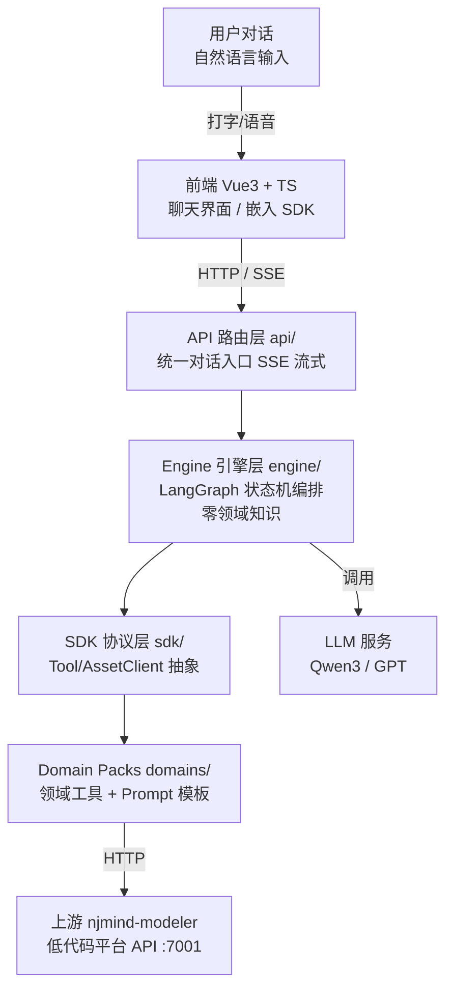

**核心架构原则——三层六边形**：

| 层 | 目录 | 职责 | 关键约束 |
|---|------|------|---------|
| **Engine 引擎层** | `engine/` | LangGraph 状态机编排（意图识别→工具执行→结果处理） | **零领域知识**（不知道表单/请假是什么） |
| **SDK 协议层** | `sdk/` | 工具协议定义（Tool ABC / AssetClient ABC / ToolResult） | 纯抽象，不依赖具体业务 |
| **Domain Pack 层** | `domains/` | 领域知识（工具实现 + Prompt 模板 + 配置） | 新增业务只改这里 |

> **架构试金石**：`grep -rE "form|formCode|template|field|leave|请假" backend/src/engine/` 必须返回空。如果 Engine 里出现了领域词汇，说明架构被破坏了。类比 Java 里 Service 层不应该出现 SQL 语句或 HTTP 细节。

---

### 第二章 核心数据流——一次对话的完整旅程

以「创建一个请假表单」为例，展示从用户输入到最终响应的完整流程。整个流程分为 3 个阶段：

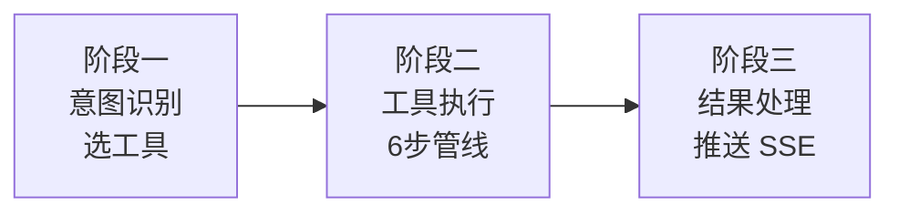

---

#### 阶段一：意图识别（classify_intent 节点）

> **本阶段职责**：LLM 从 `registry.all()` 动态生成 prompt，选出该用哪个工具。
> **本阶段产出**：`state["tool_name"]`（工具名）+ `state["intent_reason"]`（选择理由）+ `state["tool_state"]`（工具初始状态）
> **下一阶段衔接**：LangGraph 调度器读 `route_by_tool(state)` 返回值——`"tool"` 进入 execute_tool 节点（阶段二），`"end"` 直接结束。

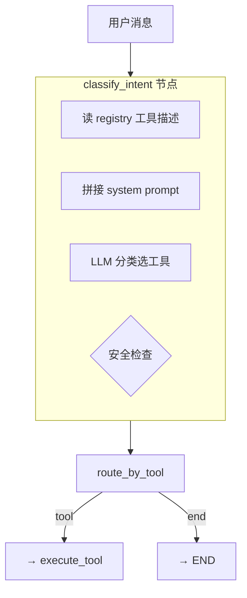

> **术语速解（Java 视角）**：
> - **registry（工具注册表）**：类似 Spring 的 `ApplicationContext`，启动时扫描所有 `@Component` 注册。这里 `ToolRegistry.all()` 返回所有已注册工具。
> - **动态 prompt**：意图识别的 prompt 不是写死的，而是从 registry 动态拼接工具描述。新增工具 → 自动出现在意图识别 prompt 里 → LLM 自动会选。类比 Spring MVC 自动扫描 `@RequestMapping`。
> - **`requires_existing_artifact`**：工具的安全属性——是否需要已有制品才能执行。如"修改表单"需要先有表单。Engine 会跳过不满足条件的工具，防止 LLM 选错。
> - **LangGraph 调度器**：`graph.stream()` 内部自动执行——跑完一个节点后，检查条件边函数（如 `route_by_tool`）的返回值决定下一步去哪个节点。类比 Spring Integration 的 router / Activiti 的 exclusiveGateway。

---

#### 阶段二：工具执行（execute_tool 节点）

> **本阶段职责**：执行选中的工具。`execute_tool_node` 构建 `ToolContext`（注入 llm_client/asset_client/emit 等依赖），调 `tool.execute(state, ctx)`。
> **CompositeTool 内部**：`execute()` 调 `run_pipeline()` → 先 emit `pipeline_definition` 给前端显示进度条 → 顺序执行 `_step_xxx`。
> **本阶段产出**：`ToolResult`（三态：artifact 制品 / reply 回复 / ask 追问）
> **追问机制**：工具返回 `ask` 时调 `interrupt()` 挂起图，等用户回答后 `Command(resume=answers)` 恢复。
> **上一阶段衔接**：由阶段一 `route_by_tool` 返回 `"tool"` 进入。
> **下一阶段衔接**：`execute_tool → handle_result` 是**无条件边**（`add_edge("execute_tool", "handle_result")`），执行完必然进入阶段三。

**主流程（正常执行路径）**：

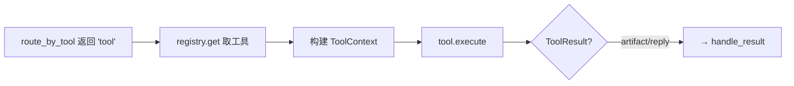

**追问路径（信息不足时）**：

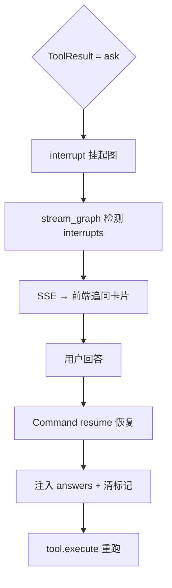

> **术语速解（Java 视角）**：
> - **CompositeTool（组合工具）**：模板方法模式。基类 `run_pipeline` 定义步骤骨架（顺序执行 `_step_xxx`），子类只实现每一步。类比 Spring 的 `JdbcTemplate`——骨架在基类，变化点在子类。
> - **interrupt / resume（中断/恢复）**：LangGraph 的原生能力。工具需要追问时调 `interrupt()` 把图挂起（状态保存到 Checkpoint），用户回答后用 `Command(resume=answers)` 从断点恢复。类比 Java 的 `Object.wait()` / `notify()`，但是跨 HTTP 请求的。
> - **Checkpoint（检查点）**：LangGraph 的状态持久化。项目用 `InMemorySaver`（内存，重启丢失），生产可换 `SqliteSaver`。类比游戏存档。
> - **ToolResult 三态**：artifact（产出制品，如表单配置 JSON）/ reply（纯文本回复）/ ask（需要追问用户）。类比 Java 方法的返回值——要么返回数据、要么返回消息、要么抛异常要求补充信息。

**以 CreateFormTool 为例的 6 步管线**（`run_pipeline` 顺序执行）：

**主流程（6步管线顺序执行）**：

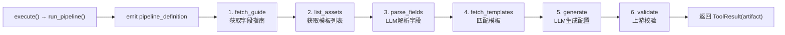

**异常分支（信息不足 / 校验失败）**：

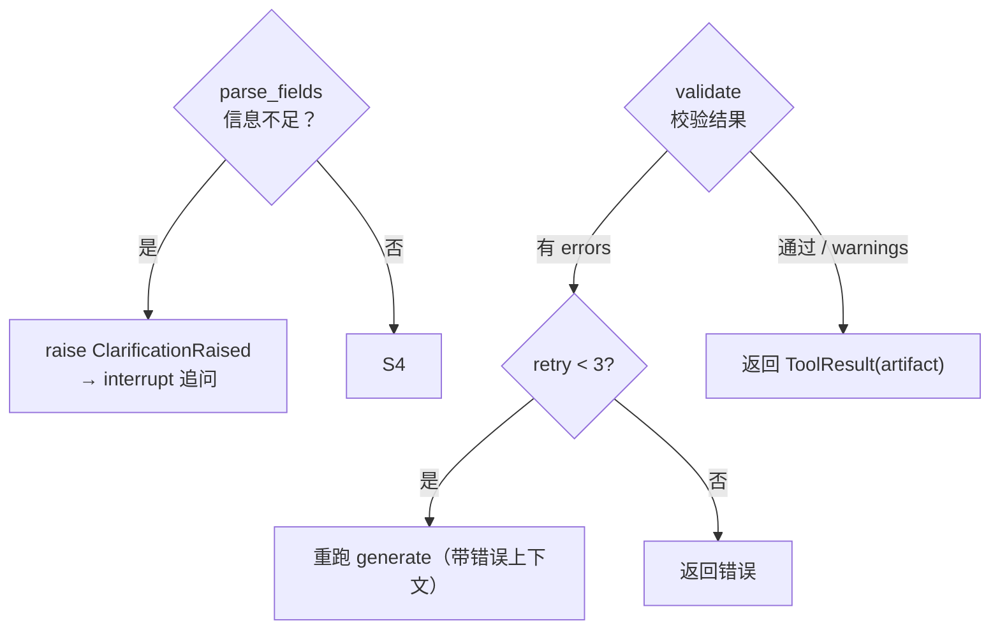

> 每步通过 `ctx.emit("stage", ...)` 实时推送 SSE 事件，前端显示管线进度。`validate` 失败时内部 retry（重跑 `generate`，最多 3 次，errors 与 warnings 分离——只有 errors 触发 retry）。

---

#### 阶段三：结果处理（handle_result 节点）

> **本阶段职责**：处理 ToolResult 三态，分流到对应的 SSE 事件。
> **本阶段产出**：SSE 事件推送给前端（通过 `state["sse_events"]` → `stream_graph` 消费 → `StreamManager` 推送）
> **上一阶段衔接**：由阶段二 `execute_tool` 无条件边进入。
> **下一阶段衔接**：`route_after_result(state)` 检查——`tool_result is None` 且有 `tool_name` → 返回 `"rerun"` 回到 execute_tool（追问恢复后重跑）；否则 → `"done"` 结束。

**主流程（结果分流）**：

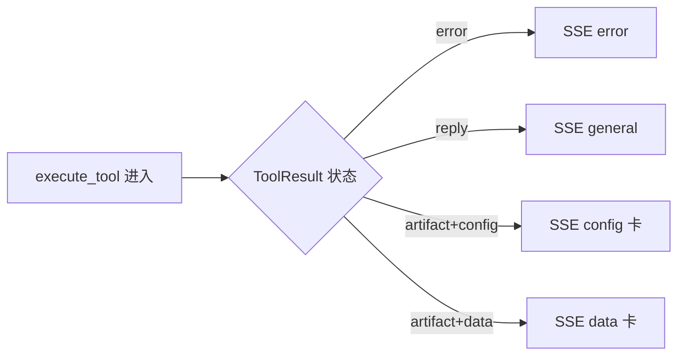

**路由判断**：

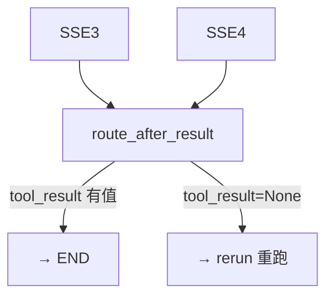

> **注意**：`tool_result is None` 只在追问恢复场景出现——`execute_tool_node` 追问后返回 `{"tool_result": None}`（行 282），`handle_result` 检测到 None 时直接返回空事件，`route_after_result` 看到 None 且有 `tool_name` 返回 `"rerun"`。

---

### 第三章 LangGraph 状态机详解

> 下图展示 LangGraph 的**图拓扑**（节点+边）和**追问恢复路径**。
> 注意：interrupt/resume 不是 LangGraph 的"边"——它在节点**内部**执行，挂起/恢复的是节点本身。

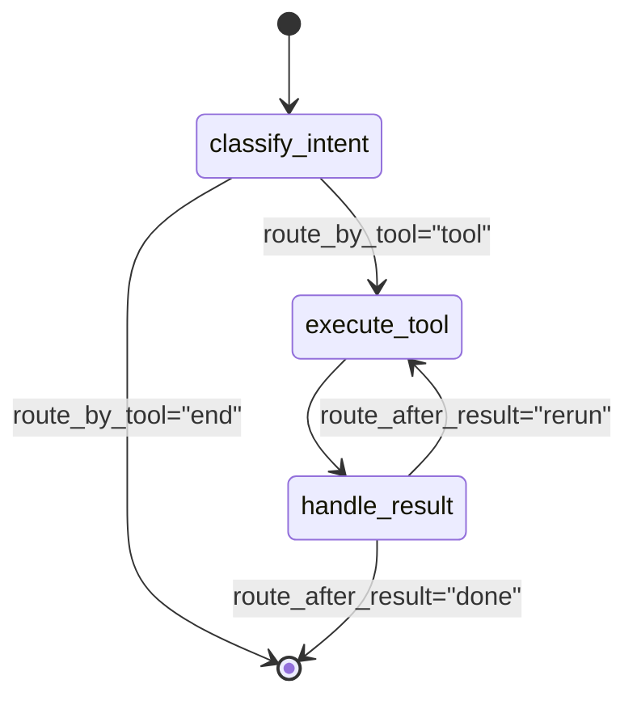

> **interrupt/resume 不是边**——它在节点**内部**执行（见第八章详解）。Checkpoint 自动保存 state，用户回答后 `Command(resume)` 从 interrupt 位置恢复。

> **术语速解（Java 视角）**：
> - **LangGraph StateGraph**：LangChain 生态的状态机框架。和 Spring State Machine 类似，但节点是 Python 函数而非 Java 方法。项目用它编排意图识别→工具执行→结果处理三节点。
> - **节点（node）**：状态机的一个执行步骤，是一个 Python 函数 `(state) → dict`（返回增量字段，框架自动 merge）。
> - **条件边（conditional edge）**：`add_conditional_edges(src, router_fn, mapping)` —— 节点执行完后调 `router_fn(state)` 返回一个 key，mapping 把 key 映射到目标节点。类比 Activiti 的 exclusiveGateway。
> - **无条件边**：`add_edge(a, b)` —— a 执行完必然到 b。`execute_tool → handle_result` 就是无条件边。
> - **interrupt/resume（不是边）**：在节点**内部**调 `interrupt(value)` 挂起，Checkpoint 保存 state。恢复时用 `Command(resume=data)` —— graph 从 interrupt 的位置继续执行同一个节点，data 作为 `interrupt()` 的返回值。类比 `Object.wait()/notify()` 但是跨 HTTP 请求。
> - **InMemorySaver**：LangGraph 的内存检查点保存器。每经过一个节点自动保存 state 快照。类比 Activiti 的 JobRepository。

**状态机三节点**（`engine/graph.py:73`）：

| 节点 | 文件:行 | 职责 |
|------|---------|------|
| `classify_intent` | `nodes.py:54` | LLM 意图识别，从 registry 选工具 |
| `execute_tool` | `nodes.py:140` | 执行工具，支持 interrupt/resume 追问 |
| `handle_result` | `nodes.py:282` | 处理 ToolResult 三态分流 |

**两条条件边**：

| 边 | 函数 | 逻辑 |
|---|------|------|
| `route_by_tool` | `nodes.py:369`（注册于 `graph.py:137`） | classify_intent 后：`tool_name` 非空 → 返回 `"tool"` → execute_tool；为空 → 返回 `"end"` → END |
| `route_after_result` | `nodes.py:383`（注册于 `graph.py:150`） | handle_result 后：`tool_result is None` 且有 `tool_name` → 返回 `"rerun"` → 重跑 execute_tool；否则 → `"done"` → END |

---

### 第四章 模块间调用关系

> 本章展示一次问答的完整调用链——从 API 入口到工具执行到持久化。
> **术语速解（Java 视角）**：
> - **依赖注入**：和 Spring `@Autowired` 一样，把服务注入到使用方。Python 用闭包/全局变量注入（nodes.py:35 `configure()`）或通过 `ToolContext` 传递。

**主调用链（API → Engine → SDK）**：


**节点内部调用**：

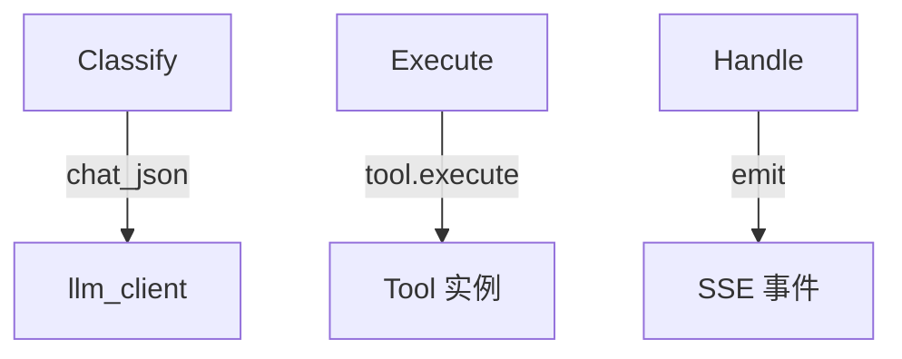

**工具内部执行链**（以 CreateFormTool 6 步管线为例）：

**主流程**：

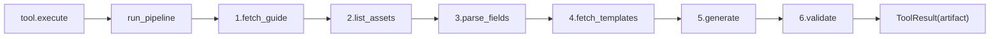

**异常分支**：

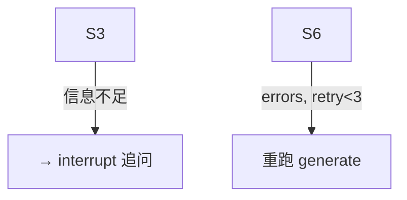

**调用链文字版**（以"创建请假表单"为例）：

> 这个表格展示了一次完整对话从 HTTP 请求到持久化的**全链路**，包含 LangGraph 的调度机制（条件边/无条件边）和工具内部的 6 步管线。

| 步骤 | 调用方 → 被调用方 | 文件:行 | 衔接说明 |
|------|-------------------|---------|---------|
| **1. HTTP 入口** | 前端 → `POST /api/config/chat` | `config.py:166` | 用户发消息，SSE 流式请求 |
| **2. 构建 input** | `chat()` → `stream_graph()` | `stream.py:46` | 构建初始 state（含 user_input/compressed_history/tool_state），answers 为空走全新 input |
| **3. 启动图执行** | `stream_graph` → `loop.run_in_executor` → `graph.stream()` | `stream.py:204` | 同步 `graph.stream` 丢线程池跑，逐 chunk 通过 `call_soon_threadsafe` 回传 SSE |
| **4. LangGraph 调度** | `graph.stream` → **classify_intent 节点** | LangGraph 自动 | `add_edge(START, "classify_intent")` 是入口边，graph.stream 自动调第一个节点 |
| **5. LLM 选工具** | `classify_intent_node` → `llm_client.chat_json()` | `nodes.py:97` | 从 `registry.all()` 动态拼 prompt → LLM 返回 `{tools: ["create_form"], reason: ...}` |
| **6. 安全检查** | `classify_intent_node` → `registry.get(name)` | `nodes.py:105` | 遍历 LLM 返回的候选工具，跳过 `requires_existing_artifact=True` 但无制品的 |
| **7. 写入 state** | `classify_intent_node` 返回 `{"tool_name": "create_form", ...}` | `nodes.py:114` | 返回增量 dict，LangGraph 自动 merge 到 state |
| **8. 条件边路由** | LangGraph 调度器 → `route_by_tool(state)` | `nodes.py:369` | `tool_name` 非空 → 返回 `"tool"` → 映射到 `execute_tool` 节点 |
| **9. 取工具实例** | `execute_tool_node` → `registry.get("create_form")` | `nodes.py:154` | 从注册表取 CreateFormTool 实例 |
| **10. 构建上下文** | `execute_tool_node` → `ToolContext(llm_client, asset_client, emit, ...)` | `nodes.py:189` | 注入依赖（类比 @Autowired） |
| **11. 执行工具** | `execute_tool_node` → `tool.execute(tool_state, ctx)` | `nodes.py:220` | CreateFormTool.execute 内部调 `self.run_pipeline(state, ctx)` |
| **12. 发管线定义** | `run_pipeline` → `ctx.emit("pipeline_definition", steps)` | `tool.py:163` | 先告诉前端有 6 步，前端渲染进度条 |
| **13. Step 1** | `_step_fetch_guide` → `ctx.asset_client.get_guide()` → `HttpAssetClient` → `UpstreamClient.get_guide()` | `create_form.py:126` | GET 上游 :7001/guide.json → `sanitize_obj` 清洗 |
| **14. Step 2** | `_step_list_assets` → `ctx.asset_client.list_templates()` | `create_form.py:142` | 获取可用模板列表 |
| **15. Step 3** | `_step_parse_fields` → `ctx.llm_client.chat_json()` | `create_form.py:142` | LLM 解析自然语言→字段列表（如返回 `needsClarification` 则 raise 追问） |
| **16. Step 4** | `_step_fetch_templates` → `ctx.asset_client.get_template()` | `create_form.py:212` | 根据字段类型匹配模板详情 |
| **17. Step 5** | `_step_generate` → `ctx.llm_client.chat_json()` | `create_form.py:212` | LLM 生成表单配置 JSON |
| **18. Step 6** | `_step_validate` → `ctx.asset_client.validate_artifact()` | `create_form.py:287` | 上游校验。**有 errors → retry**：重跑 `_step_generate`（带错误上下文），最多 3 次（`create_form.py:329`）；**只有 warnings → 通过** |
| **19. 返回 ToolResult** | `tool.execute` 返回 `ToolResult(artifact=配置JSON)` | `create_form.py:70` | 写入 `state["tool_result"]` |
| **20. 无条件边** | LangGraph 调度器 → `add_edge("execute_tool", "handle_result")` | `graph.py:144` | execute_tool 执行完**必然**到 handle_result（无条件边） |
| **21. 三态分流** | `handle_result_node` 检查 ToolResult | `nodes.py:282` | artifact_type="config" → 构造 SSE result（含 config + valid + validationErrors） |
| **22. SSE 推送** | `handle_result` 返回 `{"sse_events": [...]}` | `nodes.py:340` | stream_graph 的 `_process_chunk` 消费 sse_events → `StreamManager.emit_result()` |
| **23. 条件边路由** | LangGraph 调度器 → `route_after_result(state)` | `nodes.py:383` | `tool_result` 有值 → 返回 `"done"` → 映射到 END |
| **24. 持久化** | `stream_graph` → `_save_result_conversation()` | `stream.py:292` | 写 user + assistant 消息到 events 表，更新 session_meta.current_config |

**追问链路（步骤 15 信息不足时）**：

| 步骤 | 调用方 → 被调用方 | 文件:行 | 衔接说明 |
|------|-------------------|---------|---------|
| A1 | `_step_parse_fields` 返回 `needsClarification` | `create_form.py:142` | LLM 判断信息不足，返回追问问题 |
| A2 | `execute_tool_node` 检测 `result.ask` 非空 | `nodes.py:245` | 不返回 ToolResult，改走 interrupt 路径 |
| A3 | 调 `interrupt({questions, summary})` | `nodes.py:265` | LangGraph 挂起图，Checkpoint 自动保存当前 state |
| A4 | `graph.stream` 自动停止迭代 | `stream.py:204` | graph.stream 遇到 interrupt 不抛异常，自然结束循环 |
| A5 | `stream_graph` 检测 `graph.get_state().tasks[].interrupts` | `stream.py:220` | 从 task.interrupts 提取追问数据 |
| A6 | 推 SSE `needsClarification` 事件 | `stream.py:232` | 前端渲染追问卡片 |
| A7 | 用户回答 → `POST /api/config/chat` 带 `answers` | `config.py:166` | 新 HTTP 请求，answers 非空 |
| A8 | `stream_graph` 走 `Command(resume=answers)` | `stream.py:95` | graph 从 Checkpoint 恢复，answers 注入到 interrupt 的返回值 |
| A9 | `execute_tool_node` 从 `interrupt()` 后恢复 | `nodes.py:265` | answers 注入 `tool_state["clarify_answers"]`，清除 `_need_clarify` 标记 |
| A10 | 返回 `{"tool_result": None}` 触发 rerun | `nodes.py:282` | handle_result 检测 None 返回空事件 |
| A11 | `route_after_result` 返回 `"rerun"` | `nodes.py:383` | `tool_result is None` 且有 `tool_name` → 重跑 execute_tool |
| A12 | 重跑 `tool.execute`（这次有完整信息） | `nodes.py:220` | 正常完成 → 步骤 19 继续走后续链路 |

> **📖 深入阅读**：每个步骤的源码实现见「第十五章 关键实现深度解析」。工具执行的 6 步管线详见「第十五章 15.7」。追问机制详见「第八章 追问（Clarification）机制详解」。

---

### 第五章 三层六边形架构详解

> **术语速解（Java 视角）**：
> - **六边形架构（端口与适配器）**：核心业务逻辑（Engine）不依赖外部，通过"端口"（SDK 抽象接口）与外部交互。类比 Spring 的 `@Controller` 不直接调 `DataSource`，而是调 `Repository` 接口。
> - **ABC（Abstract Base Class）**：Python 的抽象基类，类似 Java `abstract class` 或 `interface`。`Tool(ABC)` 定义了工具协议，子类必须实现 `execute`。

**上层（API + Engine + SDK）**：

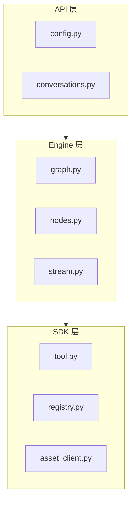

**下层（Domains + Infra）**：

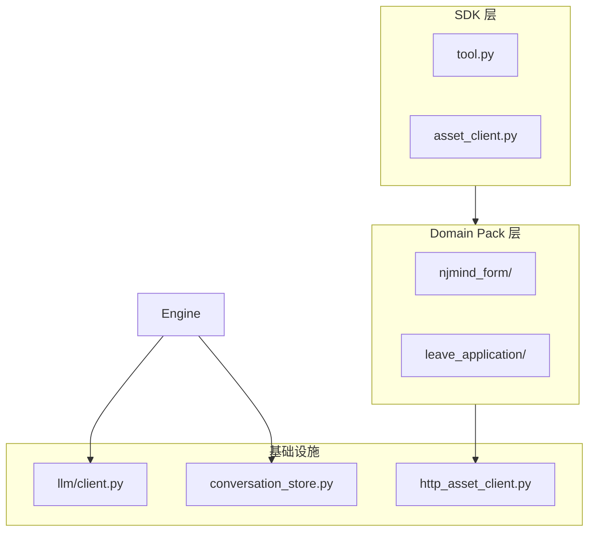

**层级依赖约束**：

| 规则 | 说明 | 验证方法 |
|------|------|---------|
| Engine 不依赖 Domains | Engine 不知道表单/请假是什么 | `grep -rE "form\|leave\|请假" engine/` 返回空 |
| Domains 依赖 SDK | 工具实现 Tool ABC | import sdk.tool |
| Adapters 实现 SDK | HttpAssetClient 实现 AssetClient ABC | extends AssetClient |
| 新增业务只改 Domains | 加一个 `domains/xxx/` 目录 | discover_packs 自动发现 |

---

### 第六章 数据库模型

> **术语速解（Java 视角）**：
> - **SQLite**：轻量级文件数据库，无需独立服务。类比 Java 的 H2 Database。项目用 WAL 模式（Write-Ahead Logging，类比 MySQL 的 redo log）。
> - **append-only（只追加）**：事件只追加不修改，类比 Event Sourcing。对话历史是事件流，压缩时追加 `compacted` 事件而非删除旧的。

项目用 SQLite（无 ORM），3 张表：

**主表 events（事件流）**：

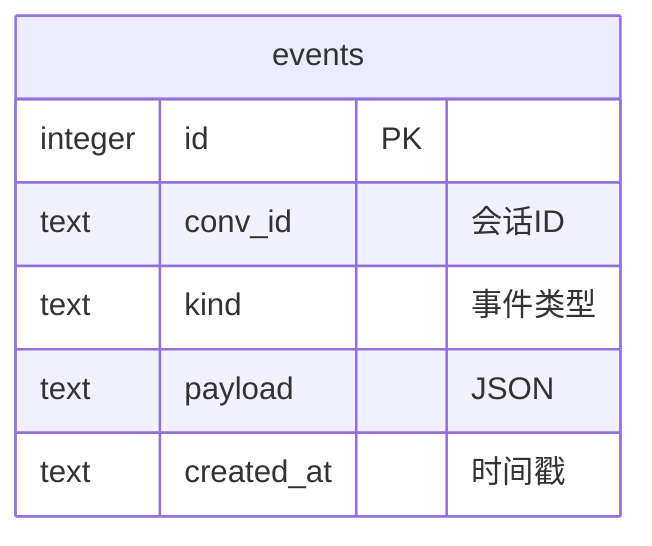

**关联表（会话元数据 + 调用审计）**：

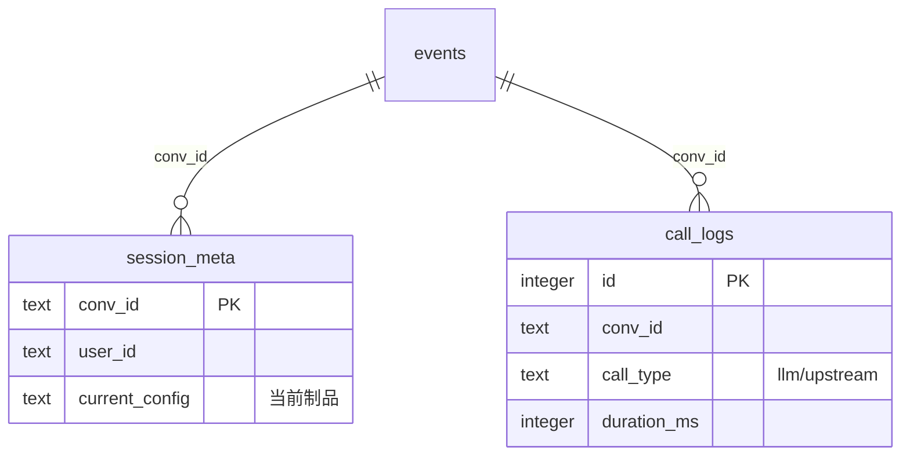

**events 表的 kind 取值**：

| kind | 含义 | 类比 Java |
|------|------|----------|
| `user` | 用户消息 | `UserMessage` |
| `assistant` | AI 回复 | `AssistantMessage` |
| `tool_result` | 工具执行结果 | `ToolResponse` |
| `compacted` | 压缩后的历史 | 压缩后的日志 |
| `compact_trace` | 压缩操作记录 | 压缩操作的审计 |
| `checkpoint` | LangGraph 检查点 | 游戏存档 |
| `ask` | 追问请求 | `ClarificationRequest` |

---

### 第七章 SDK 协议层详解

SDK 层是架构的核心——定义了 Engine 和 Domain Pack 之间的协议。

#### 7.1 Tool ABC（工具抽象基类）

```python
# sdk/tool.py:84
class Tool(ABC):
    name: str                          # 工具名（唯一标识）
    description: str                   # 给 LLM 的描述
    when: str                          # 什么时候用这个工具
    artifact_type: str                 # "config" | "data"
    is_destructive: bool = True        # ★ Fail-Closed 默认值
    is_read_only: bool = False         # ★ Fail-Closed 默认值
    is_concurrency_safe: bool = False  # ★ Fail-Closed 默认值
    requires_existing_artifact: bool = False

    @abstractmethod
    async def execute(self, state, ctx) -> ToolResult: ...

    # Engine 通过这些钩子避免读制品内部（架构试金石）
    def validate_input(self, input): ...       # 输入校验
    def summarize_artifact(self, artifact): ... # 制品摘要
    def title_for(self, artifact): ...          # 制品标题
    def format_result(self, result): ...        # 结果格式化
```

> **Fail-Closed 安全默认**：`is_destructive=True`（默认认为会破坏数据）、`is_read_only=False`（默认认为会写）、`is_concurrency_safe=False`（默认认为不安全）。工具必须显式声明安全才被信任。类比 Java SecurityManager 默认拒绝。

#### 7.2 CompositeTool（模板方法模式）

```python
# sdk/tool.py:138
class CompositeTool(Tool):
    steps: list[str]  # 子类定义步骤名，如 ["fetch_guide", "generate", "validate"]

    async def run_pipeline(self, state, ctx) -> ToolResult:
        # 先发管线定义给前端（显示进度条）
        ctx.emit("pipeline_definition", {"steps": self.steps})
        # 顺序执行 _step_xxx
        for step in self.steps:
            method = getattr(self, f"_step_{step}")
            result = await method(state, ctx)
            if isinstance(result, ClarificationRaised):
                # 信息不足 → interrupt 追问
                raise result
        return ToolResult(artifact=...)
```

> **术语速解（Java 视角）**：
> - **模板方法模式**：`CompositeTool.run_pipeline` 是模板（定义步骤骨架），子类的 `_step_xxx` 是具体实现。类比 `HttpServlet.doGet()` 调 `processRequest()`——框架控制流程，子类填逻辑。

#### 7.3 AssetClient ABC（资产抽象）

```python
# sdk/asset_client.py:42
class AssetClient(ABC):
    # 表单类操作
    @abstractmethod
    async def get_template(self, template_id) -> dict: ...
    @abstractmethod
    async def list_templates(self) -> list: ...
    @abstractmethod
    async def get_schema(self) -> dict: ...
    @abstractmethod
    async def get_guide(self) -> dict: ...
    @abstractmethod
    async def validate_artifact(self, config) -> dict: ...
    @abstractmethod
    async def persist_artifact(self, config) -> dict: ...

    # 通用数据操作
    @abstractmethod
    async def submit_data(self, data) -> dict: ...
    @abstractmethod
    async def query_data(self, query) -> dict: ...
```

`HttpAssetClient` 是它的实现，调上游 njmind-modeler API。

---

### 第八章 追问（Clarification）机制详解

追问是本项目的核心亮点之一——工具执行到一半发现信息不足时，能暂停等用户补充，然后从断点恢复。

#### 8.1 整体流程概览

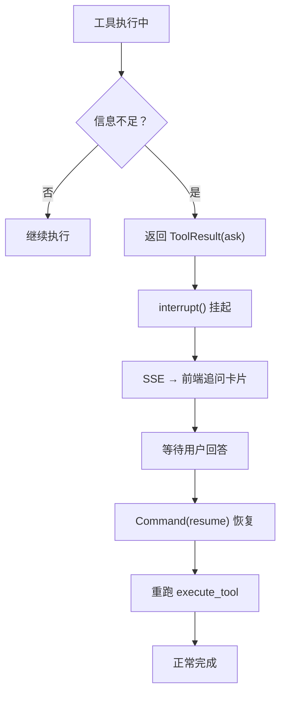

#### 8.2 interrupt/resume 深度解析（Java 视角）

**核心问题**：工具执行到一半，发现信息不足（比如用户只说"创建请假表单"但没说请假类型），怎么暂停？怎么恢复？

**LangGraph 的解决方案**：

| 概念 | 作用 | Java 类比 |
|------|------|----------|
| `interrupt(value)` | 挂起图执行，把 value 保存到 Checkpoint | `Object.wait()` + 序列化状态到数据库 |
| `Command(resume=data)` | 从挂起点恢复，data 注入到状态 | `Object.notify()` + 反序列化恢复 |
| `Checkpoint` | 状态持久化（内存/SQLite/Postgres） | 游戏存档 / Activiti 流程变量持久化 |

**关键区别**：Java 的 `wait()/notify()` 是同一线程内的，而 LangGraph 的 interrupt/resume **跨 HTTP 请求**——挂起时 HTTP 响应结束，恢复时是新的 HTTP 请求。

#### 8.3 核心问题解答（Java 开发者常见困惑）

> **❓ 问题 1：interrupt 后，线程暂停了吗？**
>
> **没有！线程直接结束了。** 不是 `Thread.suspend()`，不是 `Object.wait()`。`interrupt()` 内部抛 `PauseSignal` 异常 → LangGraph 捕获异常 → 保存 state 到 Checkpoint → `graph.stream()` 结束 → 线程池任务完成 → **线程释放回线程池**。此时没有任何线程在等待 `answer = interrupt(...)` 的返回值。

> **❓ 问题 2：第二次请求，如何找到上一次的链路？**
>
> **通过 `thread_id`（= `conversation_id`）。** `stream.py:121` 用 `conversation_id` 做 `thread_id`，LangGraph 按 `thread_id` 在 Checkpoint 里存取状态。前端每次请求都带同一个 `conversation_id`，LangGraph 用它找到上次存的 state。
>
> **Java 类比**：Activiti 用 `processInstanceId` 找流程实例。当前任务结束 → 状态存 `ACT_RU_EXECUTION` 表 → 下次来新请求 → 用 `processInstanceId` 查表 → 找到当前活动节点 → 继续执行。LangGraph 的 `thread_id` = Activiti 的 `processInstanceId`。

> **❓ 问题 3：快照存了什么？如何让代码在指定位置继续执行？**
>
> **存的不是"代码行号"，而是"下一个要执行的节点名"。** Checkpoint 里存的是：
>
> ```
> {
>   "thread_id": "abc123",
>   "channel_values": { ... 完整 state ... },
>   "next_nodes": ["execute_tool"],    ← ★ 下一个要执行的节点
>   "interrupt": {
>     "value": {questions: [...]},      ← interrupt() 的参数
>     "resumed": false                  ← 还没恢复
>   }
> }
> ```
>
> 恢复时 LangGraph 读 Checkpoint → 发现 `next_nodes = ["execute_tool"]` → **重新调用** `execute_tool_node(state)` → 整个节点函数从头执行 → 走到 `answer = interrupt(...)` 时，LangGraph 检测到 `Command(resume=answers)` → **不抛异常**，直接返回 `answers` → 代码继续往下走。
>
> **关键理解**：不是"从第 250 行继续执行"，而是"整个节点函数重新执行，但 `interrupt()` 这次不抛异常了，直接返回 answers"。

> **❓ 问题 4：`interrupt()` 两次调用行为不同？**
>
> **是的！这是 LangGraph 框架的魔法。**
>
> | | 第一次调用（无 resume） | 第二次调用（有 resume） |
> |---|---|---|
> | 输入 | 普通 `graph.stream(state)` | `graph.stream(Command(resume=answers))` |
> | `interrupt()` 行为 | 抛 `PauseSignal` 异常 | 不抛异常，直接返回 `answers` |
> | 后续代码 | 不执行（异常跳出了） | 正常执行 |
>
> **Java 类比**：想象一个神奇的 `MagicLock.lock()` 方法——第一次调抛 `WaitException`，第二次调直接返回数据。看起来像"从断点恢复"，实际是框架拦截了两次调用，行为不同。

#### 8.4 时序图——第一次请求（interrupt 触发）

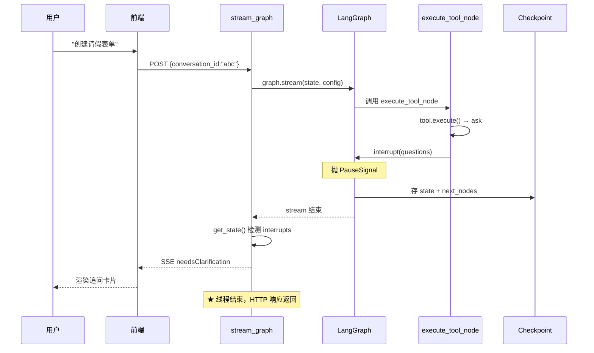

#### 8.5 时序图——第二次请求（resume 恢复）

**恢复阶段（读 Checkpoint + 重跑节点）**：

```mermaid
sequenceDiagram
    participant U as 用户
    participant F as 前端
    participant API as stream_graph
    participant LG as LangGraph
    participant N as execute_tool_node
    participant CP as Checkpoint

    U->>F: 选择"年假"
    F->>API: POST {conversation_id:"abc", answers}
    API->>LG: graph.stream(Command(resume=answers))
    LG->>CP: 用 "abc" 读 state
    CP-->>LG: 返回 state + next_nodes
    Note over LG: 发现 next_nodes=["execute_tool"]
    LG->>N: 重新调用 execute_tool_node
    Note over N: ★ 整个函数重新执行
```

**执行阶段（interrupt 返回 answers + 重跑工具）**：

```mermaid
sequenceDiagram
    participant LG as LangGraph
    participant N as execute_tool_node
    participant API as stream_graph
    participant F as 前端
    participant U as 用户

    N->>N: tool.execute() → ask（再次）
    N->>LG: interrupt(questions)
    Note over LG: ★ 这次不抛异常！检测到 resume
    LG-->>N: 返回 answers
    Note over N: answer = answers
    N->>N: 注入 clarify_answers + 清标记
    N-->>LG: return tool_result=None
    LG->>LG: route_after_result → "rerun"
    LG->>N: 再次调用 execute_tool_node
    N->>N: tool.execute() → artifact（成功）
    N-->>LG: return tool_result=artifact
    LG-->>API: stream 继续
    API-->>F: SSE artifact
    F-->>U: 显示表单配置
```

> **两次请求对比**：
> - 第一次：`graph.stream(state)` → 节点执行 → `interrupt()` 抛异常 → 存 Checkpoint → 线程结束
> - 第二次：`graph.stream(Command(resume=answers))` → 读 Checkpoint → 重新调用节点 → `interrupt()` 返回 answers → 继续执行
> - **关键**：第二次是**新线程**、**新 HTTP 请求**，通过 `conversation_id` 关联。不是同一个线程"醒来"了。

#### 8.4 代码级解析：interrupt() 之后发生了什么？

**第一步：interrupt() 挂起**（`nodes.py:250`）

```python
# 工具返回 ask 时，调用 interrupt() 挂起图
answer = interrupt(interrupt_value)  # ★ 这一行会"停住"
```

**底层发生了什么**：
1. `interrupt()` 内部抛出 `PauseSignal` 异常
2. LangGraph 框架捕获异常，把当前 state 序列化保存到 Checkpoint
3. `graph.stream()` 提前结束（但状态已保存）
4. `stream_graph` 检测到 `graph.get_state().tasks[].interrupts` 非空
5. 通过 SSE 推送 `needsClarification` 事件给前端
6. **HTTP 响应结束**——此时没有线程在等待 `answer`

**第二步：用户回答，Command(resume) 恢复**（`stream.py:92-95`）

```python
# 用户回答后，前端带 answers 发起新的 HTTP 请求
if answers:
    input_data = Command(resume=answers)  # ★ 告诉 graph "这是回答"
```

**底层发生了什么**：
1. `Command(resume=answers)` 是一个特殊输入，告诉 LangGraph "从上次中断的地方继续"
2. LangGraph 从 Checkpoint 恢复 state
3. **关键**：`interrupt()` 那行代码"继续执行"——`answer = interrupt(...)` 的 `answer` 被赋值为 `answers`
4. 代码继续往下走（`nodes.py:256-263`）

**第三步：注入答案 + 清除标记**（`nodes.py:256-263`）

```python
# resume 后，answer 就是用户在前端输入的回答
tool_state["clarify_answers"] = answer if isinstance(answer, dict) else {"text": str(answer)}

# ★ 关键：清除中断标记，否则 run_pipeline 会在第一步前就 break
tool_state.pop("_need_clarify", None)
tool_state.pop("_clarify_spec", None)
tool_state.pop("_clarify_summary", None)
```

**WHY 必须清标记**：
- `_need_clarify` 是工具内部设置的标记，表示"我需要追问"
- `run_pipeline`（`tool.py:184`）在每一步前检查这个标记，如果是 `True` 就直接 `break`
- 如果不清除，重跑时会在第一步前就退出，追问答案永远不会被消费
- 这是 interrupt/resume 重入的关键坑——**状态必须干净，否则逻辑会短路**

**第四步：重跑工具**（`nodes.py:267-270`）

```python
# 返回 None 的 tool_result，触发 route_after_result 返回 "rerun"
return {
    "tool_state": tool_state,
    "tool_result": None,  # ★ 关键：None 触发 rerun 路由
}
```

**路由判断**（`nodes.py:383-390`）：

```python
def route_after_result(state: GraphState) -> str:
    tool_result = state.get("tool_result")
    if tool_result is None and state.get("tool_name"):
        return "rerun"  # 追问恢复后重跑 execute_tool
    return "done"
```

- `tool_result is None` + `tool_name` 非空 → 返回 `"rerun"` → 重新进入 `execute_tool` 节点
- 这次 `tool_state["clarify_answers"]` 已有值，工具会消费它，正常完成

#### 8.5 术语速解（Java 视角）

- **interrupt / resume**：LangGraph 的中断恢复机制。`interrupt(value)` 把图挂起并把 value 返回给调用方；`Command(resume=data)` 从挂起点恢复，data 注入到状态里。类比 Java 的 `wait()/notify()` 但是跨 HTTP 请求的——挂起时 HTTP 响应结束，恢复时是新的 HTTP 请求。
- **AskSpec**：追问规格，声明式定义要问什么（问题文本 + 选项列表）。类比 Java 的 `ValidationException` 带字段提示。
- **PauseSignal**：LangGraph 内部异常，`interrupt()` 抛出，框架捕获后保存状态。类比 Java 的 `InterruptedException` 但语义不同——不是"被打断"，而是"主动暂停"。
- **Checkpoint**：状态持久化。项目用 `InMemorySaver`（内存，重启丢失），生产可换 `SqliteSaver`/`PostgresSaver`。类比游戏存档 / Activiti 的 `RuntimeService` 流程变量持久化。

---

### 第九章 上下文压缩机制

> **术语速解（Java 视角）**：
> - **token**：LLM 的计量单位。中文每字约 1.5 token，英文每 4 字符约 1 token。LLM 有 token 上限（如 Qwen3 的 262144），超了必须压缩。
> - **熔断器**：和 Resilience4j/Hystrix 一样。压缩连续失败 3 次触发熔断，降级为简单截断。

**主流程（阈值检查 + 压缩）**：

```mermaid
flowchart TD
    Msg["新消息进来"] --> Check{"token > 70%?"}
    Check -->|否| Normal["用完整历史"]
    Check -->|是| CB{"熔断器?"}
    CB -->|open| Fallback["降级：截断最近 N 条"]
    CB -->|closed/half-open| LLM["LLM 摘要旧消息"]
    LLM --> Success{"成功？"}
    Success -->|是| Save["追加 compacted 事件"]
    Success -->|否| Count["失败计数+1"]
    Count --> Trip{"连续失败 ≥ 3？"}
    Trip -->|是| Open["熔断器 open 60s"]
    Trip -->|否| Fallback
```

**压缩特点**：
- **70% 阈值**：留 30% 给工具执行和 LLM 输出
- **熔断器**：连续 3 次失败熔断，期间降级为截断（信息损失但可用）
- **append-only**：压缩后追加 `compacted` 事件，不删除旧事件（可回溯）
- **后台压缩**：`CompressionSidechain` 在 forked 线程跑不阻塞主流程

---

### 第十章 嵌入模式（Embed SDK）

项目支持两种部署模式：独立模式和嵌入模式（作为 iframe 嵌入到其他系统）。

```mermaid
flowchart LR
    subgraph Host["宿主系统 njmind-modeler"]
        Button["浮动按钮"] --> Iframe["iframe LLMFormModeler"]
    end

    subgraph Embed["嵌入 SDK embed.ts"]
        SDK["LLMFormModeler 类<br/>postMessage 通信"]
    end

    Host <-->|postMessage| Embed

    Msg1["MODELER_INIT<br/>宿主→嵌入：传 headers"] --> Embed
    Msg2["CONFIG_GENERATED<br/>嵌入→宿主：传配置"] --> Host
    Msg3["CONFIG_APPLY<br/>宿主→嵌入：应用配置"] --> Embed
    Msg4["CLOSE<br/>宿主→嵌入：关闭"] --> Embed
```

> **术语速解（Java 视角）**：
> - **postMessage**：浏览器跨窗口通信 API。iframe 和宿主页面通过 `window.postMessage()` 互发消息。类比 Java RMI 但是前端版。
> - **forward_headers（请求头透传）**：嵌入模式下，宿主系统的认证头（X-User-Id / Authorization / Cookie）透传到后端再透传到上游 API，实现单点登录。类比 Spring 的 `SecurityContextHolder` 传递但跨系统。

---

### 第十一章 安全架构

> **术语速解（Java 视角）**：
> - **Fail-Closed**：安全默认是"危险"。工具默认认为会破坏数据、不是只读、不并发安全，必须显式声明安全才被信任。类比 SecurityManager 默认拒绝。
> - **Unicode 隐写注入**：用零宽字符（不可见）藏指令到上游返回数据里，影响 LLM 判断。类比 SQL 注入但是用 Unicode 字符。

**输入安全 + 工具安全**：

```mermaid
flowchart LR
    subgraph L1["1. 输入安全"]
        L1a["Unicode 隐写清洗"]
        L1b["上游数据必经清洗"]
    end
    subgraph L2["2. 工具安全"]
        L2a["Fail-Closed 默认"]
        L2b["制品存在检查"]
        L2c["validate_input 钩子"]
    end
    L1 --> L2
```

**传输安全 + 日志安全 + 数据安全**：

```mermaid
flowchart LR
    subgraph L3["3. 传输安全"]
        L3a["请求头白名单"]
        L3b["排除 hop-by-hop"]
    end
    subgraph L4["4. 日志安全"]
        L4a["凭证脱敏 RedactFilter"]
        L4b["挂 root logger"]
    end
    subgraph L5["5. 数据安全"]
        L5a["append-only 事件流"]
        L5b["调用日志审计"]
    end
    L3 --> L4 --> L5
```

**安全层次详解**：

| 层次 | 措施 | 代码位置 | 说明 |
|------|------|---------|------|
| 输入安全 | Unicode 清洗 | `sdk/sanitize.py:45` | NFKC 归一化 + 删零宽/方向反转/BOM/私用区字符 |
| 输入安全 | 上游数据强制清洗 | `adapters/http_asset_client.py:44` | 每个 `get_*` 方法返回前必过 `sanitize_obj` |
| 工具安全 | Fail-Closed 默认 | `sdk/tool.py:95` | `is_destructive=True` 等，显式声明才安全 |
| 工具安全 | 制品存在检查 | `engine/nodes.py:101` | `requires_existing_artifact=True` 但无配置 → 跳过 |
| 工具安全 | 输入校验钩子 | `sdk/tool.py:112` | `validate_input` 在 execute 前调 |
| 传输安全 | 请求头白名单 | `api/config.py:103` | 只转发匹配前缀的头 |
| 传输安全 | 排除 hop-by-hop | `api/config.py:125` | host/content-length 等不转发 |
| 日志安全 | 凭证脱敏 | `engine/logging_filter.py:82` | RedactFilter 正则替换 Bearer/sk-/Authorization/Cookie |
| 日志安全 | 挂 root logger | `main.py:56` | `install_redact_filter()` 启动时挂载 |
| 数据安全 | append-only | `services/conversation_store.py:632` | `_append_event` 只 INSERT 不 UPDATE |
| 数据安全 | 调用审计 | `services/conversation_store.py:529` | `save_call_log` 记录 LLM/上游调用 |

> **核心原则 — Fail-Closed**：安全相关功能出问题拒绝而非放行。
>
> **📖 深入阅读**：Unicode 清洗实现见「第十四章 代码引用索引」的 `sdk/sanitize.py`；Fail-Closed 默认值见「第七章 7.1 Tool ABC」。

---

### 第十二章 关键设计决策

| 决策 | 选择 | 替代方案 | 理由 |
|------|------|---------|------|
| AI 框架 | LangGraph StateGraph | 自建状态机 | 原生 interrupt/resume 支持追问；Checkpoint 自动持久化；节点是纯函数易测试 |
| 架构 | 三层六边形 | 单体 | Engine 零领域知识可复用；新增业务只加 Domain Pack |
| 工具协议 | Tool ABC + 钩子 | Engine 读制品内部 | 钩子隔离让 Engine 不依赖领域数据结构 |
| 多步工具 | CompositeTool 模板方法 | Engine 编排步骤 | 工具自己管理步骤，Engine 只调 execute |
| 追问机制 | LangGraph interrupt/resume | 自建暂停/恢复 | 原生支持 + Checkpoint 自动持久化 |
| 安全默认 | Fail-Closed（destructive=True） | Fail-Open | 宁可保守，工具显式声明安全才被信任 |
| 动态能力上报 | ChatTool 从 registry 读 | 手写能力列表 | 新增工具自动被介绍 |
| 持久化 | SQLite append-only | PostgreSQL | 轻量、无依赖、事件流可回溯 |
| Checkpoint | InMemorySaver | SqliteSaver | 简单够用，生产可切换 |
| 上下文压缩 | LLM 摘要 + 熔断器 | 简单截断 | 保语义 + 防失败浪费 API |
| Prompt 模板 | Jinja2 + YAML frontmatter | 字符串拼接 | 支持变量/条件/循环 + section 级缓存 |
| Unicode 清洗 | NFKC + 危险字符移除 | 不清洗 | 防上游内容隐写注入（零宽字符藏指令） |

---

### 第十三章 项目文件结构

```
llm-to-modler/
├── backend/src/                      # 后端核心代码
│   ├── main.py                       # FastAPI 入口 + lifespan
│   ├── mcp_server.py                 # MCP 协议服务
│   ├── api/                          # 路由层（Controller）
│   │   ├── config.py                 # 统一对话入口 SSE 流式
│   │   ├── conversations.py          # 会话 CRUD
│   │   ├── skills.py                 # 代理上游 templates/schemas
│   │   ├── health.py                 # 健康检查
│   │   └── sse.py                    # StreamManager + SSEEvent
│   ├── engine/                       # ★ Engine 引擎层（零领域知识）
│   │   ├── graph.py                  # StateGraph 构建 + compile
│   │   ├── graph_state.py            # GraphState TypedDict
│   │   ├── nodes.py                  # 三节点逻辑（classify/execute/handle）
│   │   ├── stream.py                 # graph.stream → SSE 桥接
│   │   ├── conversation.py           # ConversationManager
│   │   ├── compression.py            # 上下文压缩（70%阈值+熔断+PTL）
│   │   ├── prompt_loader.py          # Jinja2 模板加载（缓存+覆写）
│   │   ├── dispatcher.py             # 旧调度器（MCP/遗留兼容）
│   │   └── logging_filter.py         # 日志凭证脱敏
│   ├── sdk/                          # ★ SDK 协议层
│   │   ├── tool.py                   # Tool/CompositeTool/ToolResult/AskSpec
│   │   ├── registry.py               # ToolRegistry
│   │   ├── asset_client.py           # AssetClient ABC
│   │   └── sanitize.py               # Unicode 隐写清洗
│   ├── adapters/                     # 适配器
│   │   └── http_asset_client.py      # HttpAssetClient（HTTP 上游）
│   ├── domains/                      # ★ Domain Packs（领域知识）
│   │   ├── __init__.py               # 自动发现 load_all_packs()
│   │   ├── njmind_form/              # 表单配置插件（6 工具）
│   │   │   ├── pack.py               # 注册工具
│   │   │   ├── tools/                # create/modify/get/clone/image/chat
│   │   │   ├── models.py             # ParsedField/FormConfig
│   │   │   └── config.yaml           # 字段类型映射
│   │   └── leave_application/        # 请假申请插件（Demo）
│   ├── llm/client.py                 # LLM 客户端（OpenAI 兼容,多模态）
│   └── services/
│       ├── conversation_store.py     # SQLite 持久化
│       └── upstream_client.py        # UpstreamClient（httpx）
├── frontend/src/                     # Vue 3 前端
│   ├── App.vue                       # 根组件（独立/嵌入布局切换）
│   ├── embed.ts                      # 嵌入 SDK
│   ├── stores/conversation.ts        # Pinia store
│   ├── services/api.ts               # API 调用 + SSE 解析
│   └── components/                   # 聊天/JSON 面板
├── tests/                            # 测试（3403 行）
├── README.md / TECH-ROADMAP.md
└── docker-compose.yml / .env
```

---

### 第十四章 代码引用索引

#### 核心入口

| 模块 | 文件 | 关键入口 |
|------|------|---------|
| 应用入口 | `backend/src/main.py:73` | `lifespan()` — 启动流程 |
| FastAPI 应用 | `backend/src/main.py:160` | `app = FastAPI(...)` |
| 状态机构建 | `backend/src/engine/graph.py:73` | `build_graph()` — 三节点 + 两条件边 |
| 统一对话入口 | `backend/src/api/config.py:166` | `chat()` — SSE 流式 |

#### Engine 引擎层

| 模块 | 文件 | 关键入口 |
|------|------|---------|
| 节点配置 | `backend/src/engine/nodes.py:35` | `configure()` — 模块级依赖注入 |
| 意图识别节点 | `backend/src/engine/nodes.py:54` | `classify_intent_node()` — LLM 选工具 |
| 工具执行节点 | `backend/src/engine/nodes.py:140` | `execute_tool_node()` — 执行 + interrupt/resume |
| 结果处理节点 | `backend/src/engine/nodes.py:282` | `handle_result_node()` — ToolResult 三态分流 |
| 路由函数 | `backend/src/engine/nodes.py:383` | `route_after_result()` — rerun 判断 |
| SSE 桥接 | `backend/src/engine/stream.py:46` | `stream_graph()` — graph.stream → SSE |
| 上下文压缩 | `backend/src/engine/compression.py:156` | `CompressionSidechain` — 后台压缩+熔断器 |
| Prompt 加载 | `backend/src/engine/prompt_loader.py` | `PromptLoader` — Jinja2 + 缓存 |

#### SDK 协议层

| 模块 | 文件 | 关键入口 |
|------|------|---------|
| 工具协议 | `backend/src/sdk/tool.py:84` | `Tool` ABC — 抽象基类 |
| 组合工具 | `backend/src/sdk/tool.py:138` | `CompositeTool` — 模板方法模式 |
| 工具结果 | `backend/src/sdk/tool.py:57` | `ToolResult` — 三态（artifact/reply/ask） |
| 追问规格 | `backend/src/sdk/tool.py:37` | `AskSpec` / `AskQuestion` / `AskOption` |
| 工具上下文 | `backend/src/sdk/tool.py:13` | `ToolContext` — 工具执行依赖注入 |
| 工具注册表 | `backend/src/sdk/registry.py:28` | `ToolRegistry` — register/all/get |
| 资产抽象 | `backend/src/sdk/asset_client.py:42` | `AssetClient` ABC |
| Unicode 清洗 | `backend/src/sdk/sanitize.py:45` | `sanitize_text()` — NFKC + 危险字符移除 |

#### Domain Packs

| 模块 | 文件 | 关键入口 |
|------|------|---------|
| 自动发现 | `backend/src/domains/__init__.py:151` | `load_all_packs()` — 扫描 + 注册 |
| 表单创建工具 | `backend/src/domains/njmind_form/tools/create_form.py:24` | `CreateFormTool` — 6 步管线 |
| 表单修改工具 | `backend/src/domains/njmind_form/tools/modify_form.py:47` | `ModifyFormTool` — 3 步管线 |
| 闲聊工具 | `backend/src/domains/njmind_form/tools/chat.py:35` | `ChatTool` — 动态能力上报 |
| 表单模型 | `backend/src/domains/njmind_form/models.py:45` | `FormConfig` — 表单配置 Pydantic 模型 |
| 字段类型映射 | `backend/src/domains/njmind_form/config.yaml` | type_to_template / type_names |

#### 基础设施

| 模块 | 文件 | 关键入口 |
|------|------|---------|
| LLM 客户端 | `backend/src/llm/client.py` | `LLMClient` — OpenAI 兼容, json_object 模式 |
| 会话存储 | `backend/src/services/conversation_store.py` | `ConversationStore` — SQLite 3 表 |
| 上游客户端 | `backend/src/services/upstream_client.py` | `UpstreamClient` — httpx + 缓存 |
| HTTP 适配器 | `backend/src/adapters/http_asset_client.py` | `HttpAssetClient` — 实现 AssetClient ABC |
| SSE 管理 | `backend/src/api/sse.py:65` | `StreamManager` — 线程安全队列 |

#### 前端

| 模块 | 文件 | 关键入口 |
|------|------|---------|
| Pinia Store | `frontend/src/stores/conversation.ts:84` | `sendMessage()` — 统一发消息 + 追问恢复 |
| API 调用 | `frontend/src/services/api.ts:66` | `chat()` — SSE 流式 |
| SSE 解析 | `frontend/src/services/api.ts:85` | `streamSSE()` — 手动解析 SSE |
| 嵌入 SDK | `frontend/src/embed.ts:31` | `LLMFormModeler` — iframe + postMessage |

---

## 第二部分：学习路线图

### 学习路径总览

> **前置知识**：了解 Python 基础、了解 REST API 概念、了解 Vue 3 基础。
> **目标**：能读懂并修改代码，能新增 Domain Pack。
> **时间说明**：以下时间为"从零到能读代码"的估算。

```mermaid
graph LR
    S1["阶段一<br/>项目背景<br/>半天"] --> S2["阶段二<br/>技术栈<br/>3-5天"]
    S2 --> S3["阶段三<br/>架构<br/>1天"]
    S3 --> S4["阶段四<br/>核心流程<br/>1-2天"]
    S4 --> S5["阶段五<br/>深入模块<br/>5-10天"]
    S5 --> S6["阶段六<br/>扩展实践<br/>2-3天"]
```

---

### 阶段一：项目背景（半天）

#### 学习目标
理解项目定位、核心价值、架构理念。

#### 必读
- `README.md` — 项目概览
- 本文档「第一章 整体架构总览」

#### 验证方法
1. 用自然语言描述：这个项目解决什么问题？
2. 解释"Engine 层零领域知识"是什么意思
3. 说出三层六边形架构的每一层职责

#### 动手练习
1. 运行 `./start_dev.sh` 启动前后端
2. 在对话界面输入"创建一个请假表"，观察完整流程
3. 查看 `data/conversations.db` 的 events 表，理解 append-only 事件流

---

### 阶段二：技术栈（3-5 天，按需学习）

> ⚠️ 不要求精通全部技术栈，目标是"能读懂代码"。

| 技术 | 用途 | 学习重点 | Java 类比 |
|------|------|---------|----------|
| **Python 3.12** | 后端语言 | async/await、TypedDict、Pydantic | JDK 21 |
| **FastAPI** | Web 框架 | 路由、SSE、依赖注入 | Spring Boot |
| **LangGraph** | 状态机编排 | StateGraph、node、conditional edge、interrupt/resume | Spring State Machine |
| **Pydantic** | 数据校验 | BaseModel、Field、ConfigDict | Jackson + Bean Validation |
| **Jinja2** | Prompt 模板 | 变量、条件、循环 | Thymeleaf |
| **httpx** | HTTP 客户端 | 异步请求 | OkHttp |
| **SQLite** | 本地数据库 | SQL 基础即可 | H2 Database |
| **Vue 3 + TS** | 前端 | Composition API、Pinia | React Hooks + Redux |

#### 动手练习
1. 阅读 `engine/graph.py`，画出 StateGraph 的拓扑
2. 阅读 `sdk/tool.py`，理解 Tool ABC 的抽象方法
3. 运行 `python -m pytest tests/ -v`，看测试通过情况

---

### 阶段三：系统架构（1 天）

#### 必读
- 本文档「第一章 整体架构总览」+「第五章 三层六边形架构」+「第四章 模块间调用关系」

#### 验证方法
1. 画出三层架构图（不看文档默画）
2. 解释 Engine 为什么不能依赖 Domains
3. 说出 `grep -rE "form|leave" engine/` 为什么必须返回空
4. 说出「第四章 模块间调用关系」的 15 步调用链

#### 动手练习
1. 查看 `backend/src/engine/` 目录，确认无领域词汇（架构试金石）
2. 查看 `backend/src/domains/` 目录，理解 pack.py 约定
3. 阅读 `domains/__init__.py`，理解自动发现机制

---

### 阶段四：核心数据流（1-2 天）

#### 必读
- 本文档「第二章 核心数据流」+「第三章 状态机」+「第八章 追问机制」+「第十五章 关键实现深度解析」

#### 验证方法
1. 不看文档，完整描述一次对话的 3 个阶段
2. 解释 interrupt/resume 追问机制的完整流程
3. 说出 ToolResult 三态分别走什么 SSE 事件
4. 说出 `_step_validate` 校验失败的 retry 逻辑

#### 动手练习
1. 设置断点在 `nodes.py:140` 的 `execute_tool_node`，跟踪一次完整执行
2. 触发追问场景（信息不足时），观察 interrupt → needsClarification → resume 流程
3. 阅读 `engine/stream.py`，理解线程池跑同步 graph.stream 的 WHY

---

### 阶段五：深入模块（5-10 天）

#### 5.1 Engine 层（核心中的核心）

> **📖 深入阅读**：本文档「第十五章 关键实现深度解析」13.1-13.4

| 模块 | 文件 | 学习重点 |
|------|------|---------|
| 状态机构建 | `engine/graph.py` | build_graph 如何构建三节点 |
| 节点逻辑 | `engine/nodes.py` | 三个节点函数的实现细节 |
| SSE 桥接 | `engine/stream.py` | graph.stream 如何转成 SSE |
| 上下文压缩 | `engine/compression.py` | 70% 阈值 + 熔断器 + 后台压缩 |
| Prompt 加载 | `engine/prompt_loader.py` | Jinja2 + section 缓存 + 覆写 |

#### 5.2 SDK 层

| 模块 | 文件 | 学习重点 |
|------|------|---------|
| Tool ABC | `sdk/tool.py` | 抽象基类 + 钩子 + Fail-Closed 默认值 |
| CompositeTool | `sdk/tool.py` | 模板方法模式 + run_pipeline |
| AssetClient | `sdk/asset_client.py` | 端口抽象（六边形架构核心） |
| sanitize | `sdk/sanitize.py` | Unicode 隐写清洗 |

#### 5.3 Domain Packs

| 模块 | 文件 | 学习重点 |
|------|------|---------|
| 自动发现 | `domains/__init__.py` | discover_packs 扫描注册 |
| CreateFormTool | `domains/njmind_form/tools/create_form.py` | 6 步管线 + retry + 追问 |
| ChatTool | `domains/njmind_form/tools/chat.py` | 动态能力上报 |
| config.yaml | `domains/njmind_form/config.yaml` | 字段类型映射（换环境只改这里） |

#### 5.4 前端

| 模块 | 文件 | 学习重点 |
|------|------|---------|
| Pinia Store | `stores/conversation.ts` | sendMessage + 追问恢复 + onResult 分流 |
| SSE 解析 | `services/api.ts` | 手动解析 SSE 事件流 |
| 嵌入 SDK | `embed.ts` | iframe + postMessage 通信 |

---

### 阶段六：扩展实践（2-3 天）

#### 动手练习
1. **新增一个 Domain Pack**：创建 `domains/my_domain/`，实现一个简单工具，验证自动发现
2. **加一个追问场景**：在工具里返回 `ToolResult(ask=AskSpec(...))`，验证 interrupt/resume
3. **加一个 CompositeTool**：继承 CompositeTool，定义 steps，实现 `_step_xxx`
4. **换 LLM**：改 `.env` 的 LLM_BASE_URL / LLM_MODEL，验证兼容性

---

### 附录 A：常用命令

```bash
# 启动后端
cd backend && python -m uvicorn src.main:app --port 18080 --reload

# 启动前端
cd frontend && npx vite --port 13080

# 一键启动（前后端）
./start_dev.sh

# 跑测试
cd backend && python -m pytest tests/ -v

# Mock 上游（开发时）
python mock_api_server.py
```

### 附录 B：术语速查表

| 术语 | Java 类比 |
|------|----------|
| Engine | DispatcherServlet（只路由不碰业务） |
| Domain Pack | @Component + @Configuration（扫描注册） |
| Tool ABC | abstract class / interface |
| CompositeTool | JdbcTemplate（模板方法） |
| ToolContext | @Autowired 注入的依赖 |
| ToolRegistry | ApplicationContext |
| AssetClient ABC | Repository 接口（端口） |
| HttpAssetClient | RepositoryImpl（适配器） |
| LangGraph StateGraph | Spring State Machine |
| interrupt/resume | wait()/notify()（跨 HTTP 请求） |
| Checkpoint | 游戏存档 |
| InMemorySaver | 内存缓存 |
| SSE | SseEmitter |
| Pinia | Redux / Vuex |
| postMessage | RMI（前端版） |
| Fail-Closed | SecurityManager 默认拒绝 |
| append-only | Event Sourcing |
| Jinja2 | Thymeleaf |
| frontmatter | HTML 的 `<head>` |
| NFKC | String.normalize() |

---

### 第十五章 关键实现深度解析

> 本章基于源码深度分析，补充架构图的实现细节。每个小节给出关键代码片段（带行号）、关键常量/阈值、设计决策 WHY、失败处理策略。

#### 13.1 LangGraph 三节点详解（`engine/nodes.py`）

**依赖注入——module-level 闭包**（行 28-48）：

LangGraph 节点签名只能是 `(state) → dict`，外部依赖通过模块级变量注入。`build_graph` 启动时调一次 `configure()`。

```python
# nodes.py:28-32 — 模块级变量
_registry: Optional[ToolRegistry] = None
_llm_client: Any = None
_asset_client: Any = None
```

**classify_intent_node 安全检查**（行 103-110）：

LLM 可能选错工具，安全闸门兜底——`requires_existing_artifact=True`（如 modify_form）但 `current_config` 为空 → 跳过该工具：

```python
# nodes.py:103-110 — 遍历 LLM 返回的候选工具，跳过不满足条件的
if getattr(tool, 'requires_existing_artifact', False) and not has_existing_config:
    logger.info(f"Safety: {name} requires existing config but none found, skipping")
    continue  # 跳过，继续遍历候选工具
```

- 兜底（行 124-126）：没选到工具 → `_get_fallback_tool_name()`（优先级：chat → 安全只读 → 第一个非 artifact 工具）
- 失败处理：LLM 调用异常只 warning 不崩

**execute_tool_node 的 interrupt/resume 核心**（行 246-268）：

> **📖 完整流程**：见「第八章 追问（Clarification）机制详解」，这里只列核心代码片段。

```python
# ── 第一阶段：检测追问 + 触发 interrupt ──
# nodes.py:236-250 — 工具返回 ask 时，不直接返回 ToolResult，改走 interrupt 路径
if result.ask:
    # 构建 interrupt_value：结构化问题 + 文本摘要
    interrupt_value = {
        "questions": questions_data,  # 前端渲染追问表单用
        "summary": questions_text,    # 前端直接展示用
    }

    # ★ 核心：interrupt() 抛 PauseSignal 挂起当前执行
    # 框架把 interrupt_value 序列化保存到 Checkpoint
    # 此时 HTTP 响应结束，没有线程在等待 answer
    answer = interrupt(interrupt_value)

    # ── 第二阶段：resume 后从 interrupt 位置恢复 ──
    # 用户回答后，Command(resume=answers) 触发恢复
    # interrupt() 那行"继续执行"，answer 被赋值为 answers
    # 类比 Java：wait() 被 notify() 唤醒后，代码从 wait() 下一行继续

    # 注入答案到 tool_state，供工具重跑时消费
    tool_state["clarify_answers"] = answer if isinstance(answer, dict) else {"text": str(answer)}

    # ★ 关键：清除中断标记，否则 run_pipeline 会在第一步前就 break
    # pop 第二参 None：key 不存在不报错，类比 Java map.remove + null check
    tool_state.pop("_need_clarify", None)
    tool_state.pop("_clarify_spec", None)
    tool_state.pop("_clarify_summary", None)

    # 返回 None 的 tool_result，触发 route_after_result 返回 "rerun"
    return {"tool_state": tool_state, "tool_result": None}
```

> **WHY 必须清标记**（行 259-260 注释）：不清 `_need_clarify`，`run_pipeline`（`tool.py:184`）会在第一个 step 前就 `break`，追问答案永远不会被消费。这是 interrupt/resume 重入的关键坑。
>
> **底层原理**：`interrupt()` 内部抛 `PauseSignal`（LangGraph 自定义异常），框架捕获后把 state 序列化到 Checkpoint。`graph.stream()` 提前结束，但状态已保存。下次 `Command(resume=answers)` 进来，框架从 Checkpoint 恢复 state，把 `answers` 注入到 `interrupt()` 的返回值，代码从 `answer = interrupt(...)` 下一行继续执行。

**route_after_result rerun 判断**（行 383-390）：

```python
# nodes.py:383-390 — tool_result 为 None 且有 tool_name → 返回 "rerun"
def route_after_result(state: GraphState) -> str:
    tool_result = state.get("tool_result")
    if tool_result is None and state.get("tool_name"):
        return "rerun"  # 追问恢复后重跑 execute_tool
    return "done"
```

#### 13.2 状态机构建详解（`engine/graph.py`）

```python
# graph.py:124-153 — 三节点 + 两条件边（实际行号）
workflow.add_node("classify_intent", nodes.classify_intent_node)   # :124
workflow.add_node("execute_tool", nodes.execute_tool_node)         # :125
workflow.add_node("handle_result", nodes.handle_result_node)       # :126

workflow.add_edge(START, "classify_intent")                        # :130（入口边）
workflow.add_conditional_edges("classify_intent", nodes.route_by_tool,  # :137
    {"tool": "execute_tool", "end": END})
workflow.add_edge("execute_tool", "handle_result")                     # :144（无条件边）
workflow.add_conditional_edges("handle_result", nodes.route_after_result, # :150
    {"rerun": "execute_tool", "done": END})

# graph.py:171-174 — InMemorySaver checkpoint
checkpointer = InMemorySaver()
graph = workflow.compile(checkpointer=checkpointer)
```

- `thread_id = conversation_id`（见 `stream.py:121`），每个会话一个 checkpoint 线程
- InMemorySaver 状态存内存，重启丢失；生产可换 SqliteSaver/PostgresSaver

#### 13.3 SSE 桥接详解（`engine/stream.py`）

**线程池跑同步 graph.stream**（行 196-215）：

```python
# stream.py:196-215 — 在线程池跑同步 graph.stream
def _run_graph():
    for chunk in graph.stream(input_data, config):  # :204 同步阻塞调用
        _process_chunk(chunk)
await loop.run_in_executor(None, _run_graph)  # :215 线程池跑，不阻塞事件循环
```

> **WHY**：`graph.stream` 是同步 API，但 SSE 产出要 async generator → 用线程池执行器跑同步循环，通过 `call_soon_threadsafe` 桥接到事件循环。

**Command(resume=answers) 逻辑**（行 92-116）：

```python
# stream.py:92-116 — answers 非空走 resume，为空走全新 input
if answers:
    input_data = Command(resume=answers)  # 从 Checkpoint 断点恢复
else:
    input_data = {"user_input": user_input, ...}  # 全新对话
```

**interrupt 检测**（行 148-161）：

```python
# graph.stream 遇到 interrupt 自动停止；迭代结束后查 task.interrupts
state_snapshot = graph.get_state(config)
for task in state_snapshot.tasks:
    if task.interrupts:
        # 提取挂起数据 → SSE needsClarification 事件
        await sm.emit_result({"needsClarification": True, "questions": ...})
```

#### 13.4 上下文压缩详解（`engine/compression.py`）

**关键常量**（行 23-40）：

| 常量 | 值 | 含义 |
|------|-----|------|
| `MODEL_CONTEXT_WINDOW` | 200,000 | 模型上下文窗口（Qwen3） |
| `MAX_OUTPUT_TOKENS_FOR_SUMMARY` | 20,000 | 预留输出 Token |
| `COMPRESSION_THRESHOLD` | 0.70 | 触发阈值 |
| `KEEP_RECENT_TURNS` | 3 | 保留最近 N 轮 |
| `CIRCUIT_BREAKER_THRESHOLD` | 3 | 熔断连续失败阈值 |
| `CIRCUIT_BREAKER_COOLDOWN` | 120 | 熔断冷却秒数 |

**70% 阈值完整链路**：

```
有效窗口 = 总窗口(200K) − 预留输出(20K) = 180K
触发点 = 180K × 70% = 126K tokens
```

**token 粗估**（行 43-52）：CJK 每字 1.5 token，其余 4 字符/token，不依赖 tiktoken。

**熔断器三态**（行 101-138）：

```
CLOSED（正常）→ 连续 3 次失败 → OPEN（拒绝压缩）
OPEN 持续 120 秒 → 半开（自动 reset，放行一次试探）
试探成功 → CLOSED；试探失败 → OPEN
```

**CompressionSidechain 后台压缩**（行 141-303）：

```python
# 立即返回 keep-recent（3 轮×2=6 条），压缩在 ThreadPoolExecutor 后台跑
keep_n = KEEP_RECENT_TURNS * 2
recent = messages[-keep_n:]
self._executor.submit(self._do_compress, ...)  # 后台不阻塞
return recent
```

**PTL 防御**（行 268-303）：摘要自身超限时"剥洋葱"——每次剥掉 20% 行重试，最多 3 次，耗尽降级截断保留前 500 字符。

#### 13.5 Tool ABC + Fail-Closed 详解（`sdk/tool.py`）

**安全声明默认值**（行 95-102）：

```python
# Fail-Closed：默认保守，pack 必须显式声明 False 才认为安全
is_destructive: bool = True      # 默认破坏性
is_read_only: bool = False       # 默认非只读
is_concurrency_safe: bool = False # 默认不并发安全
```

**钩子方法——架构试金石**（行 84-135）：

| 钩子 | 作用 | Engine 用途 |
|------|------|------------|
| `format_result(artifact)` | 提取前端字段 | SSE 渲染（不读制品内部） |
| `summarize_artifact(artifact)` | 提取状态补偿文本 | 压缩器用 |
| `title_for(artifact)` | 生成标题 | 对话列表用 |
| `validate_input(state)` | 语义校验 | execute 前校验 |

> **架构试金石**：如果 Engine 里出现了 `artifact['xxx']`，说明隔离被破坏了。Engine 必须通过钩子操作制品。

#### 13.6 CompositeTool 模板方法详解（`sdk/tool.py:138`）

```python
# tool.py:154-173 — run_pipeline 步骤骨架
def run_pipeline(self, state, ctx):
    ctx.emit("pipeline_definition", {"tool": self.name, "steps": self.pipeline_steps})
    for step_name in self.steps:
        if state.get("_need_clarify"):  # 前序 step 请求中断
            break
        method = getattr(self, f"_step_{step_name}")
        method(state, ctx)
```

- step 通过设置 `state["_need_clarify"]=True` 中断后续步骤
- 先 emit `pipeline_definition` 让前端动态渲染步骤进度条

#### 13.7 CreateFormTool 6 步管线详解

**步骤定义**（`create_form.py:39-50`）：

```python
steps = ["fetch_guide", "list_assets", "parse_fields",
         "fetch_templates", "generate", "validate"]
```

**_step_validate retry 逻辑**（行 254-297）：

```python
MAX_RETRIES = 3

# 校验失败（有 errors）→ 工具内部 retry
if state["retry_count"] < MAX_RETRIES:
    self._step_generate(state, ctx)       # 重跑前序 step（带错误上下文）
    return self._step_validate(state, ctx) # 递归再校验
```

> **关键设计**：errors 与 warnings 分离——只有 `errors` 非空才算失败，warnings 不触发 retry。retry 时把校验错误和当前 artifact JSON 都喂回 LLM 让它针对性修复。

#### 13.8 动态能力上报详解（`chat.py:89`）

```python
# chat.py:89-109 — 从 registry 动态构建能力列表
def _build_capabilities(self, ctx):
    for tool in ctx.registry.all():
        if tool.name == "chat":
            continue  # 跳过自身
        when_desc = getattr(tool, 'when', '')
        lines.append(f"- {when_desc}")
    return "\n".join(lines)
```

> **WHY**：能力描述不写死，新插件注册后 ChatTool 自动向用户介绍它的能力。

#### 13.9 自动发现详解（`domains/__init__.py`）

```python
# __init__.py:38-52 — 扫描规则
for item in domains_dir.iterdir():
    if item.name.startswith('_'):
        continue
    if (item / 'pack.py').exists():  # 识别规则：目录含 pack.py
        packs.append(item.name)
```

- 加载失败不阻塞：单个 pack 异常只 error + continue，全部失败才抛 RuntimeError

#### 13.10 SQLite append-only 详解（`conversation_store.py`）

**3 张表**：`events`（append-only 事件流）/ `session_meta`（列表查询）/ `call_logs`（调用审计）

**append-only 原则**（行 413-429）：

```python
# 只 INSERT 不 UPDATE，完整保留历史轨迹
conn.execute("INSERT INTO events (id, conv_id, kind, payload, created_at) VALUES (?, ?, ?, ?, ?)", ...)
```

- WAL 模式（`PRAGMA journal_mode=WAL`）优化并发读写
- 旧表迁移策略：RENAME 为 `_legacy_*` 留档，不导入数据

#### 13.11 LLM 客户端 JSON 解析详解（`llm/client.py`）

**chat_json 两级降级**（行 178-261）：

1. 优先 `response_format={"type": "json_object"}` + 强约束 system message
2. 失败（任何异常静默 pass）降级到纯文本 + 手动 JSON 提取

**_parse_json_from_text 三级容错**（行 283-316）：

```
1. 直接 json.loads（纯 JSON）
2. 提取 markdown ```json ``` 代码块
3. 找第一个 { 到最后一个 } 的子串
都失败 → 抛 ValueError
```

**Qwen3 reasoning_content 回退**（行 131-142）：content 为空且 `finish_reason='length'` 时，输出在 `reasoning_content`，需回退读取。

#### 13.12 贯穿全局的关键设计模式

| 模式 | 位置 | 说明 |
|------|------|------|
| **机制归 Engine / 内容归 pack** | compression.py 文件头 | 压缩/调度/prompt 装配机制在 Engine，具体内容在 pack |
| **Fail-Closed 默认值** | tool.py:95-102 | 安全属性默认保守，pack 显式声明才放开 |
| **架构试金石** | tool.py 钩子 + graph_state.py | Engine 不读制品内部，通过钩子操作 |
| **interrupt/resume 重入清标记** | nodes.py:226-230 | resume 后必须清 `_need_clarify` 否则 run_pipeline 提前 break |
| **三级保护兜底** | compression.py | 70% 阈值 + 熔断器 + PTL 防御 + 降级截断 |
| **上游数据必经 sanitize** | http_asset_client.py `_clean` | 每个 `get_*` 返回前都过 sanitize_obj |
| **append-only 事件流** | conversation_store.py | events 表只 INSERT，完整保留历史 |
| **线程池桥接同步到 async** | stream.py + sse.py | run_in_executor + call_soon_threadsafe |

---

## 附录 C：完整代码引用索引（200+ 条 file:line）

> 行号基于当前代码（含注释后的实际行号），可直接跳转。

#### `engine/nodes.py` — LangGraph 节点函数
| 行号 | 定义 | 描述 |
|------|------|------|
| 35 | `configure()` | 模块级依赖注入（registry/llm_client/asset_client/conversation/prompt_loader） |
| 54 | `classify_intent_node(state)` | LLM 意图识别节点：动态构建 prompt，从 registry 选工具 |
| 140 | `execute_tool_node(state)` | 执行选中工具：构建 ToolContext + emit 回调，遇到 ask 调 interrupt 挂起；resume 时注入 answers 重跑 |
| 282 | `handle_result_node(state)` | 处理工具结果三态分流（error/reply/ask/artifact），按 artifact_type 构造 SSE 事件 |
| 369 | `route_by_tool(state)` | 条件边：classify_intent 后按 tool_name 路由 |
| 383 | `route_after_result(state)` | 条件边：tool_result 为空且需重跑→rerun，否则→done |
| 396 | `_build_intent_prompt(has_existing_config)` | 从 registry.all() 动态生成意图识别 prompt |
| 417 | `_get_fallback_tool_name()` | 兜底工具名（优先级：chat → 安全只读 → 第一个非 artifact 工具） |

#### `engine/graph.py` — StateGraph 构建
| 行号 | 定义 | 描述 |
|------|------|------|
| 73 | `build_graph(...)` | 构建+编译 StateGraph：configure 注入 → 3 节点 → 边/条件边 → compile(InMemorySaver) |

#### `engine/graph_state.py` — 图状态定义
| 行号 | 定义 | 描述 |
|------|------|------|
| 42 | `GraphState(TypedDict)` | 状态字段：输入/意图/执行/追问/sse_events |

#### `engine/stream.py` — SSE 桥接
| 行号 | 定义 | 描述 |
|------|------|------|
| 46 | `stream_graph(...)` | 线程池跑 graph.stream → SSE；处理 GraphInterrupt→needsClarification；answers 走 Command(resume) |
| 277 | `_save_conversation(...)` | 简单保存一轮对话（追问摘要场景） |
| 292 | `_save_result_conversation(...)` | 保存工具结果：写 user+assistant summary，更新会话配置/标题 |

#### `engine/compression.py` — 压缩 forked sidechain
| 行号 | 定义 | 描述 |
|------|------|------|
| 24 | `MODEL_CONTEXT_WINDOW = 200_000` | 模型上下文窗口（Qwen3） |
| 30 | `COMPRESSION_THRESHOLD = 0.70` | 触发压缩阈值 |
| 33 | `KEEP_RECENT_TURNS = 3` | 保留最近 N 轮 |
| 39 | `CIRCUIT_BREAKER_THRESHOLD = 3` | 熔断器连续失败阈值 |
| 40 | `CIRCUIT_BREAKER_COOLDOWN = 120` | 熔断器冷却秒数 |
| 43 | `estimate_tokens(text)` | 粗估 token（CJK×1.5 + 其他/4） |
| 74 | `build_compressed_history(...)` | 历史格式化为文本（保留最近 N 条+截断） |
| 100 | `should_compress(...)` | token 超有效窗口 70% → True |
| 114 | `CompressionCircuitBreaker` | 熔断器：record_failure/record_success/is_tripped |
| 156 | `CompressionSidechain` | 压缩 forked sidechain：compress_async 立即返回+后台压缩 |

#### `engine/conversation.py` — 多轮对话管理器
| 行号 | 定义 | 描述 |
|------|------|------|
| 41 | `ConversationManager` | append-only 事件流管理器 |

#### `engine/prompt_loader.py` — Prompt 装配器
| 行号 | 定义 | 描述 |
|------|------|------|
| 77 | `PromptLoader` | section 级缓存的 Jinja2 装配器 |

#### `engine/logging_filter.py` — 日志脱敏
| 行号 | 定义 | 描述 |
|------|------|------|
| 44 | `_SECRET_RULES` | 敏感模式（Bearer/sk-/Authorization/Cookie/JWT） |
| 82 | `RedactFilter` | 日志凭证脱敏过滤器 |
| 145 | `install_redact_filter()` | 安装到 root logger（幂等） |

#### `sdk/tool.py` — Tool/CompositeTool/数据类
| 行号 | 定义 | 描述 |
|------|------|------|
| 13 | `ToolContext(BaseModel)` | 工具执行依赖（llm_client/asset_client/conversation/emit/forward_headers） |
| 51 | `AskSpec(BaseModel)` | 追问规格（questions 列表） |
| 57 | `ToolResult(BaseModel)` | 工具结果三层：artifact + reply/ask + extra/error_for_llm |
| 84 | `Tool(ABC)` | 工具基类（Fail-Closed 安全声明）+ 钩子方法 |
| 138 | `CompositeTool(Tool)` | 复合工具基类：steps + run_pipeline（顺序执行 _step_xxx） |

#### `sdk/registry.py` — 工具注册表
| 行号 | 定义 | 描述 |
|------|------|------|
| 28 | `ToolRegistry` | register/all/get/describe_for_llm |

#### `sdk/asset_client.py` — AssetClient 抽象
| 行号 | 定义 | 描述 |
|------|------|------|
| 42 | `AssetClient(ABC)` | 资产来源抽象：get_template/list_templates/get_schema/get_guide/validate/persist/submit_data/query_data |

#### `sdk/sanitize.py` — Unicode 隐写清洗
| 行号 | 定义 | 描述 |
|------|------|------|
| 35 | `_DANGEROUS_RANGES` | 危险字符范围（零宽/方向反转/PUA） |
| 45 | `sanitize_text(text)` | 清洗：NFKC + 删 BOM + 删危险字符 |
| 87 | `sanitize_obj(obj)` | 递归清洗 dict/list/str |

#### `llm/client.py` — 同步 OpenAI 兼容客户端
| 行号 | 定义 | 描述 |
|------|------|------|
| 36 | `LLMConfig(BaseModel)` | LLM 配置（base_url/api_key/model/temperature/max_tokens/timeout） |
| 56 | `LLMClient` | 同步 OpenAI 兼容客户端 |
| 145 | `.chat(...)` | chat completion（处理 Qwen3 reasoning_content 回退） |
| 252 | `.chat_json(...)` | chat + 解析 JSON：先 json_object 模式，失败回退纯文本提取 |

#### `services/conversation_store.py` — SQLite append-only 存储
| 行号 | 定义 | 描述 |
|------|------|------|
| 67 | `ConversationStore` | SQLite 存储（events + session_meta + call_logs 三表） |

#### `services/upstream_client.py` — 上游 HTTP 客户端
| 行号 | 定义 | 描述 |
|------|------|------|
| 104 | `UpstreamClient` | 上游 HTTP 客户端（httpx + 缓存 + 调用日志） |

#### `adapters/http_asset_client.py` — AssetClient HTTP 实现
| 行号 | 定义 | 描述 |
|------|------|------|
| 31 | `HttpAssetClient(AssetClient)` | 委托 UpstreamClient + sanitize 层 |

#### `api/config.py` — 配置/聊天路由
| 行号 | 定义 | 描述 |
|------|------|------|
| 43 | `ChatRequest(BaseModel)` | 统一聊天入口（message/conversation_id/answers/image_base64） |
| 103 | `_extract_forward_headers(...)` | 提取要透传给上游的 headers |
| 166 | `chat(...)` | 统一聊天入口：stream_graph SSE |

#### `api/sse.py` — SSE 事件管理
| 行号 | 定义 | 描述 |
|------|------|------|
| 31 | `_STREAM_END` | 流结束哨兵 |
| 34 | `SSEEvent` | SSE 事件（event/data/to_sse） |
| 65 | `StreamManager` | 线程安全事件队列（loop 桥接） |

#### `main.py` — FastAPI 主应用
| 行号 | 定义 | 描述 |
|------|------|------|
| 73 | `lifespan(app)` | 启动：Store→Upstream→LLM→load_all_packs→build_graph→MCP |
| 160 | `app = FastAPI(...)` | 应用实例（version=0.4.0） |

#### `mcp_server.py` — MCP Server
| 行号 | 定义 | 描述 |
|------|------|------|
| 38 | `create_mcp_server(...)` | 创建 FastMCP server + 注册工具/资源 |

#### `domains/__init__.py` — Pack 自动发现
| 行号 | 定义 | 描述 |
|------|------|------|
| 49 | `discover_packs()` | 扫描 domains/ 下含 pack.py 的目录 |
| 93 | `load_pack(pack_name)` | 加载指定 pack：调 create_registry + create_prompt_loader |
| 151 | `load_all_packs()` | 加载所有 pack 并合并 registry |

#### `domains/njmind_form/pack.py` — 表单 Pack
| 行号 | 定义 | 描述 |
|------|------|------|
| 37 | `create_registry()` | 注册 6 个工具（create/modify/get/clone/image/chat） |

#### `domains/njmind_form/models.py` — 表单模型
| 行号 | 定义 | 描述 |
|------|------|------|
| 26 | `ParsedField(BaseModel)` | 解析出的字段（fieldTitleText/fieldTitleKey/formFieldType） |
| 45 | `FormConfig(BaseModel)` | njmind 表单配置（extra=allow） |

#### `domains/njmind_form/tools/create_form.py` — 6 步管线
| 行号 | 定义 | 描述 |
|------|------|------|
| 21 | `MAX_RETRIES = 3` | generate/validate 重试上限 |
| 24 | `CreateFormTool(CompositeTool)` | 新建表单工具 |

#### `domains/njmind_form/tools/modify_form.py` — 修改表单
| 行号 | 定义 | 描述 |
|------|------|------|
| 47 | `ModifyFormTool(CompositeTool)` | 修改表单工具（requires_existing_artifact=True） |

#### `domains/njmind_form/tools/chat.py` — 动态能力上报
| 行号 | 定义 | 描述 |
|------|------|------|
| 14 | `ChatTool(Tool)` | 闲聊工具（兜底） |

#### `domains/njmind_form/tools/get_form.py` — 查询表单
| 行号 | 定义 | 描述 |
|------|------|------|
| 28 | `GetFormTool(Tool)` | 查询表单（is_read_only=True） |

#### `domains/njmind_form/tools/clone_form.py` — 克隆表单
| 行号 | 定义 | 描述 |
|------|------|------|
| 14 | `CloneFormTool(Tool)` | 克隆表单 |

#### `domains/njmind_form/tools/image_form.py` — 图片识别表单
| 行号 | 定义 | 描述 |
|------|------|------|
| 15 | `ImageFormTool(Tool)` | 图片识别表单（多模态） |

#### `domains/leave_application/pack.py` — 请假 Pack
| 行号 | 定义 | 描述 |
|------|------|------|
| 37 | `create_registry()` | 注册 2 个工具（submit_leave/query_leave_status） |

#### `domains/leave_application/tools/submit_leave.py` — 提交请假
| 行号 | 定义 | 描述 |
|------|------|------|
| 30 | `SubmitLeaveTool(CompositeTool)` | 提交请假（artifact_type=data，3 步管线） |

#### `domains/leave_application/tools/query_status.py` — 查询请假
| 行号 | 定义 | 描述 |
|------|------|------|
| 32 | `QueryLeaveStatusTool(Tool)` | 查询请假状态（is_read_only=True） |

---

*本文档基于 llm-to-modler 项目源码分析生成*
