# LLM Form Modeler 系统架构与学习指南

> 本文档为 LLM Form Modeler 项目的完整架构图 + 学习路线图 + 代码引用索引。
> 所有架构图使用 Mermaid 语法，GitHub / VS Code 原生渲染。
> 技术术语在首次用到处加「术语速解（Java 视角）」内联说明。

---

> **文档地图**：第一部分（第一~十三章）讲"是什么"——架构/数据流/LangGraph/追问/
> 嵌入/设计决策（第十二章含九篇决策演进实录）；第二部分讲"怎么学"——分六阶段的
> 路线图与动手实验；第三部分讲"怎么读码"——逐模块实现深度解析；附录 A/B/C 为
> 命令、术语、200+ 条代码索引。

## 第一部分：系统架构

### 第一章 整体架构总览

LLM Form Modeler 是一个 **LLM 驱动的多插件智能助手引擎**——用户用自然语言对话，系统自动调用工具完成业务操作（表单配置、请假申请、审批查询等）。项目本身是一个**桥梁（Bridge）**：上游对接 `njmind-modeler` 低代码平台 API，对外提供统一对话入口。

> **术语速解（Java 视角）**：
> - **LLM（大语言模型）**：不是 API 接口，是"猜下一个词"的神经网络。项目里调 `llm_client.chat_json()` 函数，传入 Prompt 文本，返回 JSON。类比一个超级 `String → String` 函数。
> - **Prompt（提示词）**：给 LLM 的输入文本。类比 SQL 是给数据库的输入，Prompt 是给 LLM 的输入。
> - **Engine（引擎层）**：本项目的核心设计——Engine 层**零领域知识**（不知道"表单""请假"是什么），只负责编排（意图识别→工具执行→结果处理）。类比 Spring 的 DispatcherServlet——不关心业务，只负责路由。
> - **Domain Pack（领域包）**：业务知识的载体。新增业务 = 新增一个 `domains/xxx/` 目录。类比 Spring 的 `@Component` + `@Configuration`，扫描即注册。
> - **MCP（Model Context Protocol）**：模型上下文协议，让外部系统调用本项目的工具。类比 OpenAPI/Swagger 但面向 AI。

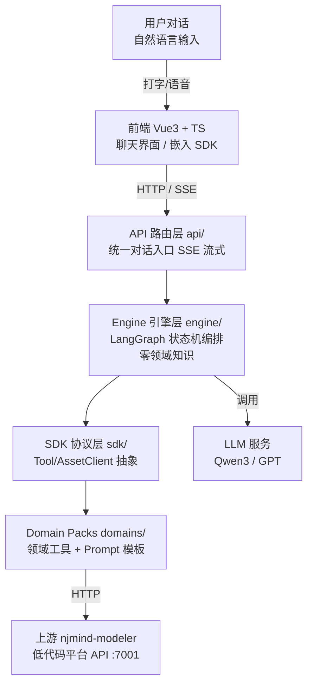

**核心架构原则——三层六边形**：

| 层 | 目录 | 职责 | 关键约束 |
|---|------|------|---------|
| **Engine 引擎层** | `engine/` | LangGraph 状态机编排（意图识别→工具执行→结果处理） | **零领域知识**（不知道表单/请假是什么） |
| **SDK 协议层** | `sdk/` | 工具协议定义（Tool ABC / AssetClient ABC / ToolResult） | 纯抽象，不依赖具体业务 |
| **Domain Pack 层** | `domains/` | 领域知识（工具实现 + Prompt 模板 + 配置） | 新增业务只改这里 |

> **架构试金石**：`grep -rE "form|formCode|template|field|leave|请假" backend/src/engine/` 必须返回空。如果 Engine 里出现了领域词汇，说明架构被破坏了。类比 Java 里 Service 层不应该出现 SQL 语句或 HTTP 细节。

---

### 第二章 核心数据流——一次对话的完整旅程

以「创建一个请假表单」为例，展示从用户输入到最终响应的完整流程。整个流程分为 3 个阶段：

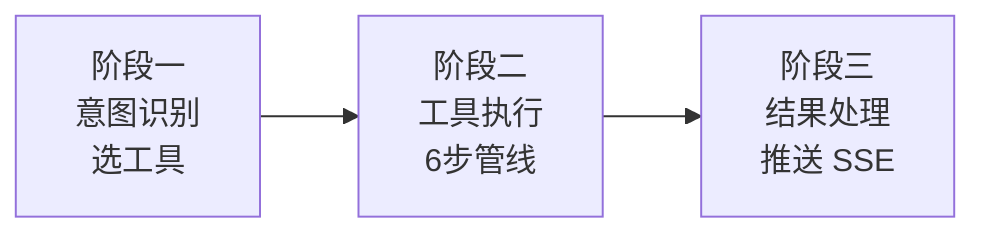

---

#### 阶段一：意图识别（classify_intent 节点）

> **本阶段职责**：LLM 从 `registry.all()` 动态生成 prompt，选出该用哪个工具。
> **本阶段产出**：`state["tool_name"]`（工具名）+ `state["intent_reason"]`（选择理由）+ `state["tool_state"]`（工具初始状态）
> **下一阶段衔接**：LangGraph 调度器读 `route_by_tool(state)` 返回值——`"tool"` 进入 execute_tool 节点（阶段二），`"end"` 直接结束。

**节点内部执行**：

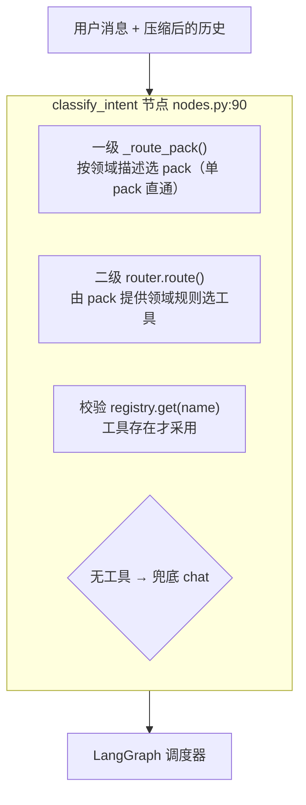

**路由判断**：

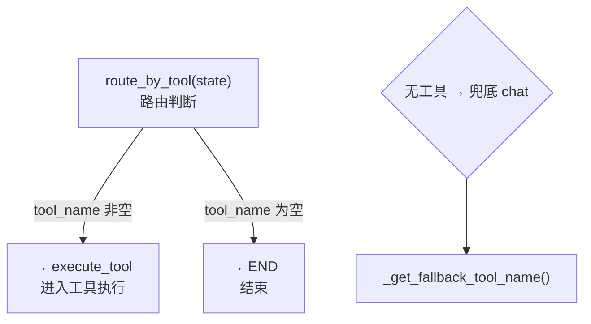

> **术语速解（Java 视角）**：
> - **registry（工具注册表）**：类似 Spring 的 `ApplicationContext`，启动时扫描所有 `@Component` 注册。这里 `ToolRegistry.all()` 返回所有已注册工具。
> - **动态 prompt**：二级路由 prompt 不是写死的，而是从 registry 动态拼接工具描述（`PackRouter.build_prompt()`）。新增工具 → 自动出现在路由 prompt 里 → LLM 自动会选。类比 Spring MVC 自动扫描 `@RequestMapping`。
> - **路由数据铁律**：部分"修改 vs 创建"判断由数据规则定死（如无制品必创建），不依赖 LLM 猜。这类规则写在 pack 的 router 里（`router.py`），是比"安全标记位"更可靠的防线（详见 12.11 标记位退役 ADR）。
> - **LangGraph 调度器**：`graph.stream()` 内部自动执行——跑完一个节点后，检查条件边函数（如 `route_by_tool`）的返回值决定下一步去哪个节点。类比 Spring Integration 的 router / Activiti 的 exclusiveGateway。

---

#### 阶段二：工具执行（execute_tool 节点）

> **本阶段职责**：执行选中的工具。`execute_tool_node` 构建 `ToolContext`（注入 llm_client/asset_client/emit 等依赖），调 `tool.execute(state, ctx)`。
> **CompositeTool 内部**：`execute()` 调 `run_pipeline()` → 先 emit `pipeline_definition` 给前端显示进度条 → 顺序执行 `_step_xxx`。
> **本阶段产出**：`ToolResult`（三态：artifact 制品 / reply 回复 / ask 追问）
> **追问机制**：工具返回 `ask` 时调 `interrupt()` 暂停图（状态存 Checkpoint、`graph.stream()` 正常收尾返回），等用户回答后新 HTTP 请求 `Command(resume=answers)` 恢复重跑节点。
> **上一阶段衔接**：由阶段一 `route_by_tool` 返回 `"tool"` 进入。
> **下一阶段衔接**：`execute_tool → handle_result` 是**无条件边**（`add_edge("execute_tool", "handle_result")`），执行完必然进入阶段三。

**主流程**：

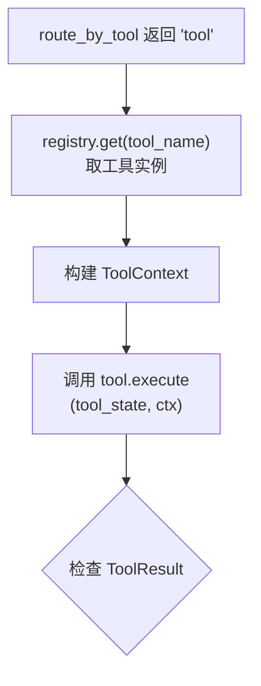

> ToolContext 注入：llm_client / asset_client / emit / forward_headers

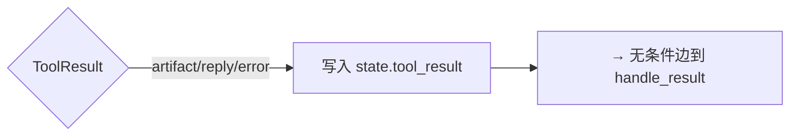

**追问路径**：

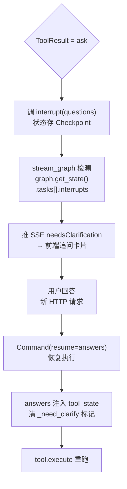

> **术语速解（Java 视角）**：
> - **CompositeTool（组合工具）**：模板方法模式。基类 `run_pipeline` 定义步骤骨架（顺序执行 `_step_xxx`），子类只实现每一步。类比 Spring 的 `JdbcTemplate`——骨架在基类，变化点在子类。
> - **interrupt / resume（中断/恢复）**：LangGraph 的原生能力。工具需要追问时调 `interrupt()` 暂停图执行（状态自动存到 Checkpoint，`graph.stream()` 正常收尾返回，本轮执行结束）；用户回答后**新的 HTTP 请求**调 `Command(resume=answers)`，LangGraph 从头重跑被中断的节点函数，`interrupt()` 直接返回 answers。**不是线程暂停——是执行栈展开 + 状态存档 + 重跑节点函数**。类比 Activiti 的 `processInstance.signal()`，但是跨 HTTP 请求的。
> - **Checkpoint（检查点）**：LangGraph 的状态持久化。项目用 `SqliteSaver`（SQLite 落盘，重启追问现场仍在；连接方式见 16.4 的踩坑记录）。类比游戏存档。
> - **ToolResult 三态**：artifact（产出制品，如表单配置 JSON）/ reply（纯文本回复）/ ask（需要追问用户）。类比 Java 方法的返回值——要么返回数据、要么返回消息、要么抛异常要求补充信息。

**以 CreateFormTool 为例的 6 步管线**（`run_pipeline` 顺序执行）：

**步骤 1：获取字段指南**：

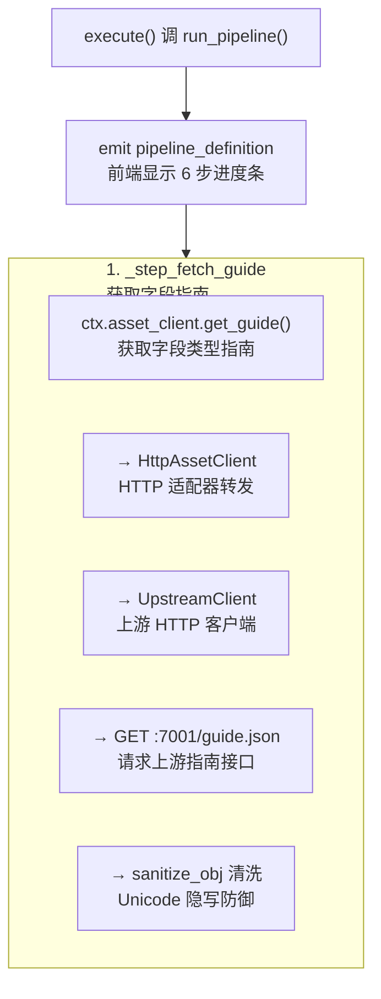

**步骤 2-3：列模板 + 解析字段**：

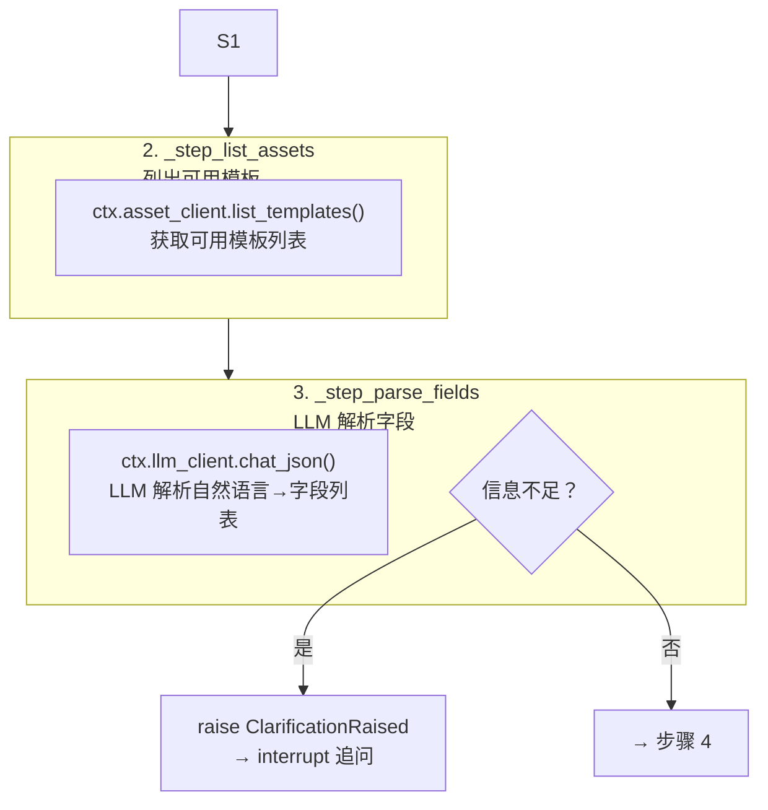

**步骤 4-6**：

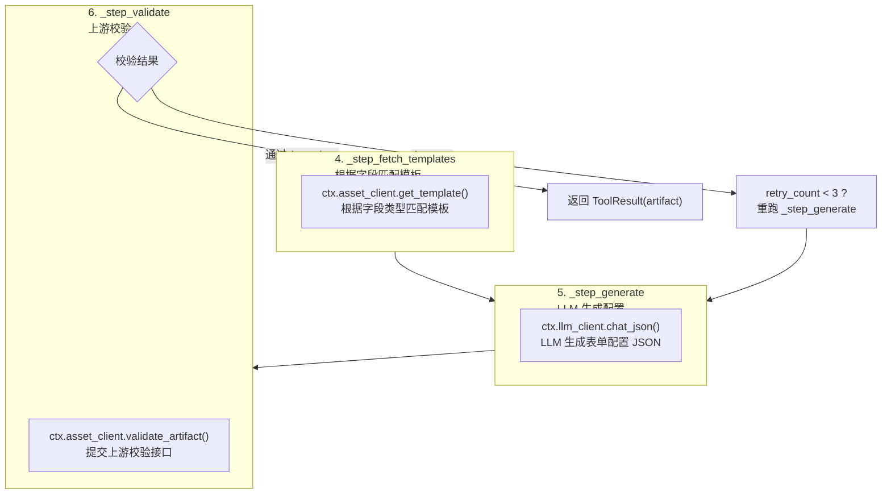

> 每步通过 `ctx.emit("stage", ...)` 实时推送 SSE 事件，前端显示管线进度。`validate` 失败时内部 retry（重跑 `generate`，最多 3 次，errors 与 warnings 分离——只有 errors 触发 retry）。

---

#### 阶段三：结果处理（handle_result 节点）

> **本阶段职责**：处理 ToolResult 三态，分流到对应的 SSE 事件。
> **本阶段产出**：SSE 事件推送给前端（通过 `state["sse_events"]` → `stream_graph` 消费 → `StreamManager` 推送）
> **上一阶段衔接**：由阶段二 `execute_tool` 无条件边进入。
> **下一阶段衔接**：`route_after_result(state)` 检查——`tool_result is None` 且有 `tool_name` → 返回 `"rerun"` 回到 execute_tool（追问恢复后重跑）；否则 → `"done"` 结束。

**结果分流**：

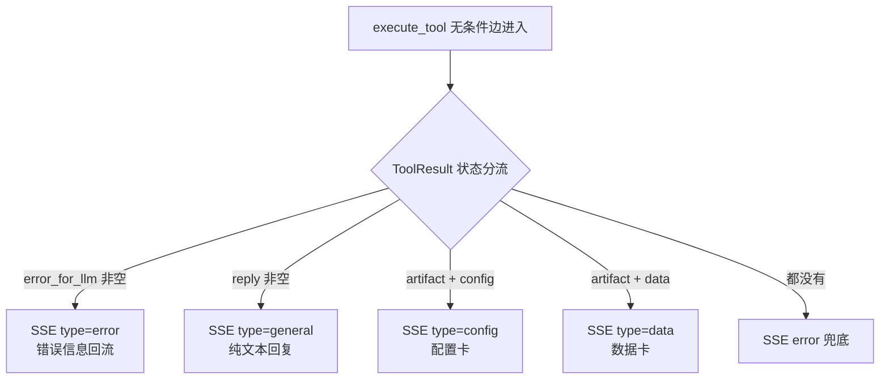

**路由判断**：

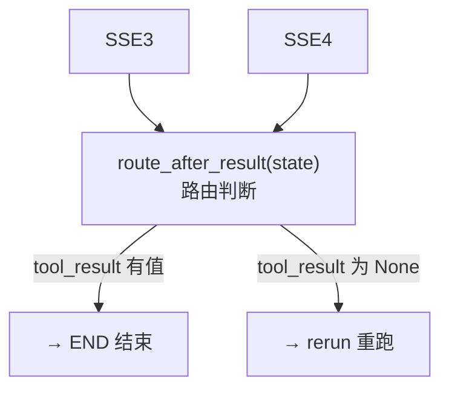

> **配置卡 vs 数据卡**（`tool.py:57-74` `ToolResult.artifact_type`）：
> - **配置卡（config）**：表单配置类制品。如"创建请假表单"生成的 JSON 配置。前端显示"应用/保存"按钮，会存到 `config_snapshot`（当前制品快照），带上游校验错误。Java 类比：生成配置文件，需用户确认后"部署"。
> - **数据卡（data）**：数据查询类制品。如"查询请假记录"返回的表格数据。只存消息历史，不存 `config_snapshot`，前端显示摘要卡片。Java 类比：执行 SELECT 查询，返回结果集展示。

> **注意**：`tool_result is None` 只在追问恢复场景出现——`execute_tool_node` 追问后返回 `{"tool_result": None}`（行 282），`handle_result` 检测到 None 时直接返回空事件，`route_after_result` 看到 None 且有 `tool_name` 返回 `"rerun"`。

---

### 第三章 LangGraph 状态机详解

> 下图展示 LangGraph 的**图拓扑**（节点+边）和**追问恢复路径**。
> 注意：interrupt/resume 不是 LangGraph 的"边"——它在节点**内部**执行，暂停/恢复的是节点本身。

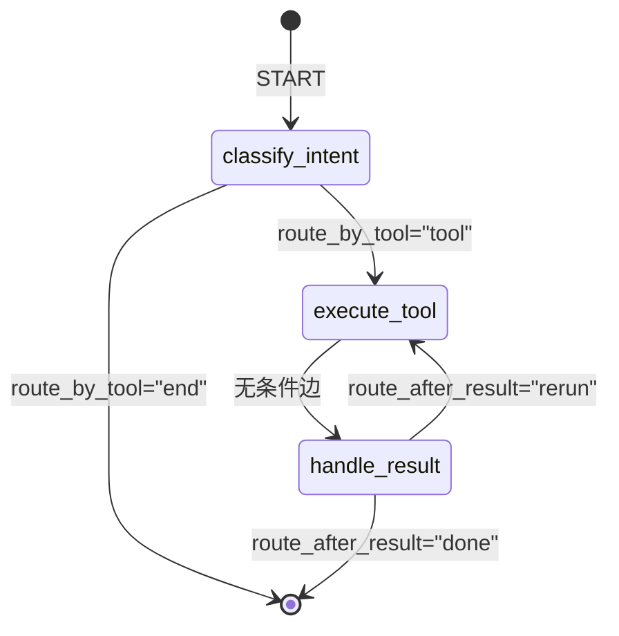

> **interrupt/resume 不是边**——它在 execute_tool 节点**内部**执行（见第八章详解）。Checkpoint 自动保存 state，用户回答后 `Command(resume)` 从 interrupt 位置恢复。

> **术语速解（Java 视角）**：
> - **LangGraph StateGraph**：LangChain 生态的状态机框架。和 Spring State Machine 类似，但节点是 Python 函数而非 Java 方法。项目用它编排意图识别→工具执行→结果处理三节点。
> - **节点（node）**：状态机的一个执行步骤，是一个 Python 函数 `(state) → dict`（返回增量字段，框架自动 merge）。
> - **条件边（conditional edge）**：`add_conditional_edges(src, router_fn, mapping)` —— 节点执行完后调 `router_fn(state)` 返回一个 key，mapping 把 key 映射到目标节点。类比 Activiti 的 exclusiveGateway。
> - **无条件边**：`add_edge(a, b)` —— a 执行完必然到 b。`execute_tool → handle_result` 就是无条件边。
> - **interrupt/resume（不是边）**：在节点**内部**调 `interrupt(value)` 暂停，Checkpoint 保存 state（`graph.stream()` 正常收尾返回，本轮执行结束）。恢复时用 `Command(resume=data)` 发起新一轮执行——graph 从头重新调用被中断的节点函数，`interrupt()` 这次直接返回 data（不抛 PauseSignal），效果等价于"从 interrupt 的位置继续"。类比 Activiti 的 `processInstance.signal()` 但是跨 HTTP 请求。**注意：不是线程暂停——是执行栈展开 + 状态存档 + 重跑节点函数**。
> - **SqliteSaver（checkpointer）**：LangGraph 的检查点保存器。每经过一个节点自动保存 state 快照到 SQLite（`data/conversations.db`）。⚠ 曾踩坑：`SqliteSaver.from_conn_string` 的 with 语义会在请求间隙关连接——必须显式 `sqlite3.connect(check_same_thread=False)` 长连接 + `SqliteSaver(conn=)`（`graph.py:183`）。类比 Activiti 的 JobRepository。

**状态机三节点**（`engine/graph.py:72`）：

| 节点 | 文件:行 | 职责 |
|------|---------|------|
| `classify_intent` | `nodes.py:90` | 两级路由：一级选 pack，二级选工具 |
| `execute_tool` | `nodes.py:154` | 执行工具，支持 interrupt/resume 追问 |
| `handle_result` | `nodes.py:332` | 处理 ToolResult 三态分流 |

**两条条件边**：

| 边 | 函数 | 逻辑 |
|---|------|------|
| `route_by_tool` | `nodes.py:419`（注册于 `graph.py:138`） | classify_intent 后：`tool_name` 非空 → 返回 `"tool"` → execute_tool；为空 → 返回 `"end"` → END |
| `route_after_result` | `nodes.py:433`（注册于 `graph.py:151`） | handle_result 后：`tool_result is None` 且有 `tool_name` → 返回 `"rerun"` → 重跑 execute_tool；否则 → `"done"` → END |

---

#### 3.1 核心概念总览（六概念一张表）

| 概念 | 一句话 | 本项目落点 |
|------|--------|-----------|
| StateGraph | 声明式状态机：节点+边+共享状态 | `engine/graph.py:72 build_graph()`，三节点两条件边 |
| 节点（node） | 纯函数 `(state) -> dict`，返回增量被框架 merge | `classify_intent / execute_tool / handle_result`（nodes.py） |
| 条件边（conditional edge） | 节点后跑 router 函数返回 key，映射到下一节点 | `route_by_tool / route_after_result`（graph.py:151） |
| interrupt / resume | 节点内部"暂停整图"，跨 HTTP 请求恢复 | 追问机制（见 16.3） |
| checkpointer | 每过一个节点自动存档 state | SqliteSaver，thread_id=conversation_id（见 16.4） |
| Command | 恢复/改道指令对象 | 用户回答追问后 `Command(resume=answers)` 发起新一轮 |

```
              ┌────────────────────────────────────────────┐
              │  START → classify_intent                   │
              │            │ route_by_tool                 │
              │      tool ─┴─ end → END                    │
              │            ▼                               │
              │      execute_tool ──(无条件边)──► handle_result
              │            ▲  route_after_result          │
              │            └────── rerun（校验失败重试）────┘
              └────────────────────────────────────────────┘
```

#### 3.2 State 设计：为什么用 dict 而不是 add_messages

`engine/graph_state.py` 的 `GraphState` 是 TypedDict，**默认覆盖语义**（不声明
`Annotated[list, add_messages]` 累加 reducer）。为什么：

- 我们的状态不是"消息流"（那由 events 表管），而是"本轮执行的working set"：
  user_input / active_tool / tool_state / artifact / validation_errors…；
- 工具内部自带 retry 循环（如 modify 校验失败重跑 `_step_modify`），状态由工具
  自己维护在 `tool_state` dict 里，不需要框架级 reducer 介入；
- **学习要点**：LangGraph 的 state merge 语义取决于 TypedDict 注解——不写
  Annotated 就是整键覆盖，写了 add_messages 就是列表追加。选哪种取决于你的
  状态是"快照"还是"流水"。

#### 3.3 Checkpointer：thread_id 语义与 SqliteSaver 的坑

```python
# graph.py:183 — 最终形态（显式长连接 + SqliteSaver(conn=)）
_conn = sqlite3.connect(DB_PATH, check_same_thread=False)  # 显式长连接
checkpointer = SqliteSaver(_conn)
graph = workflow.compile(checkpointer=checkpointer)

# 每次执行都带 thread_id（=conversation_id），会话隔离
config = {"configurable": {"thread_id": conversation_id}}
```

- **thread_id 就是"存档槽位"**：同一会话的多轮请求打到同一条 checkpoint 链，
  interrupt 的现场因此能跨请求存活；换 conversation_id 则互相不可见；
- **⚠ 真实踩坑：`SqliteSaver.from_conn_string` 的 with 语义。** 官方示例是
  `with SqliteSaver.from_conn_string(path) as saver:`——with 退出时**关闭连接**。
  我们的服务是长驻进程，第一次请求结束后连接被关，第二次请求报
  `cannot operate on a closed database`。修复：显式 `sqlite3.connect`（进程级
  长连接，`check_same_thread=False` 因为 graph 跑在线程池）+ `SqliteSaver(conn=)`；
- **双轨关系**（易混淆）：LangGraph checkpoint 管"执行到哪"（含 interrupt 现场，
  框架私有格式）；events 表管"发生过什么"（append-only 业务事件，可回放重建）。
  两者互补：刷新页面恢复追问用 checkpoint+pending_ask，会话历史/回滚用 events。

### 第四章 模块间调用关系

> 本章展示一次问答的完整调用链——从 API 入口到工具执行到持久化。
> **术语速解（Java 视角）**：
> - **依赖注入**：和 Spring `@Autowired` 一样，把服务注入到使用方。Python 用闭包/全局变量注入（nodes.py:69 `configure()`）或通过 `ToolContext` 传递。

**第一层：API 入口 + SSE 桥接**

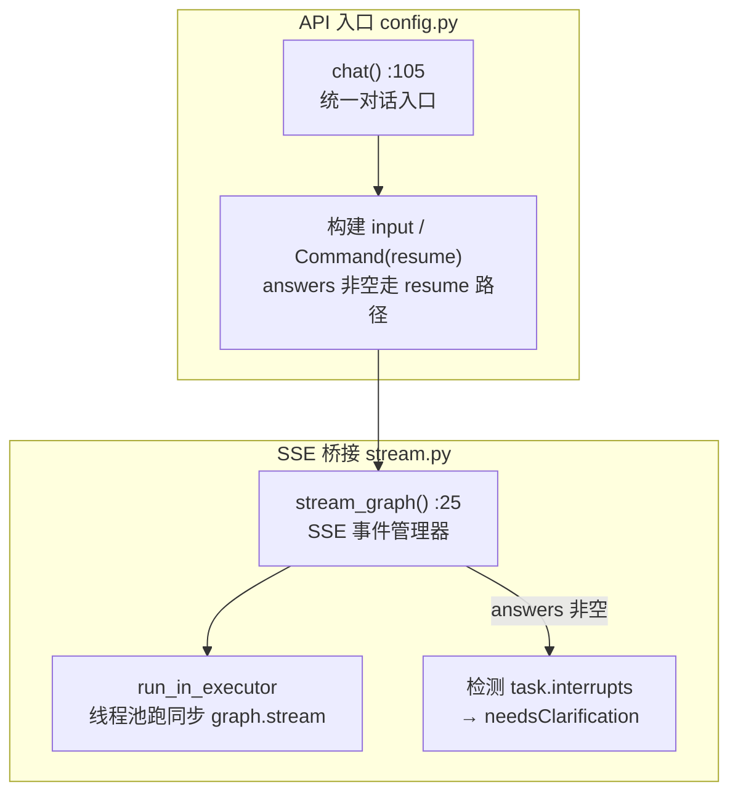

**第二层：LangGraph 图执行**

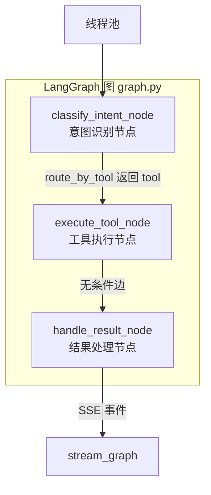

**第三层：工具执行（sdk + domains）**

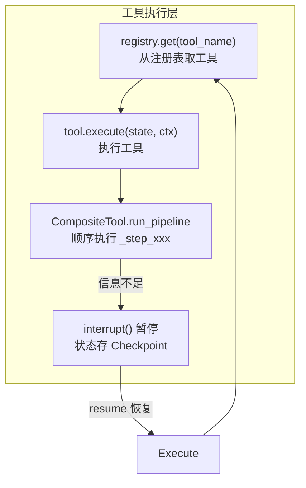

**第四层：基础设施调用**

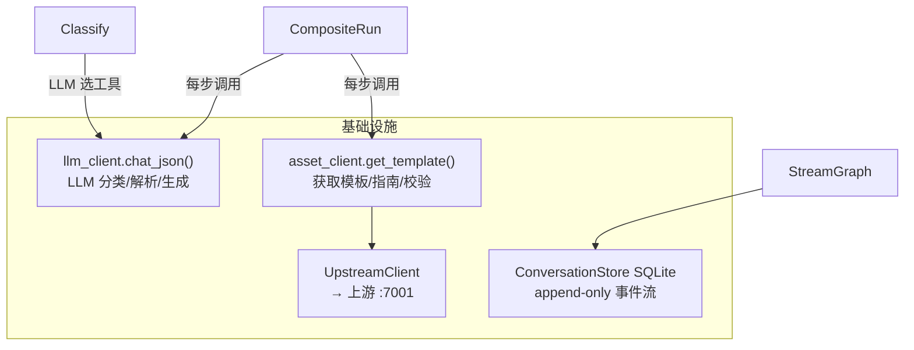

**调用链文字版**（以"创建请假表单"为例）：

> 这个表格展示了一次完整对话从 HTTP 请求到持久化的**全链路**，包含 LangGraph 的调度机制（条件边/无条件边）和工具内部的 6 步管线。

| 步骤 | 调用方 → 被调用方 | 文件:行 | 衔接说明 |
|------|-------------------|---------|---------|
| **1. HTTP 入口** | 前端 → `POST /api/config/chat` | `config.py:168` | 用户发消息，SSE 流式请求 |
| **2. 构建 input** | `chat()` → `stream_graph()` | `stream.py:60` | 构建初始 state（含 user_input/compressed_history/context_artifact/tool_state），answers 为空走全新 input |
| **3. 启动图执行** | `stream_graph` → `loop.run_in_executor` → `graph.stream()` | `stream.py:212` | 同步 `graph.stream` 丢线程池跑，逐 chunk 通过 `call_soon_threadsafe` 回传 SSE |
| **4. LangGraph 调度** | `graph.stream` → **classify_intent 节点** | LangGraph 自动 | `add_edge(START, "classify_intent")` 是入口边，graph.stream 自动调第一个节点 |
| **5. 两级路由** | `classify_intent_node` → 一级 `_route_pack` → 二级 `router.route()` | `nodes.py:108/118` | 一级按 config.yaml 领域描述选 pack（单 pack 直通零 LLM），二级由 pack 提供领域规则选工具 |
| **6. 校验工具存在** | `classify_intent_node` → `registry.get(name)` | `nodes.py:127` | 二级路由返回的工具名必须真实存在才采用，否则走兜底 chat |
| **7. 写入 state** | `classify_intent_node` 返回 `{"tool_name": "create_form", ...}` | `nodes.py:129` | 返回增量 dict，LangGraph 自动 merge 到 state |
| **8. 条件边路由** | LangGraph 调度器 → `route_by_tool(state)` | `nodes.py:419` | `tool_name` 非空 → 返回 `"tool"` → 映射到 `execute_tool` 节点 |
| **9. 取工具实例** | `execute_tool_node` → `registry.get("create_form")` | `nodes.py:168` | 从注册表取 CreateFormTool 实例 |
| **10. 构建上下文** | `execute_tool_node` → `ToolContext(llm_client, asset_client, emit, ...)` | `nodes.py:231` | 注入依赖（类比 @Autowired） |
| **11. 执行工具** | `execute_tool_node` → `tool.execute(tool_state, ctx)` | `nodes.py:253` | CreateFormTool.execute 内部调 `self.run_pipeline(state, ctx)` |
| **12. 发管线定义** | `run_pipeline` → `ctx.emit("pipeline_definition", steps)` | `tool.py:153` | 先告诉前端有 6 步，前端渲染进度条 |
| **13. Step 1** | `_step_fetch_guide` → `ctx.asset_client.get_guide()` → `HttpAssetClient` → `UpstreamClient.get_guide()` | `create_form.py:168` | GET 上游 :7001/guide.json → `sanitize_obj` 清洗 |
| **14. Step 2** | `_step_list_assets` → `ctx.asset_client.list_templates()` | `create_form.py:175` | 获取可用模板列表 |
| **15. Step 3** | `_step_parse_fields` → `ctx.llm_client.chat_json()` | `create_form.py:184` | LLM 解析自然语言→字段列表（如返回 `needsClarification` 则 raise 追问） |
| **16. Step 4** | `_step_fetch_templates` → `ctx.asset_client.get_template()` | `create_form.py:240` | 根据字段类型匹配模板详情 |
| **17. Step 5** | `_step_generate` → `ctx.llm_client.chat_json()` | `create_form.py:289` | LLM 生成表单配置 JSON |
| **18. Step 6** | `_step_validate` → `ctx.asset_client.validate_artifact()` | `create_form.py:366` | 上游校验。**有 errors → retry**：重跑 `_step_generate`（带错误上下文），最多 3 次（`create_form.py:428`）；**只有 warnings → 通过** |
| **19. 返回 ToolResult** | `tool.execute` 返回 `ToolResult(artifact=配置JSON)` | `create_form.py:91` | 写入 `state["tool_result"]` |
| **20. 无条件边** | LangGraph 调度器 → `add_edge("execute_tool", "handle_result")` | `graph.py:145` | execute_tool 执行完**必然**到 handle_result（无条件边） |
| **21. 三态分流** | `handle_result_node` 检查 ToolResult | `nodes.py:332` | artifact_type="config" → 构造 SSE result（含 config + valid + validationErrors） |
| **22. SSE 推送** | `handle_result` 返回 `{"sse_events": [...]}` | `nodes.py:404` | stream_graph 的 `_process_chunk` 消费 sse_events → `StreamManager.emit_result()` |
| **23. 条件边路由** | LangGraph 调度器 → `route_after_result(state)` | `nodes.py:433` | `tool_result` 有值 → 返回 `"done"` → 映射到 END |
| **24. 持久化** | `stream_graph` → `_save_result_conversation()` | `stream.py:359` | 写 user + assistant 消息到 events 表，更新 session_meta（含当前制品快照） |

**追问链路（步骤 15 信息不足时）**：

| 步骤 | 调用方 → 被调用方 | 文件:行 | 衔接说明 |
|------|-------------------|---------|---------|
| A1 | `_step_parse_fields` 返回 `needsClarification` | `create_form.py:184` | LLM 判断信息不足，返回追问问题 |
| A2 | `execute_tool_node` 检测 `result.ask` 非空 | `nodes.py:280` | 不返回 ToolResult，改走 interrupt 路径 |
| A3 | 调 `interrupt({questions, summary})` | `nodes.py:298` | 抛 PauseSignal，Checkpoint 自动保存当前 state，graph.stream 正常收尾返回 |
| A4 | `graph.stream` 自动停止迭代 | `stream.py:265` | graph.stream 遇到 interrupt 不抛异常，自然结束循环（本轮执行结束） |
| A5 | `stream_graph` 检测 `graph.get_state().tasks[].interrupts` | `stream.py:287` | 从 task.interrupts 提取追问数据 |
| A6 | 推 SSE `needsClarification` 事件 | `stream.py:298` | 前端渲染追问卡片 |
| A7 | 用户回答 → `POST /api/config/chat` 带 `answers` | `config.py:168` | 新 HTTP 请求，answers 非空 |
| A8 | `stream_graph` 走 `Command(resume=answers)` | `stream.py:110` | graph 读 Checkpoint 从头重跑 execute_tool，answers 作为 `interrupt()` 的返回值注入 |
| A9 | `execute_tool_node` 从 `interrupt()` 后恢复 | `nodes.py:308` | answers 注入 `tool_state["clarify_answers"]`，清除 `_need_clarify` 标记 |
| A10 | 返回 `{"tool_result": None}` 触发 rerun | `nodes.py:315` | 返回 None 的 tool_result 会被 route_after_result 识别为"需要重跑" |
| A11 | `route_after_result` 返回 `"rerun"` | `nodes.py:433` | `tool_result is None` 且有 `tool_name` → 重跑 execute_tool |
| A12 | 重跑 `tool.execute`（这次有完整信息） | `nodes.py:253` | 正常完成 → 步骤 19 继续走后续链路 |

> **📖 深入阅读**：每个步骤的源码实现见「第十五章 关键实现深度解析」。工具执行的 6 步管线详见「第十五章 15.7」。追问机制详见「第八章 追问（Clarification）机制详解」。

---

### 第五章 三层六边形架构详解

> **术语速解（Java 视角）**：
> - **六边形架构（端口与适配器）**：核心业务逻辑（Engine）不依赖外部，通过"端口"（SDK 抽象接口）与外部交互。类比 Spring 的 `@Controller` 不直接调 `DataSource`，而是调 `Repository` 接口。
> - **ABC（Abstract Base Class）**：Python 的抽象基类，类似 Java `abstract class` 或 `interface`。`Tool(ABC)` 定义了工具协议，子类必须实现 `execute`。

**上层（API + Engine + SDK）**：

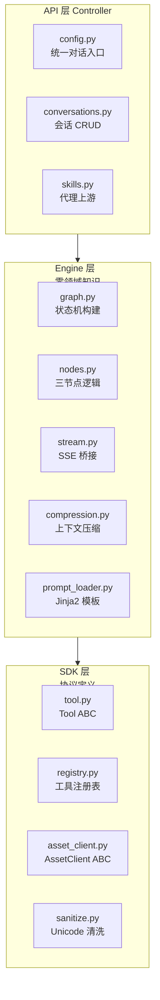

**下层（Domains + Infra）**：

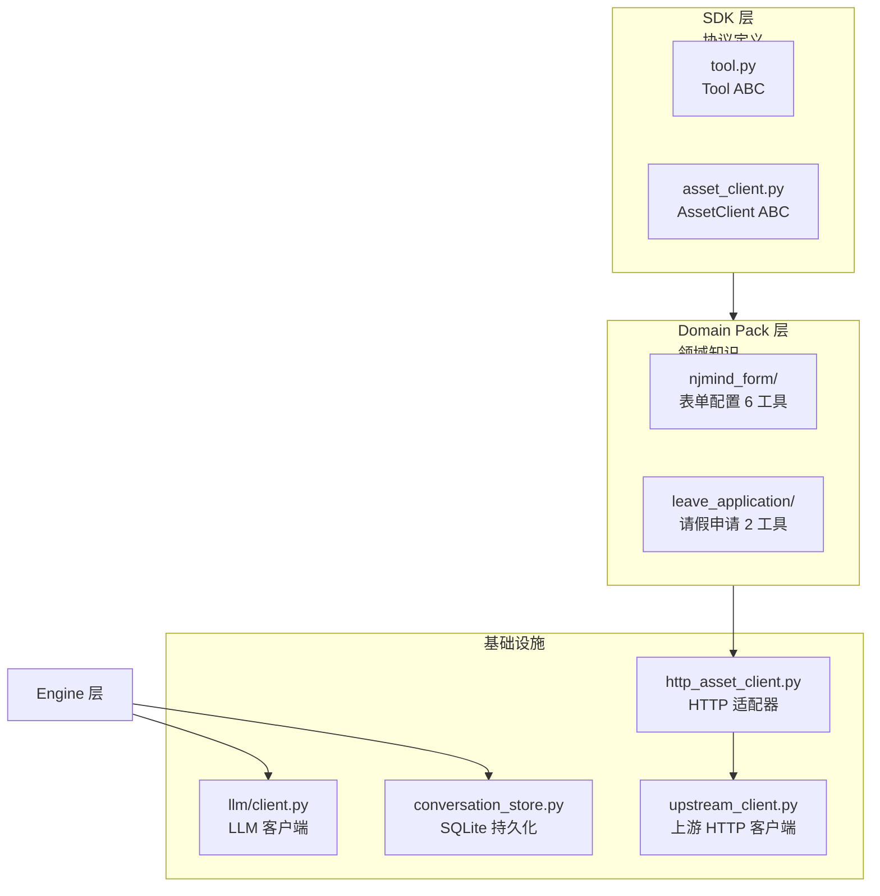

**层级依赖约束**：

| 规则 | 说明 | 验证方法 |
|------|------|---------|
| Engine 不依赖 Domains | Engine 不知道表单/请假是什么 | `grep -rE "form\|leave\|请假" engine/` 返回空 |
| Domains 依赖 SDK | 工具实现 Tool ABC | import sdk.tool |
| Adapters 实现 SDK | HttpAssetClient 实现 AssetClient ABC | extends AssetClient |
| 新增业务只改 Domains | 加一个 `domains/xxx/` 目录 | discover_packs 自动发现 |

---

### 第六章 数据库模型

> **术语速解（Java 视角）**：
> - **SQLite**：轻量级文件数据库，无需独立服务。类比 Java 的 H2 Database。项目用 WAL 模式（Write-Ahead Logging，类比 MySQL 的 redo log）。
> - **append-only（只追加）**：事件只追加不修改，类比 Event Sourcing。对话历史是事件流，压缩时追加 `compacted` 事件而非删除旧的。

项目用 SQLite（无 ORM），3 张表：

**主表 events（事件流）**：

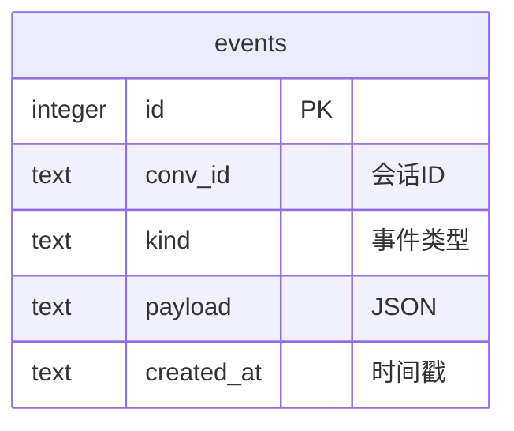

**关联表（会话元数据 + 调用审计）**：

```mermaid
erDiagram
    events ||--o{ session_meta : "conv_id"
    events ||--o{ call_logs : "conv_id"

    session_meta {
        text conv_id PK
        text user_id
        text title
        text summary "压缩摘要"
        text current_config "当前制品快照(存储层字段名, 保留)"
        text created_at
        text updated_at
    }

    call_logs {
        integer id PK
        text conv_id
        text call_type "llm/upstream"
        text endpoint
        text request_data
        text response_data
        integer status_code
        integer duration_ms
        text error_message
        text created_at
    }
```

**events 表的 kind 取值**：

| kind | 含义 | 类比 Java |
|------|------|----------|
| `user` | 用户消息 | `UserMessage` |
| `assistant` | AI 回复 | `AssistantMessage` |
| `tool_result` | 工具执行结果 | `ToolResponse` |
| `compacted` | 压缩后的历史 | 压缩后的日志 |
| `compact_trace` | 压缩操作记录 | 压缩操作的审计 |
| `checkpoint` | LangGraph 检查点 | 游戏存档 |
| `ask` | 追问请求 | `ClarificationRequest` |

---

### 第七章 SDK 协议层详解

SDK 层是架构的核心——定义了 Engine 和 Domain Pack 之间的协议。

#### 7.1 Tool ABC（工具抽象基类）

**Tool 继承体系图**：

```mermaid
classDiagram
    class Tool {
        <<abstract>>
        +name: str
        +when: str

        +validate_input(input) str
        +summarize_artifact(artifact) str
        +title_for(artifact) str
        +format_result(artifact) dict
        +execute(state, ctx) ToolResult*
    }

    class CompositeTool {
        +steps: list~str~
        +run_pipeline(state, ctx)
    }

    class ChatTool {
        +_build_capabilities()
    }
    class CreateFormTool {
        +steps = 6步
    }
    class ModifyFormTool {
        +_plan_ops() 增量指令集
    }
    class GetFormTool {
        +查询已有表单
    }

    Tool <|-- CompositeTool
    Tool <|-- ChatTool
    CompositeTool <|-- CreateFormTool
    CompositeTool <|-- ModifyFormTool
    Tool <|-- GetFormTool
```

```python
# sdk/tool.py — Tool 抽象协议（安全标记位已退役，见 12.11）
class Tool(ABC):
    name: str                          # 工具名（唯一标识）
    description: str                   # 给 LLM 的描述
    when: str                          # 什么时候用这个工具
    artifact_type: str                 # "config" | "data"

    def validate_input(self, state) -> str | None   # execute 前语义自检
    @abstractmethod
    def execute(self, state, ctx) -> ToolResult: ...

    # Engine 通过这些钩子避免读制品内部（架构试金石）
    def validate_input(self, input): ...       # 输入校验
    def summarize_artifact(self, artifact): ... # 制品摘要
    def title_for(self, artifact): ...          # 制品标题
    def format_result(self, result): ...        # 结果格式化
```

> **注**：曾有 Fail-Closed 安全标记位（is_destructive/is_read_only/is_concurrency_safe），已整批退役——审查发现 is_concurrency_safe 全仓零消费、另两者的唯一消费点在不可达分支（详见 12.11 ADR）。实际防线：路由数据铁律 + 各工具 validate_input 语义自检。

#### 7.2 CompositeTool（模板方法模式）

```python
# sdk/tool.py:137
class CompositeTool(Tool):
    steps: list[str]  # 子类定义步骤名，如 ["fetch_guide", "generate", "validate"]

    async def run_pipeline(self, state, ctx) -> ToolResult:
        # 先发管线定义给前端（显示进度条）
        ctx.emit("pipeline_definition", {"steps": self.steps})
        # 顺序执行 _step_xxx
        for step in self.steps:
            method = getattr(self, f"_step_{step}")
            result = await method(state, ctx)
            if isinstance(result, ClarificationRaised):
                # 信息不足 → interrupt 追问
                raise result
        return ToolResult(artifact=...)
```

> **术语速解（Java 视角）**：
> - **模板方法模式**：`CompositeTool.run_pipeline` 是模板（定义步骤骨架），子类的 `_step_xxx` 是具体实现。类比 `HttpServlet.doGet()` 调 `processRequest()`——框架控制流程，子类填逻辑。

#### 7.3 AssetClient ABC（资产抽象）

```python
# sdk/asset_client.py:42
class AssetClient(ABC):
    # 表单类操作
    @abstractmethod
    async def get_template(self, template_id) -> dict: ...
    @abstractmethod
    async def list_templates(self) -> list: ...
    @abstractmethod
    async def get_schema(self) -> dict: ...
    @abstractmethod
    async def get_guide(self) -> dict: ...
    @abstractmethod
    async def validate_artifact(self, config) -> dict: ...
    @abstractmethod
    async def persist_artifact(self, config) -> dict: ...

    # 通用数据操作
    @abstractmethod
    async def submit_data(self, data) -> dict: ...
    @abstractmethod
    async def query_data(self, query) -> dict: ...
```

`HttpAssetClient` 是它的实现，调上游 njmind-modeler API。

---

### 第八章 追问（Clarification）机制详解

追问是本项目的核心亮点之一——工具执行到一半发现信息不足时，能暂停等用户补充，然后从断点恢复。

```mermaid
flowchart TD
    Execute["工具执行中"] --> Need{"信息不足？"}
    Need -->|否| Continue["继续执行"]
    Need -->|是| Ask["返回 ToolResult(ask=AskSpec)"]

    Ask --> Interrupt["nodes.py: interrupt()"]
    Interrupt --> Save["Checkpoint 自动保存状态"]
    Save --> SSE["SSE needsClarification → 前端"]
    SSE --> Card["前端渲染追问卡片"]
    Card --> Wait["等待用户输入"]

    Wait --> Answer["用户回答"]
    Answer --> Post["POST /api/config/chat<br/>带 answers 参数"]
    Post --> Resume["stream.py: Command(resume=answers)"]
    Resume --> Restore["Checkpoint 恢复状态"]
    Restore --> Inject["answers 注入 tool_state"]
    Inject --> Clear["清除中断标记"]
    Clear --> Rerun["重跑 execute_tool"]
    Rerun --> Complete["字段完整 → 正常完成"]
```

> **术语速解（Java 视角）**：
> - **interrupt / resume**：LangGraph 的中断恢复机制。`interrupt(value)` 抛 `PauseSignal` 暂停图执行——状态自动存到 Checkpoint（`graph.stream()` 正常收尾返回，本轮执行结束，HTTP 响应关闭）；用户回答后**新的 HTTP 请求**调 `Command(resume=data)`，LangGraph 读 Checkpoint 从头重跑被中断的节点函数，`interrupt()` 这次**不抛异常、直接返回 data**，代码从 `interrupt()` 调用处继续往下走。**不是线程暂停——是执行栈展开 + 状态存档 + 重跑节点函数**。类比 Activiti 的 `processInstance.signal()` 但是跨 HTTP 请求。
> - **AskSpec**：追问规格，声明式定义要问什么（问题文本 + 选项列表）。类比 Java 的 `ValidationException` 带字段提示。

---

#### 8.1 interrupt/resume 全链路（本项目最值得学的一块）

**触发侧**（工具 → 引擎）：

```python
# tools/create_form.py — 信息不足时抛领域异常（不直接调 interrupt）
raise ClarificationRaised([
    "请选择字段类型：文本 / 数字 / 日期",
    "是否需要审批流？",
])

# engine/nodes.py execute_tool_node — 引擎统一转 LangGraph interrupt
except ClarificationRaised as e:          # ⚠ 必须在 except Exception 之前！
    questions = interrupt(e.questions)    # 图在这里暂停，state 存入 checkpoint
    state["tool_state"]["clarify_answers"] = questions  # resume 后拿到答案
```

**持久化**：`save_pending_ask(conv_id, tool, questions, round)` 落 events 表
（kind=ask，最新一条生效）——刷新页面也能取回未答追问。

**恢复侧**（下一个 HTTP 请求）：

```python
# engine/stream.py — answers 非空表示这是"回答追问"的请求
graph.stream(Command(resume=answers), config={"configurable": {"thread_id": conv_id}})
# LangGraph 行为：从头重跑被中断的节点函数 execute_tool，
# 再次执行到 interrupt(...) 时直接返回 answers（不再暂停）——
# 效果等价于"从暂停点继续"，实现是"重放节点 + interrupt 透传答案"。
```

**⚠ 真实踩坑一：追问被吞成报错 + resume 死循环。** 早期 `except Exception`
写在了 `except ClarificationRaised` 前面——领域异常被当普通错误吞掉，前端收到
error 而不是追问卡片；用户补一句话后又被当成新请求、工具从头再追问……修复就是
调整捕获顺序（上面代码的注释处）。**教训：interrupt 依赖异常向上冒泡，任何宽泛
的 except 都要给领域异常让路。**

**⚠ 学习要点二：重跑语义对工具设计的要求。** resume 后节点函数**从头执行**——
意味着 interrupt 之前的步骤（拉模板、调 LLM 解析）会重跑一遍。工具要么把重算
做幂等（本项目：缓存/步骤结果写 tool_state，重跑先查），要么把可能 interrupt 的
步骤尽量前置。create_form 的做法：解析结果存 `state["parsed_fields"]`，
resume 分支检测到就跳过重新解析。


### 第九章 上下文压缩机制

> **术语速解（Java 视角）**：
> - **token**：LLM 的计量单位。中文每字约 1.5 token，英文每 4 字符约 1 token。LLM 有 token 上限（如 Qwen3 的 262144），超了必须压缩。
> - **熔断器**：和 Resilience4j/Hystrix 一样。压缩连续失败 3 次触发熔断，降级为简单截断。

```mermaid
flowchart TD
    Msg["新消息进来"] --> Check{"历史 token > 70%<br/>模型上限？"}
    Check -->|否| Normal["直接用完整历史"]
    Check -->|是| Compress["触发压缩"]

    Compress --> CB{"熔断器状态？"}
    CB -->|open 熔断中| Fallback["降级：截断保留最近 N 条"]
    CB -->|closed 正常| LLM["LLM 摘要旧消息"]
    CB -->|half-open 试探| LLM

    LLM --> Success{"压缩成功？"}
    Success -->|是| Save["追加 compacted 事件"]
    Success -->|否| Count["失败计数+1"]
    Count --> Trip{"连续失败 ≥ 3？"}
    Trip -->|是| Open["熔断器 open 60s"]
    Trip -->|否| Fallback
```

**压缩特点**：
- **70% 阈值**：留 30% 给工具执行和 LLM 输出
- **熔断器**：连续 3 次失败熔断，期间降级为截断（信息损失但可用）
- **append-only**：压缩后追加 `compacted` 事件，不删除旧事件（可回溯）
- **后台压缩**：`CompressionSidechain` 在 forked 线程跑不阻塞主流程

---

### 第十章 嵌入模式（Embed SDK）

项目支持两种部署模式：独立模式和嵌入模式（作为 iframe 嵌入到其他系统）。

```mermaid
flowchart LR
    subgraph Host["宿主系统 njmind-modeler"]
        Button["浮动按钮"] --> Iframe["iframe LLMFormModeler"]
    end

    subgraph Embed["嵌入 SDK embed.ts"]
        SDK["LLMFormModeler 类<br/>postMessage 通信"]
    end

    Host <-->|postMessage| Embed

    Msg1["MODELER_INIT<br/>宿主→嵌入：传 headers"] --> Embed
    Msg2["CONFIG_GENERATED<br/>嵌入→宿主：传配置"] --> Host
    Msg3["CONFIG_APPLY<br/>宿主→嵌入：应用配置"] --> Embed
    Msg4["CLOSE<br/>宿主→嵌入：关闭"] --> Embed
```

> **术语速解（Java 视角）**：
> - **postMessage**：浏览器跨窗口通信 API。iframe 和宿主页面通过 `window.postMessage()` 互发消息。类比 Java RMI 但是前端版。
> - **forward_headers（请求头透传）**：嵌入模式下，宿主系统的认证头（X-User-Id / Authorization / Cookie）透传到后端再透传到上游 API，实现单点登录。类比 Spring 的 `SecurityContextHolder` 传递但跨系统。

**请求头全链路透传图**（单点登录核心）：

```mermaid
flowchart LR
    subgraph Host["宿主系统 njmind-modeler"]
        Login["用户已登录<br/>持有 X-User-Id / Cookie"]
        Login -->|postMessage MODELER_INIT<br/>带认证头| SDK
    end

    subgraph Frontend["嵌入 SDK（iframe）"]
        SDK["LLMFormModeler<br/>存到 forwardHeaders"]
        SDK -->|每次 API 请求带上头| Backend
    end

    subgraph Backend["本项目后端"]
        Extract["_extract_forward_headers<br/>白名单提取认证头"]
        Extract --> Graph["LangGraph 执行"]
        Graph --> Forward["forward_headers 透传"]
    end

    subgraph Upstream["上游 njmind-modeler API"]
        API[":7001 接口<br/>校验 X-User-Id / Cookie"]
    end

    Forward -->|HTTP 请求带认证头| API

    API -->|认证通过<br/>返回用户数据| Result["免二次登录<br/>单点登录完成"]
    Result --> SDK
```

> **链路关键点**：宿主登录态 → postMessage 传给 iframe SDK → SDK 存 forwardHeaders → 每次 API 请求带上 → 后端 `_extract_forward_headers` 白名单提取 → 透传到 GraphState.forward_headers → 工具调上游时带上 → 上游校验通过。**全程不重新登录**，这就是"单点登录"的本质——认证态跨系统透传。

---

### 第十一章 安全架构

> **术语速解（Java 视角）**：
> - **Fail-Closed**：安全默认是"危险"。工具默认认为会破坏数据、不是只读、不并发安全，必须显式声明安全才被信任。类比 SecurityManager 默认拒绝。
> - **Unicode 隐写注入**：用零宽字符（不可见）藏指令到上游返回数据里，影响 LLM 判断。类比 SQL 注入但是用 Unicode 字符。

**输入安全 + 工具安全**：

```mermaid
graph LR
    subgraph L1["1. 输入安全"]
        L1a["Unicode 隐写清洗<br/>sanitize_obj — NFKC + 危险字符移除"]
        L1b["上游数据必经清洗<br/>http_asset_client 每个 get_* 都调 _clean"]
    end

    subgraph L2["2. 工具安全"]
        L2a["路由数据铁律<br/>无制品必创建（pack router）"]
        L2b["工具语义自检 validate_input"]
        L2c["execute 前语义校验<br/>失败则回流给 LLM 重新选择"]
    end
```

**传输安全 + 日志安全 + 数据安全**：

```mermaid
graph LR
    subgraph L3["3. 传输安全"]
        L3a["请求头透传白名单<br/>只转发 x-/authorization/cookie/tenant"]
        L3b["排除 hop-by-hop 头<br/>host/content-length/connection"]
        L3c["CORS 配置"]
    end

    subgraph L4["4. 日志安全"]
        L4a["凭证脱敏 RedactFilter<br/>Bearer/sk-/Authorization/Cookie/JWT"]
        L4b["挂 root logger<br/>所有日志都过脱敏"]
    end

    subgraph L5["5. 数据安全"]
        L5a["append-only 事件流<br/>不修改不删除可审计"]
        L5b["SQLite WAL 模式<br/>并发读写隔离"]
        L5c["调用日志 call_logs<br/>LLM/上游调用全程审计"]
    end
```

**安全层次详解**：

| 层次 | 措施 | 代码位置 | 说明 |
|------|------|---------|------|
| 输入安全 | Unicode 清洗 | `sdk/sanitize.py:87` | NFKC 归一化 + 删零宽/方向反转/BOM/私用区字符 |
| 输入安全 | 上游数据强制清洗 | `adapters/http_asset_client.py:44` | 每个 `get_*` 方法返回前必过 `sanitize_obj`（`_clean`） |
| 工具安全 | validate_input 语义自检 + 路由数据铁律 | 曾用安全标记位 | 标记位三处消费均为死逻辑，已退役（12.11） |
| 工具安全 | 制品存在检查 | 路由前置铁律 | 无制品 → 强制 create_form（`router.py`，NjmindFormRouter） |
| 工具安全 | 输入校验钩子 | `sdk/tool.py:103` | `validate_input` 在 execute 前调 |
| 传输安全 | 请求头白名单 | `api/config.py:133` | 只转发匹配前缀的头 |
| 传输安全 | 排除 hop-by-hop | `api/config.py:128` | host/content-length 等不转发 |
| 日志安全 | 凭证脱敏 | `engine/logging_filter.py:82` | RedactFilter 正则替换 Bearer/sk-/Authorization/Cookie |
| 日志安全 | 挂 root logger | `main.py:70` | `install_redact_filter()` 启动时挂载 |
| 数据安全 | append-only | `services/conversation_store.py:681` | `_append_event` 只 INSERT 不 UPDATE |
| 数据安全 | 调用审计 | `services/conversation_store.py:578` | `save_call_log` 记录 LLM/上游调用 |

> **核心原则 — Fail-Closed**：安全相关功能出问题拒绝而非放行。
>
> **📖 深入阅读**：Unicode 清洗实现见「附录 C」的 `sdk/sanitize.py`；Fail-Closed 默认值见「第七章 7.1 Tool ABC」。

---

### 第十二章 关键设计决策

| 决策 | 选择 | 替代方案 | 理由 |
|------|------|---------|------|
| AI 框架 | LangGraph StateGraph | 自建状态机 | 原生 interrupt/resume 支持追问；Checkpoint 自动持久化；节点是纯函数易测试 |
| 架构 | 三层六边形 | 单体 | Engine 零领域知识可复用；新增业务只加 Domain Pack |
| 工具协议 | Tool ABC + 钩子 | Engine 读制品内部 | 钩子隔离让 Engine 不依赖领域数据结构 |
| 多步工具 | CompositeTool 模板方法 | Engine 编排步骤 | 工具自己管理步骤，Engine 只调 execute |
| 追问机制 | LangGraph interrupt/resume | 自建暂停/恢复 | 原生支持 + Checkpoint 自动持久化 |
| 安全防线 | 路由数据铁律 + validate_input 语义自检 | 声明式安全标记位 | 标记位已退役（12.11），确定性防线优于 LLM/声明
| 动态能力上报 | ChatTool 从 registry 读 | 手写能力列表 | 新增工具自动被介绍 |
| 持久化 | SQLite append-only | PostgreSQL | 轻量、无依赖、事件流可回溯 |
| Checkpoint | SqliteSaver（显式长连接） | PostgresSaver | 重启追问现场存活是硬需求；from_conn_string 的坑见 3.3 |
| 上下文压缩 | LLM 摘要 + 熔断器 | 简单截断 | 保语义 + 防失败浪费 API |
| Prompt 模板 | Jinja2 + YAML frontmatter | 字符串拼接 | 支持变量/条件/循环 + section 级缓存 |
| Unicode 清洗 | NFKC + 危险字符移除 | 不清洗 | 防上游内容隐写注入（零宽字符藏指令） |
| 实时推送 | SSE | WebSocket | 单向推送场景 + 天然过代理 + 自动重连，WS 双向能力用不上 |
| 并发模型 | 线程池跑同步 graph.stream | 全 async | LangGraph 节点是同步 API，async 传染性高改造成本大，线程池隔离最务实 |
| LLM 容错 | 三层防线（超时兜底/输出降级/清洗熔断） | 单次调用 | LLM 是概率系统，每个调用点都要降级路径 |
| 上下文管理 | 摘要 + keep-recent + 状态补偿 | 纯截断 | 保语义（摘要）+ 保最新（keep-recent）+ 补回关键信息（hydration） |

上表是速览。下面九篇按【背景问题 → 候选方案 → 选择与理由 → 踩坑 → 最终形态】
展开实录——**演进过程比结论更值得学**，多数决策经历过真实事故与修正。

---


#### 12.1 修改协议：全量重生成 → 增量指令集（Claude Code Edit 同源）

- **背景**：modify 让 LLM 吃 16-20KB 完整配置、回吐完整配置——33s/单，且全量
  重写会"漏抄/改坏未提及字段"。
- **候选**：a) 标准 JSON Patch（RFC 6902，path 数组下标定位，LLM 极易错位）；
  b) 两阶段读-改（最准但两轮 LLM 延迟翻倍）；c) 自定义指令集（锚点=内容而非坐标）。
- **选择 c**，理由与 Claude Code 编辑文件同构：`old_string`（内容锚）比行号稳；
  输出量与改动量成正比；未提及内容物理上不可能被破坏（根本没输出）。
- **踩坑**：① 最初按直觉把选项写成 `options:[{label,value}]`，真实配置是
  `optionSettings.optionFields[{optionLabel,optionValue}]`——"改选项假装成功"
  （打到无效键、校验也不报）。修复：目录摘要给**完整 optionSettings**（LLM 能
  抄到兄弟键）。② "改 A 偶尔动到 B"：postprocess 全配置归一化会剥 B 的
  null/布尔——修复 `restore_untouched`：未指令触碰的字段从基线逐字节还原。
- **最终形态**：六指令 + 双锚 + 原子性 + 同类型克隆补全 + 全量兜底三条升格路径。
  **37s → 4s（9 倍）**，E2E 零重试一次通过。

#### 12.2 校验策略：绝对通过 → 差分校验 + 机械修复不烧 LLM

- **背景**：上游校验比设计器保存口径严——原始配置本身就带违规（存量），要求
  "AI 结果绝对通过"等于要求它修宿主祖传问题，重试烧尽也做不到。
- **差分校验**：先验原始配置得"存量违规清单"，只把 **AI 新增的** 违规判失败；
- **机械修复**：「必填项缺失/值域不合法/未知字段」是确定性错误——值从
  「表内同类型字段 → 上游模板 → config 兜底表」三级抄写，本地循环修完，绝不
  烧 LLM 重试（曾每单多烧 35s）。
- **教训**：LLM 的重试额度是昂贵资源，只花在"真的需要智能"的地方。

#### 12.3 嵌入协议：裸 postMessage → 信封契约

- **背景**：最初 SDK 与 iframe 用裸消息（`MODELER_CONFIG_APPLY` 等），无版本、
  无身份、无请求关联。
- **踩坑三连**：① 宿主把 requestId 塞 payload，子应用在信封顶层等——**双侧
  永远匹配不上，全部超时**（最隐蔽的一类协议 bug）；② INIT 在 iframe.onload
  就发，此刻子应用监听未挂——必丢（修复：等 READY 再发）；③ gzip 事故（17.6）。
- **最终形态**：`{v, src, id?, type, payload}` 信封 + 八种消息 + capabilities
  协商（宿主缺什么能力，子应用降级什么功能）+ services 地址表。协议**零领域词**
  ——换插件换宿主都不改协议。

#### 12.4 领域内容外迁 manifest：三部曲

通用组件 ChatPanel 里曾先后发现：`artifactType:'form-config'` 硬编码、
FIELD_LABEL_MAP（20 个表单字段翻译）、欢迎页示例卡、按钮动作集——**每次都是
"第二个插件会怎样"这个问题照出来的**。解法一致：内容搬进 pack 的
config.yaml（`artifact.type / display.data_labels / welcome_examples / actions`），
组件只按声明渲染。判断标准一句话：**这行代码换个插件要不要改？要改就不该在组件里。**

#### 12.5 AI 永不落库

所有工具的产物最多渲染到宿主画布（isSaved=false），保存只属于业务人员手动点
保存。clone_form 曾有 persist 调用，删除。理由：AI 是草稿生成器不是写入者——
责任人必须是人；也让"AI 改坏了"永远可恢复（刷新/回滚即可）。

#### 12.6 SSE 三道保障（一次假死事故的复盘）

- **现象**：用户"网络请求一直没响应"，但后端日志显示事件早已发出。
- **定位**：curl 直连后端与经 vite 代理都实时；经 rsbuild（7114）——响应头多了
  `Content-Encoding: gzip`，且 30 秒管线的**全部事件同一秒到达**。读 rsbuild
  源码：gzip 中间件用 `zlib.createGzip` 无 flush，小事件进 zlib 缓冲攒到流结束。
- **三道保障**：后端 15s 心跳 + 响应头 `Cache-Control: no-transform`（HTTP
  标准语义：中间层不得压缩/改写）+ 前端 60s 空闲看门狗明确报错。
- **修复落地**：宿主 dev server 关掉 gzip 中间件（`server.compress: false`），
  让 SSE 事件实时抵达；本项目前端 dev 用的 vite 代理天然无此问题（SSE 事故
  发生在经 rsbuild/网关中间代理的场景）。
- **教训**：排查"后端正常前端卡"类问题，**中间代理层永远在嫌疑名单上**；
  用"事件到达时间戳"取证比看日志时间戳可靠。

#### 12.7 会话存储与回滚的取舍

events 表 append-only（Event Sourcing）：user/assistant/tool_result/checkpoint/ask
五类事件按序追加，状态=重放。曾考虑独立"版本库"（后端截断式回滚 API），最终
按使用诉求收敛为**纯前端版本切换**（git checkout 式）：配置卡片即版本锚点，
对话记录保留、只切当前制品+
（嵌入）自动应用画布；刷新恢复完整历史——"工作区临时回退"而非"历史抹除"。
轻，且够用。

#### 12.8 跨仓协作：模板即 VO 适用属性全集

上游 njmind-modeler 的模板由 Java 注解编译期生成。真实事故：`user_field`
模板自身缺 `selectMode`，而校验要求必填——**事实源自相矛盾**，AI 照模板生成
必挂。修复分两层：llm 侧机械修复兜底（17.2）；上游补齐 60 处模板缺口 + 校验器
`FAIL_ON_UNKNOWN_PROPERTIES=false`（真实画布带前端扩展键，严格反序列化把一切
判为失败——这正是 llm 侧"剥未知字段打地鼠"的同源病根）。**协作准则：机器生成
的说明（schema/校验）与机器生成的示例（模板）必须同源，人肉同步必腐。**

#### 12.9 平台与插件的分界线（含两笔挂账）

分界一句话：**引擎/前端只回答"怎么跑"，pack 回答"跑什么"**。已验证的试金石：
`grep 表单词` 在 engine/前端组件应为零（注释举例除外）。两笔已知分层债（记录
待还）：`services/upstream_client.py` 是 njmind 专属接口却住框架目录（应迁
pack）；AssetClient 协议方法名（get_form/validate_form）偏表单语义。YAGNI
边界示例：增量协议的"目录构建+原子 apply"骨架目前留在 pack——等第二个插件
需要增量时再提炼上移 sdk，不为不存在的需求抽象。

---

#### 12.10 标识禁改：prompt 教唆事故与双层防线

- **背景**：用户反馈"formCode 被改了、字段 key 也被改了"。排查发现教唆源头
  竟是全量 prompt 自己——旧规则白纸黑字写着"修改字段名时同步更新
  fieldTitleKey"，formCode 则留着"除非指令明确要求"的口子。
- **第二层根因**：某单增量升格全量后，LLM 重写完整配置时漏写 formCode
  （库里有 formCode=None 的事故产物）。
- **修复（双层）**：prompt 硬约束重写 + 代码级保护（增量 `update_field`
  静默剥离 patch 里的 fieldTitleKey 改名并留痕 applied；全量产物强制回填
  基线 formCode）。E2E 故意下"越权指令"（改名+改编码）实测守住。
- **教训**：**凡"禁止"类需求，prompt 只是第一道，代码层必须有独立防线**——
  LLM 是概率系统，指令遵循率永远 <100%；而这类防线恰是确定性的、零成本。

#### 12.11 状态标记位整批退役：四个"安全声明"的死逻辑审计

- **背景**：requires_existing_artifact / is_destructive / is_read_only /
  is_concurrency_safe 四个标记位，注释宣称"引擎据此要求确认/记审计日志/
  并发调度"——逐一核查消费方：
  - is_concurrency_safe：**全仓零消费**（纯装饰）；
  - is_destructive / is_read_only：唯一消费点在兜底函数的**不可达分支**
    （chat 工具永远存在，优先级 1 直接返回）；
  - requires_existing_artifact：被路由前置铁律与工具 validate_input 完全覆盖。
- **删除**：sdk 定义 + 24 处工具声明 + 死分支 + 对应测试（连带退役了
  旧扁平意图函数 _build_intent_prompt、dispatcher/pending_ask 死链、
  /generate /modify 废弃端点）。
- **教训**：**声明式标记位是"为写而写"的重灾区**——写下属性那一刻感觉
  在做架构，但如果没有人消费，它就是负债（虚假的安全感 + 维护成本 +
  误导读者的注释）。判断标准一句话：grep 消费方，数一数真实可达的调用。

### 第十三章 项目文件结构

```
llm-to-modler/
├── backend/src/                      # 后端核心代码
│   ├── main.py                       # FastAPI 入口 + lifespan
│   ├── mcp_server.py                 # MCP 协议服务
│   ├── api/                          # 路由层（Controller）
│   │   ├── config.py                 # 统一对话入口 SSE 流式
│   │   ├── conversations.py          # 会话 CRUD
│   │   ├── skills.py                 # 代理上游 templates/schemas
│   │   ├── health.py                 # 健康检查
│   │   └── sse.py                    # StreamManager + SSEEvent
│   ├── engine/                       # ★ Engine 引擎层（零领域知识）
│   │   ├── graph.py                  # StateGraph 构建 + compile
│   │   ├── graph_state.py            # GraphState TypedDict
│   │   ├── nodes.py                  # 三节点逻辑（classify/execute/handle）
│   │   ├── stream.py                 # graph.stream → SSE 桥接
│   │   ├── conversation.py           # ConversationManager
│   │   ├── compression.py            # 上下文压缩（70%阈值+熔断+PTL）
│   │   ├── prompt_loader.py          # Jinja2 模板加载（缓存+覆写）
│   │   ├── state_keys.py             # 跨模块状态键常量（engine ↔ pack ↔ 前端）
│   │   └── logging_filter.py         # 日志凭证脱敏
│   ├── sdk/                          # ★ SDK 协议层
│   │   ├── tool.py                   # Tool/CompositeTool/ToolResult/AskSpec
│   │   ├── registry.py               # ToolRegistry
│   │   ├── pack_router.py            # PackRouter 协议（一级/二级路由）
│   │   ├── asset_client.py           # AssetClient ABC
│   │   └── sanitize.py               # Unicode 隐写清洗
│   ├── adapters/                     # 适配器
│   │   └── http_asset_client.py      # HttpAssetClient（HTTP 上游）
│   ├── domains/                      # ★ Domain Packs（领域知识）
│   │   ├── __init__.py               # 自动发现 load_all_packs()
│   │   ├── njmind_form/              # 表单配置插件（6 工具）
│   │   │   ├── pack.py               # 注册工具
│   │   │   ├── router.py             # NjmindFormRouter（领域路由规则）
│   │   │   ├── keys.py               # pack 私有 JSON 键常量
│   │   │   ├── config.yaml           # 领域描述/动作/欢迎语
│   │   │   ├── tools/                # create/modify/get/clone/image/chat
│   │   │   ├── models.py             # ParsedField/FormConfig
│   │   │   └── config.yaml           # 字段类型映射
│   │   └── leave_application/        # 请假申请插件（Demo）
│   ├── llm/client.py                 # LLM 客户端（OpenAI 兼容,多模态）
│   └── services/
│       ├── conversation_store.py     # SQLite 持久化
│       └── upstream_client.py        # UpstreamClient（httpx）
├── frontend/src/                     # Vue 3 前端
│   ├── App.vue                       # 根组件（独立/嵌入布局切换）
│   ├── embed.ts                      # 嵌入 SDK（独立演示形态）
│   ├── composables/hostPort.ts       # 嵌入契约宿主端口（信封协议/RESIZE）
│   ├── stores/conversation.ts        # Pinia store（含 diff 基线 baselineConfig）
│   ├── services/api.ts               # API 调用 + SSE 解析（60s 看门狗）
│   ├── utils/lineDiff.ts             # 行级 diff（LCS，GitLab 风格视图核心）
│   └── components/                   # 聊天/JSON 面板（JsonDiffView 变更视图）
├── tests/                            # 测试（3403 行）
├── README.md / TECH-ROADMAP.md
└── docker-compose.yml / .env
```

---

## 第二部分：学习路线图

### 学习路径总览

> **前置知识**：了解 Python 基础、了解 REST API 概念、了解 Vue 3 基础。
> **目标**：能读懂并修改代码，能新增 Domain Pack。
> **时间说明**：以下时间为"从零到能读代码"的估算。

```mermaid
graph LR
    S1["阶段一<br/>项目背景<br/>半天"] --> S2["阶段二<br/>技术栈<br/>3-5天"]
    S2 --> S3["阶段三<br/>架构<br/>1天"]
    S3 --> S4["阶段四<br/>核心流程<br/>1-2天"]
    S4 --> S5["阶段五<br/>深入模块<br/>5-10天"]
    S5 --> S6["阶段六<br/>扩展实践<br/>2-3天"]
```

---

### 阶段一：项目背景（半天）

#### 学习目标
理解项目定位、核心价值、架构理念。

#### 必读
- `README.md` — 项目概览
- 本文档「第一章 整体架构总览」

#### 验证方法
1. 用自然语言描述：这个项目解决什么问题？
2. 解释"Engine 层零领域知识"是什么意思
3. 说出三层六边形架构的每一层职责

#### 动手练习
1. 运行 `./start_dev.sh` 启动前后端
2. 在对话界面输入"创建一个请假表"，观察完整流程
3. 查看 `data/conversations.db` 的 events 表，理解 append-only 事件流

---

### 阶段二：技术栈（3-5 天，按需学习）

> ⚠️ 不要求精通全部技术栈，目标是"能读懂代码"。

| 技术 | 用途 | 学习重点 | Java 类比 |
|------|------|---------|----------|
| **Python 3.12** | 后端语言 | async/await、TypedDict、Pydantic | JDK 21 |
| **FastAPI** | Web 框架 | 路由、SSE、依赖注入 | Spring Boot |
| **LangGraph** | 状态机编排 | StateGraph、node、conditional edge、interrupt/resume | Spring State Machine |
| **Pydantic** | 数据校验 | BaseModel、Field、ConfigDict | Jackson + Bean Validation |
| **Jinja2** | Prompt 模板 | 变量、条件、循环 | Thymeleaf |
| **httpx** | HTTP 客户端 | 异步请求 | OkHttp |
| **SQLite** | 本地数据库 | SQL 基础即可 | H2 Database |
| **Vue 3 + TS** | 前端 | Composition API、Pinia | React Hooks + Redux |

#### 动手练习
1. 阅读 `engine/graph.py`，画出 StateGraph 的拓扑
2. 阅读 `sdk/tool.py`，理解 Tool ABC 的抽象方法
3. 运行 `python -m pytest tests/ -v`，看测试通过情况

---

### 阶段三：系统架构（1 天）

#### 必读
- 本文档「第一章 整体架构总览」+「第五章 三层六边形架构」+「第四章 模块间调用关系」

#### 验证方法
1. 画出三层架构图（不看文档默画）
2. 解释 Engine 为什么不能依赖 Domains
3. 说出 `grep -rE "form|leave" engine/` 为什么必须返回空
4. 说出「第四章 模块间调用关系」的 15 步调用链

#### 动手练习
1. 查看 `backend/src/engine/` 目录，确认无领域词汇（架构试金石）
2. 查看 `backend/src/domains/` 目录，理解 pack.py 约定
3. 阅读 `domains/__init__.py`，理解自动发现机制

---

### 阶段四：核心数据流（1-2 天）

#### 必读
- 本文档「第二章 核心数据流」+「第三章 状态机」+「第八章 追问机制」+「第十五章 关键实现深度解析」

#### 验证方法
1. 不看文档，完整描述一次对话的 3 个阶段
2. 解释 interrupt/resume 追问机制的完整流程
3. 说出 ToolResult 三态分别走什么 SSE 事件
4. 说出 `_step_validate` 校验失败的 retry 逻辑

#### 动手练习
1. 设置断点在 `nodes.py:154` 的 `execute_tool_node`，跟踪一次完整执行
2. 触发追问场景（信息不足时），观察 interrupt → needsClarification → resume 流程
3. 阅读 `engine/stream.py`，理解线程池跑同步 graph.stream 的 WHY

---

### 阶段五：深入模块（5-10 天）

#### 5.1 Engine 层（核心中的核心）

> **📖 深入阅读**：本文档「第十五章 关键实现深度解析」13.1-13.4；
> **学 LangGraph 重点啃第三章（概念/State/Checkpointer）与第八章（interrupt 全链路与踩坑）**；
> **学设计思想必读「第十二章」下半部**（九篇决策演进实录与事故复盘）

| 模块 | 文件 | 学习重点 |
|------|------|---------|
| 状态机构建 | `engine/graph.py` | build_graph 如何构建三节点 |
| 节点逻辑 | `engine/nodes.py` | 三个节点函数的实现细节 |
| SSE 桥接 | `engine/stream.py` | graph.stream 如何转成 SSE |
| 上下文压缩 | `engine/compression.py` | 70% 阈值 + 熔断器 + 后台压缩 |
| Prompt 加载 | `engine/prompt_loader.py` | Jinja2 + section 缓存 + 覆写 |

#### 5.2 SDK 层

| 模块 | 文件 | 学习重点 |
|------|------|---------|
| Tool ABC | `sdk/tool.py` | 抽象基类 + 钩子 + Fail-Closed 默认值 |
| CompositeTool | `sdk/tool.py` | 模板方法模式 + run_pipeline |
| AssetClient | `sdk/asset_client.py` | 端口抽象（六边形架构核心） |
| sanitize | `sdk/sanitize.py` | Unicode 隐写清洗 |

#### 5.3 Domain Packs

| 模块 | 文件 | 学习重点 |
|------|------|---------|
| 自动发现 | `domains/__init__.py` | discover_packs 扫描注册 |
| CreateFormTool | `domains/njmind_form/tools/create_form.py` | 6 步管线 + retry + 追问 |
| ChatTool | `domains/njmind_form/tools/chat.py` | 动态能力上报 |
| config.yaml | `domains/njmind_form/config.yaml` | 字段类型映射（换环境只改这里） |

#### 5.4 前端

| 模块 | 文件 | 学习重点 |
|------|------|---------|
| Pinia Store | `stores/conversation.ts` | sendMessage + 追问恢复 + onResult 分流 |
| SSE 解析 | `services/api.ts` | 手动解析 SSE 事件流 |
| 嵌入 SDK | `embed.ts` | iframe + postMessage 通信 |

---

### 阶段六：扩展实践（2-3 天）

#### 动手练习
1. **新增一个 Domain Pack**：创建 `domains/my_domain/`，实现一个简单工具，验证自动发现
2. **加一个追问场景**：在工具里返回 `ToolResult(ask=AskSpec(...))`，验证 interrupt/resume
3. **加一个 CompositeTool**：继承 CompositeTool，定义 steps，实现 `_step_xxx`
4. **换 LLM**：改 `.env` 的 LLM_BASE_URL / LLM_MODEL，验证兼容性

---

#### 动手实验清单（改一处，看一处）

1. **加一个节点**：在 graph.py `build_graph` 里加 `add_node("audit", fn)` +
   `add_edge("handle_result", "audit")`——重启后每轮请求都会过它（观察 SSE）；
2. **体验 interrupt**：独立模式输入"创建一个表单"（不给字段）→ 追问卡片出现 →
   直接**刷新页面**再回答 → 仍能恢复（checkpoint+pending_ask 双保险）；
3. **看 checkpoint**：`sqlite3 data/conversations.db "select thread_id from checkpoints"`
   ——每个会话一条链；
4. **改条件边**：把 route_after_result 的 "rerun" 映射改成 END——校验失败不再
   重试，对比行为差异（改回）。

---

## 第三部分：实现深度解析（怎么读码）

### 第十五章 关键实现深度解析

> 本章基于源码深度分析，补充架构图的实现细节。每个小节给出关键代码片段（带行号）、关键常量/阈值、设计决策 WHY、失败处理策略。

#### 13.1 LangGraph 三节点详解（`engine/nodes.py`）

**依赖注入——module-level 闭包**（行 28-48）：

LangGraph 节点签名只能是 `(state) → dict`，外部依赖通过模块级变量注入。`build_graph` 启动时调一次 `configure()`。

```python
# nodes.py:60-64 — 模块级变量（graph.py 启动时调 configure() 注入）
_registry: Optional[ToolRegistry] = None
_pack_routers: dict = {}          # pack 名 → PackRouter（二级路由表）
_llm_client: Any = None
_asset_client: Any = None
```

**classify_intent_node 的两级路由**（行 100-130）：

LLM 可能选错工具，真正的防线是**路由数据铁律 + 工具 validate_input 语义自检**（四标记位已整批退役，见 12.11）。一级 `_route_pack` 按领域描述选 pack（单 pack 直通、零 LLM 调用），二级 `router.route` 由 pack 提供领域规则（引擎只传消息/画布/历史）：

```python
# nodes.py:114-127 — 两级路由骨架
pack_name = _route_pack(user_input, compressed_history)   # 一级：引擎选领域包
router = _pack_routers.get(pack_name)
if router is not None:
    # 二级：pack 提供领域规则（如"画布有内容+增量话术=修改类"）
    name = router.route(user_input, state.get(CONTEXT_ARTIFACT),
                        history=..., llm_client=...)
    if name and _registry.get(name):  # 存在才采用，否则走兜底
        tool_name = name
```

- 兜底（行 135）：没选到工具 → `_get_fallback_tool_name()`（chat 工具，多 pack 选域失败时的保守出口）
- 失败处理：LLM 调用异常只 warning 不崩

**execute_tool_node 的 interrupt/resume 核心**（行 280-320）：

```python
# nodes.py:295-300 — interrupt 触发（在 execute_tool_node 内部，不是边）
# 这是整个追问机制的核心：interrupt() 会抛 PauseSignal 暂停当前执行
answer = interrupt(interrupt_value)  # ★ 暂停，等 Command(resume=answers)

# nodes.py:306-313 — resume 后从 interrupt 位置恢复，注入答案 + 清标记
tool_state["clarify_answers"] = answer if isinstance(answer, dict) else {"text": str(answer)}
# ★ 关键：清除中断标记，否则 run_pipeline 会在第一步前 break
tool_state.pop("_need_clarify", None)
tool_state.pop("_clarify_spec", None)
tool_state.pop("_clarify_summary", None)
```

> **精确理解 interrupt/resume（不是线程暂停）**：
> - `interrupt()` 内部 `throw PauseSignal`，异常传播到框架层被捕获——框架把 state 存 Checkpoint（含 `next_nodes=['execute_tool']`），然后 `graph.stream()` **正常收尾返回**（不是崩溃）。这轮执行结束，执行线程回到线程池。
> - 用户回答后是**新的 HTTP 请求**：`graph.stream(Command(resume=answers), config={'configurable': {'thread_id': ...}})`。LangGraph 读 Checkpoint，看到 `next_nodes=['execute_tool']`，**从头重新调用 `execute_tool_node(state)`**——这次 `interrupt()` 检测到 resume 值，**不抛异常、直接返回 answers**。代码继续往下走到 `tool_state["clarify_answers"] = ...`。
> - 所以"从断点继续"是**逻辑上的**：不是回到代码行号，而是重跑节点函数、`interrupt()` 行为从"抛异常"变成"返回值"。

> **WHY 必须清标记**（行 308-313 注释）：不清 `_need_clarify`，`run_pipeline`（`tool.py:160` 的 for 循环）会在第一个 step 前就 `break`，追问答案永远不会被消费。这是 interrupt/resume 重入的关键坑。

**route_after_result rerun 判断**（行 433-441）：

```python
# nodes.py:433-440 — tool_result 为 None 且有 tool_name → 返回 "rerun"
def route_after_result(state: GraphState) -> str:
    tool_result = state.get("tool_result")
    if tool_result is None and state.get("tool_name"):
        return "rerun"  # 追问恢复后重跑 execute_tool
    return "done"
```

#### 13.2 状态机构建详解（`engine/graph.py`）

```python
# graph.py:125-155 — 三节点 + 两条件边（实际行号）
workflow.add_node("classify_intent", nodes.classify_intent_node)   # :125
workflow.add_node("execute_tool", nodes.execute_tool_node)         # :126
workflow.add_node("handle_result", nodes.handle_result_node)       # :127

workflow.add_edge(START, "classify_intent")                        # :131（入口边）
workflow.add_conditional_edges("classify_intent", nodes.route_by_tool,  # :138
    {"tool": "execute_tool", "end": END})
workflow.add_edge("execute_tool", "handle_result")                     # :145（无条件边）
workflow.add_conditional_edges("handle_result", nodes.route_after_result, # :151
    {"rerun": "execute_tool", "done": END})

# graph.py:183 — SqliteSaver checkpoint（显式长连接，from_conn_string 的 with 语义会关连接）
_conn = sqlite3.connect(db_path, check_same_thread=False)
checkpointer = SqliteSaver(_conn)
graph = workflow.compile(checkpointer=checkpointer)
```

- `thread_id = conversation_id`（见 `stream.py:136`），每个会话一个 checkpoint 线程
- 项目用 `SqliteSaver`（落盘、重启追问现场存活）；换 `PostgresSaver` 即可横向扩展

#### 13.3 SSE 桥接详解（`engine/stream.py`）

**为什么选 SSE 不选 WebSocket**（选型决策）：

| 维度 | SSE（本项目选） | WebSocket |
|------|----------------|-----------|
| 通信方向 | **单向**（服务端→客户端） | 全双工双向 |
| 协议基础 | HTTP 长连接 | 独立协议（握手后升级） |
| 代理穿透 | ✅ 天然过 Nginx/网关（关 `X-Accel-Buffering` 即可） | ⚠️ 需网关专门支持 |
| 断线重连 | ✅ `EventSource` 自动重连 + Last-Event-ID 断点续传 | ❌ 要自己写心跳+重连 |
| 前端 API | `EventSource`（原生，简单） | `WebSocket`（要处理 open/close/error/message） |
| 适用场景 | 服务端推送进度/结果（LLM 逐 token 输出） | 聊天/协同编辑（双向高频） |

> **选型理由**：本项目是"服务端单向推送执行进度"，用户到服务端走普通 POST。WebSocket 的双向能力用不上，还要自己处理握手/心跳/重连/代理穿透——**过度设计**。SSE 基于 HTTP 天然过代理 + 自动重连 + 文本流式适配 LLM 输出，是场景最优解。

**线程池跑同步 graph.stream**（行 211-282）：

```python
# stream.py:211-282 — 在线程池跑同步 graph.stream
def _run_graph():
    for chunk in graph.stream(input_data, config):  # :265 同步阻塞调用
        _process_chunk(chunk)
await loop.run_in_executor(None, _run_graph)  # :282 线程池跑，不阻塞事件循环
```

> **WHY**：`graph.stream` 是同步 API，但 SSE 产出要 async generator → 用线程池执行器跑同步循环，通过 `call_soon_threadsafe` 桥接到事件循环。

> **async vs 线程池适用边界**（关键认知）：
> - **I/O 等待**（等 LLM/HTTP/DB）→ `async/await`（协程让出 CPU，单线程扛高并发）
> - **CPU 计算 + 第三方同步库**（JSON 序列化/模板渲染/LangGraph 同步 graph.stream）→ **线程池**（阻塞代码必须挪出事件循环）
> - **为什么不全 async**：async 有传染性（一个 async 全链路都得 async），LangGraph 节点 API 是同步的、工具内部大量同步 httpx 调用，强行异步改造成本高收益低。**线程池隔离是最务实的混合同步/异步方案**。类比 Java：WebFlux（全异步，吞吐高但心智重） vs MVC+线程池（简单务实，本项目选这个）。

**同步→异步桥接链路图**（理解核心难点）：

```mermaid
flowchart LR
    subgraph Loop["事件循环线程（async）"]
        Req["FastAPI 请求进来"] --> SG["stream_graph<br/>async generator"]
        SG --> Exec["await run_in_executor<br/>把 _run_graph 丢线程池"]
        Queue["asyncio.Queue<br/>StreamManager"]
        Queue -->|逐个 yield| SSE["SSE 响应<br/>推给浏览器"]
    end

    subgraph Pool["工作线程（同步阻塞）"]
        Run["_run_graph<br/>for chunk in graph.stream"]
        Run -->|每个 chunk| Proc["_process_chunk"]
    end

    Exec -.->|调度到| Run
    Proc -.->|"call_soon_threadsafe<br/>跨线程安全投递"| Queue
```

> **关键**：`graph.stream` 在工作线程阻塞跑，不卡事件循环；事件通过 `call_soon_threadsafe` **线程安全地**投递回事件循环线程的 `asyncio.Queue`，再 yield 给 SSE。类比 Java：`CompletableFuture.supplyAsync(worker, executor)` + `SseEmitter.send()`，跨线程发消息必须走安全通道。

**Command(resume=answers) 逻辑**（行 106-116）：

```python
# stream.py:106-116 — answers 非空走 resume，为空走全新 input
if answers:
    input_data = Command(resume=answers)  # 从 Checkpoint 断点恢复
else:
    input_data = {"user_input": user_input, ...}  # 全新对话
```

**interrupt 检测**（行 148-161）：

```python
# graph.stream 遇到 interrupt 自动停止；迭代结束后查 task.interrupts
state_snapshot = graph.get_state(config)
for task in state_snapshot.tasks:
    if task.interrupts:
        # 提取暂停数据 → SSE needsClarification 事件
        await sm.emit_result({"needsClarification": True, "questions": ...})
```

#### 13.4 上下文压缩详解（`engine/compression.py`）

**关键常量**（行 23-40）：

| 常量 | 值 | 含义 |
|------|-----|------|
| `MODEL_CONTEXT_WINDOW` | 200,000 | 模型上下文窗口（Qwen3） |
| `MAX_OUTPUT_TOKENS_FOR_SUMMARY` | 20,000 | 预留输出 Token |
| `COMPRESSION_THRESHOLD` | 0.70 | 触发阈值 |
| `KEEP_RECENT_TURNS` | 3 | 保留最近 N 轮 |
| `CIRCUIT_BREAKER_THRESHOLD` | 3 | 熔断连续失败阈值 |
| `CIRCUIT_BREAKER_COOLDOWN` | 120 | 熔断冷却秒数 |

**70% 阈值完整链路**：

```
有效窗口 = 总窗口(200K) − 预留输出(20K) = 180K
触发点 = 180K × 70% = 126K tokens
```

**token 粗估**（行 43-52）：CJK 每字 1.5 token，其余 4 字符/token，不依赖 tiktoken。

**熔断器三态**（行 101-138）：

```
CLOSED（正常）→ 连续 3 次失败 → OPEN（拒绝压缩）
OPEN 持续 120 秒 → 半开（自动 reset，放行一次试探）
试探成功 → CLOSED；试探失败 → OPEN
```

**CompressionSidechain 后台压缩**（行 141-303）：

```python
# 立即返回 keep-recent（3 轮×2=6 条），压缩在 ThreadPoolExecutor 后台跑
keep_n = KEEP_RECENT_TURNS * 2
recent = messages[-keep_n:]
self._executor.submit(self._do_compress, ...)  # 后台不阻塞
return recent
```

**PTL 防御**（行 268-303）：摘要自身超限时"剥洋葱"——每次剥掉 20% 行重试，最多 3 次，耗尽降级截断保留前 500 字符。

#### 13.5 Tool ABC 详解（`sdk/tool.py`）

> **历史演进**：本文档早期版本写有"安全声明默认值 is_destructive/is_read_only/is_concurrency_safe"一段，四个标记位已整批退役（见 12.11 ADR）——is_concurrency_safe 全仓零消费、另两者唯一消费点在不可达分支，属"为写而写的负债"。如今 Tool 基类不再声明任何安全标记位，真正的防线是**路由数据铁律 + validate_input 语义自检**。

**抽象协议**（当前 `Tool` 基类，见 13.5 前的 13.1 两处代码块）：

| 成员 | 作用 | Engine 用途 |
|------|------|------------|
| `name/description/when` | 工具名 / 说明 / "何时用" | 二级路由选择 prompt |
| `input_schema()` | JSON Schema（参数从 state 抽取） | 结构校验 |
| `validate_input(state)` | 语义校验（比 schema 更严格） | execute 前调用，失败则跳过 execute、错误回流给 LLM |
| `execute(state, ctx)` | 执行工具 | execute_tool_node |
| `requires_follow_up(result)` | 是否还需 Engine 再做一轮 | Agent Loop 预留 |
| `format_result(artifact)` | 提取前端字段 | SSE 渲染（不读制品内部） |
| `summarize_artifact(artifact)` | 提取状态补偿文本 | 压缩器用 |
| `title_for(artifact)` | 生成标题 | 对话列表用 |

> **架构试金石**：如果 Engine 里出现了 `artifact['xxx']`，说明隔离被破坏了。Engine 必须通过钩子操作制品。

#### 13.6 CompositeTool 模板方法详解（`sdk/tool.py:145`）

```python
# tool.py:145-173 — run_pipeline 步骤骨架
def run_pipeline(self, state, ctx):
    if self.pipeline_steps:                                  # :153 先发管线定义
        ctx.emit("pipeline_definition", {"tool": self.name, "steps": self.pipeline_steps})
    for step_name in self.steps:                             # :160 顺序执行步骤
        if state.get("_need_clarify"):  # 前序 step 请求中断
            break
        method = getattr(self, f"_step_{step_name}")
        method(state, ctx)
```

- step 通过设置 `state["_need_clarify"]=True` 中断后续步骤
- 先 emit `pipeline_definition` 让前端动态渲染步骤进度条

#### 13.7 CreateFormTool 6 步管线详解

**步骤定义**（`create_form.py:68`）：

```python
steps = ["fetch_guide", "list_assets", "parse_fields",
         "fetch_templates", "generate", "validate"]
```

**_step_validate retry 逻辑**（行 366-430）：

```python
MAX_RETRIES = 3

# 校验失败（有 errors）→ 工具内部 retry
if state["retry_count"] < MAX_RETRIES:
    self._step_generate(state, ctx)       # 重跑前序 step（带错误上下文）
    return self._step_validate(state, ctx) # 递归再校验
```

> **关键设计**：errors 与 warnings 分离——只有 `errors` 非空才算失败，warnings 不触发 retry。retry 时把校验错误和当前 artifact JSON 都喂回 LLM 让它针对性修复。

#### 13.8 动态能力上报详解（`chat.py:86`）

```python
# chat.py:86-106 — 从 registry 动态构建能力列表
def _build_capabilities(self, ctx):
    for tool in ctx.registry.all():
        if tool.name == "chat":
            continue  # 跳过自身
        when_desc = getattr(tool, 'when', '') or getattr(tool, 'description', '')
        if when_desc:
            lines.append(f"- {when_desc}")
    return "\n".join(lines)
```

> **WHY**：能力描述不写死，新插件注册后 ChatTool 自动向用户介绍它的能力。

#### 13.9 自动发现详解（`domains/__init__.py`）

```python
# __init__.py:74-81 — 扫描规则（discover_packs 遍历 domains_dir，跳过 '_' 前缀目录）
for item in domains_dir.iterdir():
    if item.name.startswith('_'):
        continue
    if (item / 'pack.py').exists():  # 识别规则：目录含 pack.py
        packs.append(item.name)
```

- 加载失败不阻塞：单个 pack 异常只 error + continue，全部失败才抛 RuntimeError

#### 13.10 SQLite append-only 详解（`conversation_store.py`）

**3 张表**：`events`（append-only 事件流）/ `session_meta`（列表查询）/ `call_logs`（调用审计）

**append-only 原则**（行 413-429）：

```python
# 只 INSERT 不 UPDATE，完整保留历史轨迹
conn.execute("INSERT INTO events (id, conv_id, kind, payload, created_at) VALUES (?, ?, ?, ?, ?)", ...)
```

- WAL 模式（`PRAGMA journal_mode=WAL`）优化并发读写
- 旧表迁移策略：RENAME 为 `_legacy_*` 留档，不导入数据

#### 13.11 LLM 客户端 JSON 解析详解（`llm/client.py`）

**chat_json 两级降级**（行 178-261）：

1. 优先 `response_format={"type": "json_object"}` + 强约束 system message
2. 失败（任何异常静默 pass）降级到纯文本 + 手动 JSON 提取

**_parse_json_from_text 三级容错**（行 283-316）：

```
1. 直接 json.loads（纯 JSON）
2. 提取 markdown ```json ``` 代码块
3. 找第一个 { 到最后一个 } 的子串
都失败 → 抛 ValueError
```

**Qwen3 reasoning_content 回退**（行 131-142）：content 为空且 `finish_reason='length'` 时，输出在 `reasoning_content`，需回退读取。

#### 13.12 贯穿全局的关键设计模式

| 模式 | 位置 | 说明 |
|------|------|------|
| **机制归 Engine / 内容归 pack** | compression.py 文件头 | 压缩/调度/prompt 装配机制在 Engine，具体内容在 pack |
| **两级路由** | nodes.py 一级 `_route_pack` + pack 的 router.py | 一级选领域包、二级选工具，领域规则归 pack |
| **架构试金石** | tool.py 钩子 + graph_state.py | Engine 不读制品内部，通过钩子操作 |
| **interrupt/resume 重入清标记** | nodes.py:308 | resume 后必须清 `_need_clarify` 否则 run_pipeline 提前 break |
| **三级保护兜底** | compression.py | 70% 阈值 + 熔断器 + PTL 防御 + 降级截断 |
| **上游数据必经 sanitize** | http_asset_client.py `_clean` | 每个 `get_*` 返回前都过 sanitize_obj |
| **append-only 事件流** | conversation_store.py | events 表只 INSERT，完整保留历史 |
| **线程池桥接同步到 async** | stream.py + sse.py | run_in_executor + call_soon_threadsafe |

#### 13.13 LLM 容错三层防线（系统归纳）

> LLM 是概率系统，不能当确定性 API。所有关键路径都要有**校验 + 降级 + 兜底**。散落在各模块的容错设计系统归纳为三层：

```mermaid
flowchart TD
    Call["LLM 调用点<br/>意图识别 / 字段解析 / 配置生成"] --> L1

    subgraph L1["第一层：超时兜底（失败不阻塞）"]
        L1a{"调用失败？"}
        L1a -->|是| Fallback["走 fallback<br/>意图→chat工具<br/>工具→error_for_llm回流"]
        L1a -->|否| OK1["正常返回"]
    end

    OK1 --> L2

    subgraph L2["第二层：输出降级（结构化不崩）"]
        L2a{"json_object 模式"}
        L2a -->|成功| OK2["解析 JSON"]
        L2a -->|失败| Parse["_parse_json_from_text<br/>三级提取：直parse→代码块→花括号"]
        Parse -->|提取成功| OK2
        Parse -->|全失败| Raise["抛 ValueError"]
    end

    OK2 --> L3

    subgraph L3["第三层：清洗 + 熔断（防垃圾拖累）"]
        L3a["上游数据过 sanitize_obj<br/>Unicode 隐写清洗"]
        L3b{"压缩连续失败≥3？"}
        L3b -->|是| Trip["熔断 open 60s<br/>降级截断"]
        L3b -->|否| L3c["正常压缩"]
        L3d{"配置校验有 errors？"}
        L3d -->|是| Retry["retry_count&lt;3 重跑生成"]
        L3d -->|否| Done["返回制品"]
    end

    Fallback --> End(["降级结束<br/>不阻塞主流程"])
    Raise --> End
    Trip --> End
    Retry --> L3d
    L3c --> L3d
    Done --> End2(["正常完成"])
```

**第一层：超时兜底（失败不阻塞主流程）**
- 意图识别 LLM 失败 → `_get_fallback_tool_name()`（优先级：chat → 第一个工具），`nodes.py:508`
- 工具执行抛异常 → 包装成 `ToolResult(error_for_llm=...)` 回流给下一轮选择，`nodes.py:172-178`
- 对话历史加载失败 → 返回空历史 + warning，不阻断，`config.py:151-165`

**第二层：输出降级（结构化输出不崩）**
- `chat_json` 两级降级（`llm/client.py:263-370`）：① `response_format=json_object` 优先 → ② 失败降级纯文本 + `_parse_json_from_text` 三级提取（直接 parse → markdown 代码块 → 首尾花括号子串）
- 多模态消息自动跳过 json_object（该模式不支持图片）
- Qwen3 特殊处理：content 空且 `finish_reason='length'` → 回退读 `reasoning_content`

**第三层：清洗 + 熔断（防垃圾反复拖累）**
- 上游内容过 Unicode 清洗防注入（`sanitize_obj`），第十一章
- 上下文压缩熔断器（`compression.py`）：连续 3 次失败 → open（降级截断 60s）→ half-open 试探
- 配置校验失败内部 retry（重跑生成步骤，MAX_RETRIES=3），`create_form.py:428`

> **核心认知**：调 LLM 和调数据库的本质区别——数据库给确定答案，LLM 给**最可能**的答案。所以每个 LLM 调用点都要假设"它可能返回错格式/编内容/超时/幻觉"，配套降级路径。这是 LLM 应用的工程基本功。

#### 13.14 Prompt 工程化设计（`engine/prompt_loader.py`）

> Prompt 在生产环境是**代码资产**，要版本管理、缓存、可组合、可测试——不能散落在 Python 字符串里。

**Prompt 装配链路图**：

```mermaid
flowchart TD
    subgraph Files["模板文件（Jinja2 + frontmatter）"]
        Main["主模板 parse.j2"]
        Sec1["_sections/intro.j2<br/>cacheable=true"]
        Sec2["_sections/field_types.j2<br/>cacheable=true"]
        Sec3["_sections/user_input.j2<br/>cacheable=false"]
    end

    subgraph Loader["PromptLoader.render / assemble"]
        Check{"section 缓存命中？"}
        Cached["返回缓存字符串"]
        Render["Jinja2 渲染<br/>注入变量"]
        Cacheable{"cacheable=true<br/>且无变量？"}
        Save["写入 section 缓存"]
    end

    subgraph Override["嵌入模式定制层"]
        Host["宿主 override<br/>整体替换默认"]
        Append["宿主 append<br/>末尾追加合规规则"]
    end

    Main --> Loader
    Sec1 --> Check
    Sec2 --> Check
    Sec3 --> Check
    Check -->|命中| Cached
    Check -->|未命中| Render
    Render --> Cacheable
    Cacheable -->|是| Save
    Cacheable -->|否| Skip["不缓存"]
    Save --> Assemble["assemble 按优先级拼装"]
    Cached --> Assemble
    Skip --> Assemble
    Host -.->|override 替换| Assemble
    Append -.->|append 追加| Assemble
    Assemble --> Final["完整 Prompt 字符串"]
```

**设计 1：section 级缓存（不是整份 prompt）**
- 缓存粒度 = 单个片段（`_sections/` 目录下的 Jinja2 模板），`prompt_loader.py:113`（`self._cache` 声明）
- cache key = `(pack_name, template_name)`，静态片段（无变量 + `cacheable=true`）渲染一次永久缓存
- frontmatter 可声明 `cacheable: false` 禁用某模板缓存（默认 true）
- **WHY section 级而非整份**：prompt 由多个片段拼成，静态部分（字段类型说明）占大头但不变，动态部分（用户输入）小但每次变。只缓存静态部分，省 token 又省延迟

**设计 2：override / append 机制（嵌入模式定制）**
- **override**：宿主整体替换默认 prompt（如换品牌身份"你是 XX 公司的助手"）
- **append**：宿主在末尾追加（如加企业合规规则"禁止输出客户手机号"）
- 优先级：override > 默认 > append，`prompt_loader.py:171`（`assemble`，override/append 声明在 `:67-74`）
- **类比**：Jekyll/Hugo 的主题覆盖机制——默认主题 + 自定义覆盖层

**设计 3：动态拼装（意图识别 prompt 不硬编码工具列表）**
- 二级路由 prompt 由 `PackRouter.build_prompt()` 运行时从 `registry.all()` 读每个工具的 `name/when` 描述（pack 可按需改规则），见 `sdk/pack_router.py`
- 新增工具自动出现在 prompt 里，不用改 prompt 代码

> **核心认知**：Prompt 工程化 = 把 prompt 当代码管。模板化（Jinja2）+ 缓存（section 级）+ 可组合（override/append）+ 动态拼装（registry 驱动），四者缺一不可。这是"demo 调 API"和"生产级 LLM 应用"的分水岭。

#### 13.15 多轮对话上下文管理三层视角

> 第九章讲了压缩机制，这里从系统视角归纳"历史越来越长怎么办"的三层管理：

```mermaid
flowchart TD
    Msg["新消息进来"] --> L1

    subgraph L1["第一层：历史注入"]
        L1a["stream_graph 从 conversation_store<br/>读历史消息"]
        L1b["拼进 prompt 的对话历史段"]
        L1c{"历史 token > 有效窗口 70%<br/>126K token？"}
        L1c -->|否| Use["直接用完整历史"]
    end

    L1c -->|是| L2

    subgraph L2["第二层：压缩（forked 后台线程）"]
        L2a["CompressionSidechain<br/>调 LLM 摘要旧消息"]
        L2b["→ compressed_history 文本段"]
        L2c["keep-recent 保留最近 3 轮原文"]
        L2d["熔断器防失败 + append-only 可回溯"]
        L2a --> L2b --> L2c --> L2d
    end

    L2d --> L3

    subgraph L3["第三层：状态补偿（hydration）"]
        L3a["summarize_artifact 钩子<br/>提取当前制品关键信息"]
        L3b["表单名 + 字段列表复灌回 prompt"]
        L3a --> L3b
    end

    Use --> L3
    L3b --> Final["最终 prompt<br/>压缩历史 + 最近3轮 + 状态补偿"]
```

> **核心认知**：LLM 有 token 上限（本项目 Qwen3 = 200K），多轮对话历史无限增长，**压缩不是可选项是必选项**。区别只在策略：摘要（保语义、贵）vs 截断（便宜、丢信息）vs 检索（RAG，复杂）。本项目选**摘要 + keep-recent + 状态补偿**，平衡信息保留与成本。

---

### 附录 A：常用命令

```bash
# 启动后端
cd backend && python -m uvicorn src.main:app --port 18080 --reload

# 启动前端
cd frontend && npx vite --port 13080

# 一键启动（前后端）
./start_dev.sh

# 跑测试
cd backend && python -m pytest tests/ -v

# Mock 上游（开发时）
python mock_api_server.py
```

### 附录 B：术语速查表

| 术语 | Java 类比 |
|------|----------|
| Engine | DispatcherServlet（只路由不碰业务） |
| Domain Pack | @Component + @Configuration（扫描注册） |
| Tool ABC | abstract class / interface |
| CompositeTool | JdbcTemplate（模板方法） |
| ToolContext | @Autowired 注入的依赖 |
| ToolRegistry | ApplicationContext |
| AssetClient ABC | Repository 接口（端口） |
| HttpAssetClient | RepositoryImpl（适配器） |
| LangGraph StateGraph | Spring State Machine |
| interrupt/resume | Activiti processInstance.signal()（跨 HTTP） |
| Checkpoint | 游戏存档 |
| SqliteSaver | 游戏存档（SQLite 落盘） |
| SSE | SseEmitter |
| Pinia | Redux / Vuex |
| postMessage | RMI（前端版） |
| Fail-Closed | SecurityManager 默认拒绝 |
| append-only | Event Sourcing |
| Jinja2 | Thymeleaf |
| frontmatter | HTML 的 `<head>` |
| NFKC | String.normalize() |

---


## 附录 C：完整代码引用索引（200+ 条 file:line）

> 行号基于当前代码（含注释后的实际行号），可直接跳转。

#### `engine/nodes.py` — LangGraph 节点函数
| 行号 | 定义 | 描述 |
|------|------|------|
| 51 | `set_realtime_emitter(fn)` | 请求级绑定实时 SSE 推送函数（threading.local） |
| 69 | `configure()` | 模块级依赖注入（registry/pack_routers/llm_client/asset_client/conversation/prompt_loader） |
| 90 | `classify_intent_node(state)` | 意图识别节点：一级 _route_pack 选领域包 → 二级 router.route 从 registry 选工具 |
| 154 | `execute_tool_node(state)` | 执行选中工具：构建 ToolContext + emit 回调，遇到 ask 调 interrupt 暂停（状态存 Checkpoint）；resume 时注入 answers 重跑 |
| 332 | `handle_result_node(state)` | 处理工具结果三态分流（error/reply/ask/artifact），按 artifact_type 构造 SSE 事件 |
| 419 | `route_by_tool(state)` | 条件边：classify_intent 后按 tool_name 路由 |
| 433 | `route_after_result(state)` | 条件边：tool_result 为空且需重跑→rerun，否则→done |
| 446 | `_route_pack(user_input, history)` | 一级路由：单 pack 直通或按 config.yaml 领域描述选域（多 pack 时 LLM 选择 + fallback） |
| 508 | `_get_fallback_tool_name()` | 兜底工具名（优先级：chat → 第一个工具） |

#### `engine/graph.py` — StateGraph 构建
| 行号 | 定义 | 描述 |
|------|------|------|
| 72 | `build_graph(...)` | 构建+编译 StateGraph：configure 注入 → 3 节点 → 边/条件边 → compile(Checkpointer) |

#### `engine/graph_state.py` — 图状态定义
| 行号 | 定义 | 描述 |
|------|------|------|
| 42 | `GraphState(TypedDict)` | 状态字段：输入/意图/执行/追问/sse_events |

#### `engine/stream.py` — SSE 桥接
| 行号 | 定义 | 描述 |
|------|------|------|
| 60 | `stream_graph(...)` | 线程池跑 graph.stream → SSE；处理 GraphInterrupt→needsClarification；answers 走 Command(resume) |
| 344 | `_save_conversation(...)` | 简单保存一轮对话（追问摘要场景） |
| 359 | `_save_result_conversation(...)` | 保存工具结果：写 user+assistant summary，更新会话配置/标题 |

#### `engine/compression.py` — 压缩 forked sidechain
| 行号 | 定义 | 描述 |
|------|------|------|
| 24 | `MODEL_CONTEXT_WINDOW = 200_000` | 模型上下文窗口（Qwen3） |
| 30 | `COMPRESSION_THRESHOLD = 0.70` | 触发压缩阈值 |
| 33 | `KEEP_RECENT_TURNS = 3` | 保留最近 N 轮 |
| 39 | `CIRCUIT_BREAKER_THRESHOLD = 3` | 熔断器连续失败阈值 |
| 40 | `CIRCUIT_BREAKER_COOLDOWN = 120` | 熔断器冷却秒数 |
| 43 | `estimate_tokens(text)` | 粗估 token（CJK×1.5 + 其他/4） |
| 74 | `build_compressed_history(...)` | 历史格式化为文本（保留最近 N 条+截断） |
| 100 | `should_compress(...)` | token 超有效窗口 70% → True |
| 114 | `CompressionCircuitBreaker` | 熔断器：record_failure/record_success/is_tripped |
| 156 | `CompressionSidechain` | 压缩 forked sidechain：compress_async 立即返回+后台压缩 |

#### `engine/conversation.py` — 多轮对话管理器
| 行号 | 定义 | 描述 |
|------|------|------|
| 41 | `ConversationManager` | append-only 事件流管理器 |

#### `engine/prompt_loader.py` — Prompt 装配器
| 行号 | 定义 | 描述 |
|------|------|------|
| 77 | `PromptLoader` | section 级缓存的 Jinja2 装配器 |

#### `engine/logging_filter.py` — 日志脱敏
| 行号 | 定义 | 描述 |
|------|------|------|
| 44 | `_SECRET_RULES` | 敏感模式（Bearer/sk-/Authorization/Cookie/JWT） |
| 82 | `RedactFilter` | 日志凭证脱敏过滤器 |
| 145 | `install_redact_filter()` | 安装到 root logger（幂等） |

#### `sdk/tool.py` — Tool/CompositeTool/数据类
| 行号 | 定义 | 描述 |
|------|------|------|
| 13 | `ToolContext(BaseModel)` | 工具执行依赖（llm_client/asset_client/conversation/emit/forward_headers） |
| 51 | `AskSpec(BaseModel)` | 追问规格（questions 列表） |
| 57 | `ToolResult(BaseModel)` | 工具结果三层：artifact + reply/ask + extra/error_for_llm |
| 84 | `Tool(ABC)` | 工具基类 + 钩子方法（安全标记位已退役，见 12.11） |
| 129 | `CompositeTool(Tool)` | 复合工具基类：steps + run_pipeline（顺序执行 _step_xxx） |

#### `sdk/registry.py` — 工具注册表
| 行号 | 定义 | 描述 |
|------|------|------|
| 28 | `ToolRegistry` | register/all/get/describe_for_llm |

#### `sdk/asset_client.py` — AssetClient 抽象
| 行号 | 定义 | 描述 |
|------|------|------|
| 42 | `AssetClient(ABC)` | 资产来源抽象：get_template/list_templates/get_schema/get_guide/validate/persist/submit_data/query_data |

#### `sdk/sanitize.py` — Unicode 隐写清洗
| 行号 | 定义 | 描述 |
|------|------|------|
| 35 | `_DANGEROUS_RANGES` | 危险字符范围（零宽/方向反转/PUA） |
| 45 | `sanitize_text(text)` | 清洗：NFKC + 删 BOM + 删危险字符 |
| 87 | `sanitize_obj(obj)` | 递归清洗 dict/list/str |

#### `llm/client.py` — 同步 OpenAI 兼容客户端
| 行号 | 定义 | 描述 |
|------|------|------|
| 36 | `LLMConfig(BaseModel)` | LLM 配置（base_url/api_key/model/temperature/max_tokens/timeout） |
| 56 | `LLMClient` | 同步 OpenAI 兼容客户端 |
| 145 | `.chat(...)` | chat completion（处理 Qwen3 reasoning_content 回退） |
| 252 | `.chat_json(...)` | chat + 解析 JSON：先 json_object 模式，失败回退纯文本提取 |

#### `services/conversation_store.py` — SQLite append-only 存储
| 行号 | 定义 | 描述 |
|------|------|------|
| 67 | `ConversationStore` | SQLite 存储（events + session_meta + call_logs 三表） |

#### `services/upstream_client.py` — 上游 HTTP 客户端
| 行号 | 定义 | 描述 |
|------|------|------|
| 104 | `UpstreamClient` | 上游 HTTP 客户端（httpx + 缓存 + 调用日志） |

#### `adapters/http_asset_client.py` — AssetClient HTTP 实现
| 行号 | 定义 | 描述 |
|------|------|------|
| 31 | `HttpAssetClient(AssetClient)` | 委托 UpstreamClient + sanitize 层 |

#### `api/config.py` — 配置/聊天路由
| 行号 | 定义 | 描述 |
|------|------|------|
| 43 | `ChatRequest(BaseModel)` | 统一聊天入口（message/conversation_id/answers/image_base64） |
| 103 | `_extract_forward_headers(...)` | 提取要透传给上游的 headers |
| 166 | `chat(...)` | 统一聊天入口：stream_graph SSE |

#### `api/sse.py` — SSE 事件管理
| 行号 | 定义 | 描述 |
|------|------|------|
| 31 | `_STREAM_END` | 流结束哨兵 |
| 34 | `SSEEvent` | SSE 事件（event/data/to_sse） |
| 65 | `StreamManager` | 线程安全事件队列（loop 桥接） |

#### `main.py` — FastAPI 主应用
| 行号 | 定义 | 描述 |
|------|------|------|
| 73 | `lifespan(app)` | 启动：Store→Upstream→LLM→load_all_packs→build_graph→MCP |
| 160 | `app = FastAPI(...)` | 应用实例（version=0.4.0） |

#### `mcp_server.py` — MCP Server
| 行号 | 定义 | 描述 |
|------|------|------|
| 38 | `create_mcp_server(...)` | 创建 FastMCP server + 注册工具/资源 |

#### `domains/__init__.py` — Pack 自动发现
| 行号 | 定义 | 描述 |
|------|------|------|
| 49 | `discover_packs()` | 扫描 domains/ 下含 pack.py 的目录 |
| 93 | `load_pack(pack_name)` | 加载指定 pack：调 create_registry + create_prompt_loader |
| 151 | `load_all_packs()` | 加载所有 pack 并合并 registry |

#### `domains/njmind_form/pack.py` — 表单 Pack
| 行号 | 定义 | 描述 |
|------|------|------|
| 37 | `create_registry()` | 注册 6 个工具（create/modify/get/clone/image/chat） |

#### `domains/njmind_form/models.py` — 表单模型
| 行号 | 定义 | 描述 |
|------|------|------|
| 26 | `ParsedField(BaseModel)` | 解析出的字段（fieldTitleText/fieldTitleKey/formFieldType） |
| 45 | `FormConfig(BaseModel)` | njmind 表单配置（extra=allow） |

#### `domains/njmind_form/tools/create_form.py` — 6 步管线
| 行号 | 定义 | 描述 |
|------|------|------|
| 21 | `MAX_RETRIES = 3` | generate/validate 重试上限 |
| 24 | `CreateFormTool(CompositeTool)` | 新建表单工具 |

#### `domains/njmind_form/tools/modify_form.py` — 增量修改表单
| 行号 | 定义 | 描述 |
|------|------|------|
| 82 | `ModifyFormTool(CompositeTool)` | 修改表单（增量指令集 + 标识保护，见 12.10） |

#### `domains/njmind_form/tools/get_form.py` — 查询表单
| 行号 | 定义 | 描述 |
|------|------|------|
| 28 | `GetFormTool(Tool)` | 查询表单 |

#### `domains/njmind_form/tools/clone_form.py` — 克隆表单
| 行号 | 定义 | 描述 |
|------|------|------|
| 14 | `CloneFormTool(Tool)` | 克隆表单 |

#### `domains/njmind_form/tools/image_form.py` — 图片识别表单
| 行号 | 定义 | 描述 |
|------|------|------|
| 15 | `ImageFormTool(Tool)` | 图片识别表单（多模态） |

#### `domains/leave_application/pack.py` — 请假 Pack
| 行号 | 定义 | 描述 |
|------|------|------|
| 37 | `create_registry()` | 注册 2 个工具（submit_leave/query_leave_status） |

#### `domains/leave_application/tools/submit_leave.py` — 提交请假
| 行号 | 定义 | 描述 |
|------|------|------|
| 30 | `SubmitLeaveTool(CompositeTool)` | 提交请假（artifact_type=data，3 步管线） |

#### `domains/leave_application/tools/query_status.py` — 查询请假
| 行号 | 定义 | 描述 |
|------|------|------|
| 32 | `QueryLeaveStatusTool(Tool)` | 查询请假状态 |

---

*本文档基于 llm-to-modler 项目源码分析生成*
